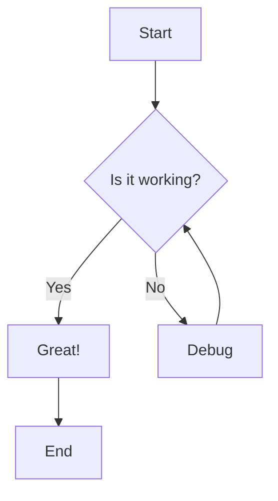
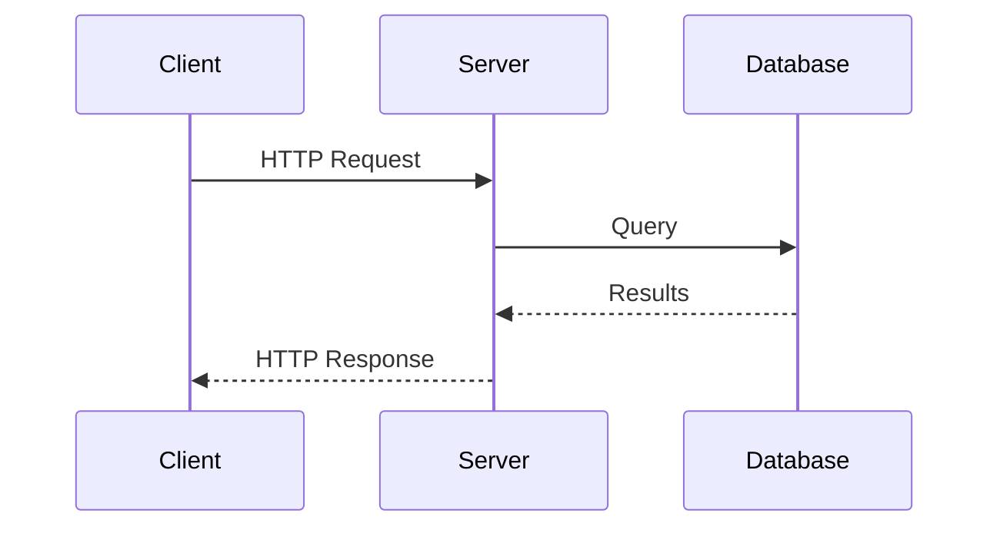
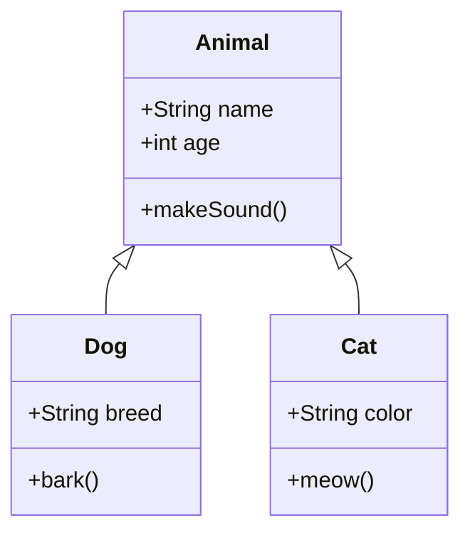
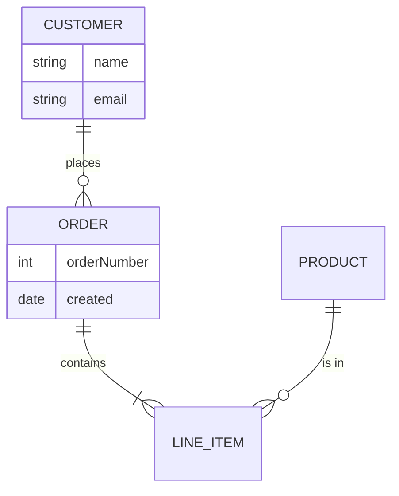
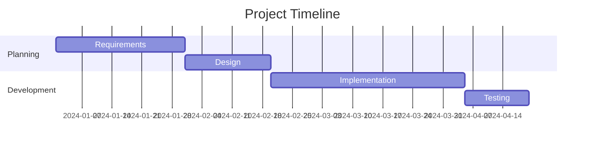
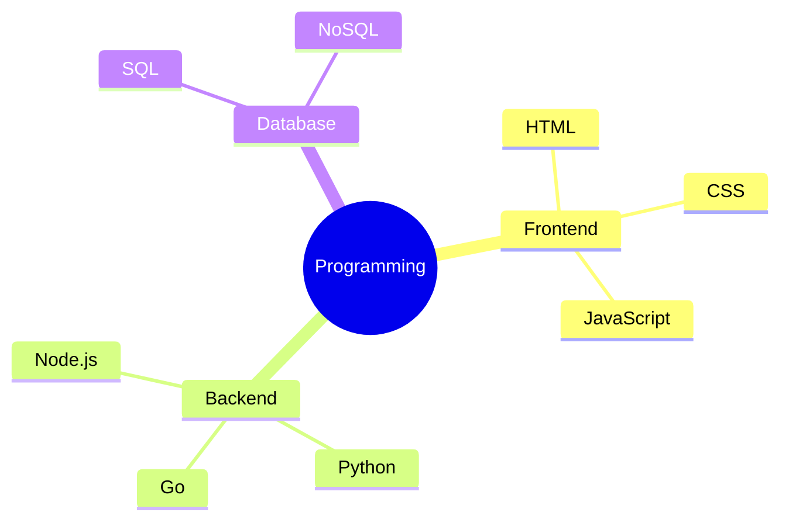

# Mixed Mermaid Diagrams Test Fixture

This document contains 8 mermaid diagrams for testing validation.
2 diagrams are intentionally invalid for error handling verification.

## 1. Flowchart (Valid)



## 2. Sequence Diagram (Valid)



## 3. Class Diagram (Valid)



## 4. State Diagram (INVALID - missing state name)

```mermaid
stateDiagram-v2
    [*] -->
    Active --> Inactive
    Inactive --> Active
    Active --> [*]
```

## 5. ER Diagram (Valid)



## 6. Gantt Chart (Valid)



## 7. Pie Chart (INVALID - malformed syntax)


## 8. Mindmap (Valid)


