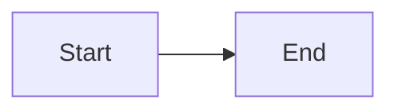

# Artifact Viewer

The Artifact Viewer displays design documents, requirements, and other
artifacts generated during rp1 workflows. Access it from Arcade run details or
the project artifacts list.

---

## Accessing Artifacts

### From Run Details

1. Navigate to a run in the dashboard.
2. Use the right panel's horizontal file list to browse all run artifacts.
3. Click an artifact file to open it without leaving the run context.

The right panel lists all artifacts associated with the run, not only the
currently selected step. Step-specific artifact shortcuts remain available from
the step list, and they open the same right-panel viewer.

### Direct URL

```
/runs/:runId/artifacts/:artifactPath
/runs/:runId/step/:stepId/artifact/:docId
/runs/:runId/artifact/:docId
```

Where `:artifactPath` is the relative path to the artifact (for example,
`requirements.md`) and `:docId` is the registered artifact document ID used by
run detail artifact links.

---

## Layout

The Artifact Viewer uses a multi-panel layout:

| Panel | Position | Description |
|-------|----------|-------------|
| **Navigation** | Left (collapsible) | File tree and artifact list |
| **Content** | Center | Rendered artifact content |
| **Outline** | Right (collapsible) | Table of contents / heading navigation |
| **Annotations** | Right (collapsible) | Annotation sidebar (when enabled) |

Toggle panels using the toolbar buttons or keyboard shortcuts.

---

## Viewing Modes

Most artifacts open in their standard renderer based on file type. File-backed
markdown artifacts generated by `pr-walkthrough` open in **Slides** mode when
they declare the `pr-walkthrough-slide-source` contract and pass slide-marker
validation.

| Mode | Use |
|------|-----|
| **Slides** | Review a supported PR walkthrough with horizontal and vertical slide navigation. Speaker notes stay in Reveal's speaker view, and evidence IDs remain in slide content. |
| **Markdown** | Read the original markdown artifact in source order, including evidence references, frontmatter, and slide markers. Use this mode for fallback reading, annotations, and audit. |

The `Slides` and `Markdown` control appears only for supported walkthrough
artifacts. Unsupported markdown, malformed walkthrough contracts, non-file
artifacts, and ordinary `pr-review` outputs stay on the existing markdown path.

If slide parsing or rendering fails after the artifact opens, Arcade shows a
short fallback message and switches to readable markdown instead of leaving a
broken slide reader. The outline panel is hidden while Slides mode owns
navigation and is available again in Markdown mode.

---

## Supported Content Types

| Extension | Rendering |
|-----------|-----------|
| `.md` | Markdown with syntax highlighting and Mermaid diagrams; supported PR walkthroughs can open in Slides mode |
| `.json` | Formatted JSON with collapsible sections |
| `.mmd` | Mermaid diagram rendering |
| `.diff` | Unified diff with syntax highlighting |
| Code files | Syntax-highlighted code with line numbers |

---

## Markdown Features

### Syntax Highlighting

Code blocks render with language-specific syntax highlighting. Supported languages include JavaScript, TypeScript, Python, Go, Rust, and more.

### Mermaid Diagrams

Mermaid code blocks render as interactive diagrams:



### Table of Contents

The outline panel shows document headings for quick navigation. Click a heading
to scroll to that section. For supported walkthrough artifacts, the outline is
available in Markdown mode; Slides mode uses the reader's slide and depth
controls instead.

---

## Annotations

The annotation system enables inline feedback on artifacts. See [Annotations](annotations.md) for complete documentation.

### Quick Reference

| Action | How |
|--------|-----|
| Add comment | Select text, click "Add Comment" in the popover |
| View annotations | Toggle annotation sidebar with toolbar button |
| Reply to annotation | Click annotation, enter reply, Cmd/Ctrl + Enter |
| Resolve annotation | Click annotation, click Resolve button |

### Annotation Sidebar

The sidebar displays all annotations for the current artifact, grouped by status:

- **Open**: Active feedback requiring attention (yellow indicator)
- **Resolved**: Addressed annotations (green indicator, collapsed)
- **Orphaned**: Annotations with missing anchors (warning badge)

Click a sidebar item to scroll to the annotation and open its popover. Long comments are truncated with a "Show more" option.

### Inline Indicators

Annotations display as thin vertical lines on the left side of annotated content:

- **Yellow line**: Open annotation requiring attention
- **Green line**: Resolved annotation
- **Click** the indicator to open the annotation popover

---

## Keyboard Shortcuts

| Shortcut | Action |
|----------|--------|
| `Cmd/Ctrl + B` | Toggle navigation sidebar |
| `Cmd/Ctrl + Enter` | Submit annotation (when input focused) |
| `Escape` | Close popover |

---

## Related

- [Annotations](annotations.md) - Complete annotation documentation
- [Dashboard](dashboard.md) - Status monitoring dashboard
- [Feature Development Guide](../guides/feature-development.md) - Using `/build` workflow
