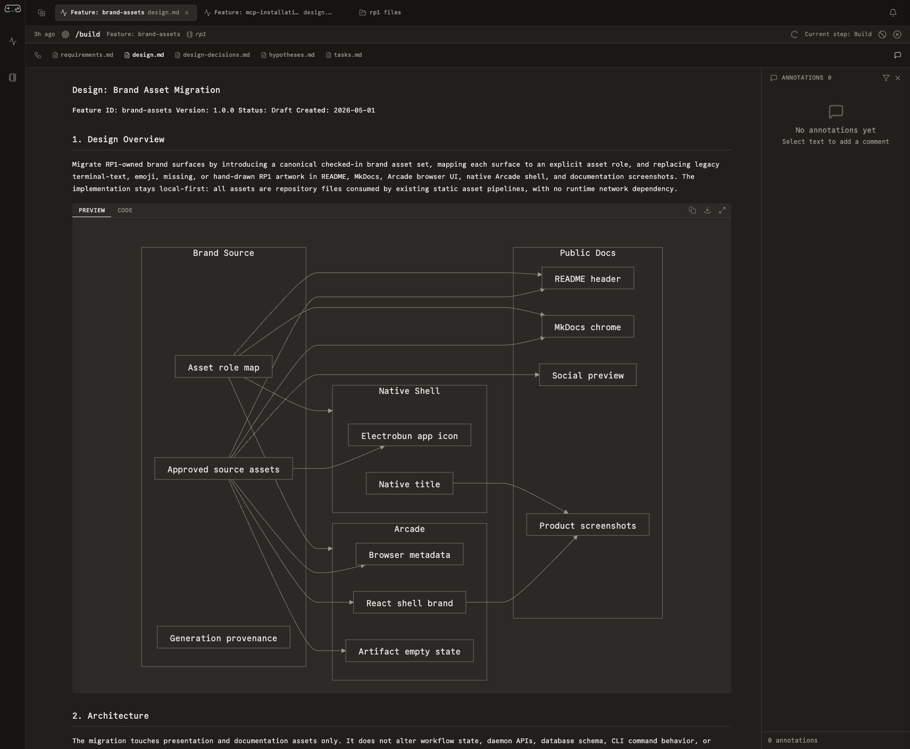

# Arcade

Arcade is rp1's browser UI for monitoring runs, checking notifications,
opening artifacts, and working through feedback without losing the surrounding
workflow context.



## Launch Arcade

Start Arcade with:

```bash
rp1 arcade
```

Run that from any project directory. By default it opens the browser on
`http://localhost:7710`.

---

## Main Surfaces

### Activity dashboard

The activity dashboard is a reverse-chronological feed of tracked runs. It
keeps run monitoring separate from persistent notifications so the main page
stays easy to scan.

Workflow activity shows up here because workflows emit canonical events through
`rp1 agent-tools emit`. Arcade consumes that event stream over WebSocket,
hydrates only the affected runs and project summaries, and keeps file watching
scoped to artifact or file-content views instead of using file changes as the
normal status-refresh mechanism.

Each row shows:

- latest activity time
- canonical run status
- harness icon
- invoked command and run display name
- quick project shortcut

Use the filter toggle on `/` to scope by status, project, or time range.
Persistent notifications do not appear as standalone feed rows; open the
notifications drawer from the shell when you need approvals, failures, or other
notification records.

If the socket reconnects after a gap, Arcade resumes from the saved
project-scoped cursor so missed workflow events can be replayed or reconciled
from a bounded snapshot before the feed falls back to broader recovery.

### Notifications drawer

The notifications drawer gives you a dedicated inbox without forcing a page
change.

- On desktop, open it from the bell trigger at the right edge of the workspace bar.
- On narrow layouts, use the matching bell action in the bottom navigation.
- The drawer stays on top of the current page, groups items by urgency, lets
  you follow linked runs or projects, and lets you dismiss notifications in
  place.
- Notification delivery stays aligned with the same emit-driven live-update
  path as the rest of Arcade, so approval, failure, and completion signals
  follow the affected run without requiring a broad page refresh.
- Reconnect recovery uses the saved WebSocket cursor plus persisted run state
  to catch up after missed live traffic; manual reload is a fallback, not the
  normal path.

### Runs list

The current shell does not have a separate runs-list route. `/runs` redirects
to `/`, and the home activity feed is the filtered run list.

### Run detail

The run detail view shows:

- current workflow status
- the step list for the selected run
- nested agent activity when a workflow delegates work
- execution-flow and artifact tabs for the selected step
- inline annotation access on the selected artifact

### Artifacts and annotations

Artifacts can be opened directly from a run. If your team uses Arcade
annotations, you can leave feedback on specific files and return later without
losing context.

---

## What Arcade Is Best At

| Use Case | Why Arcade Helps |
|----------|------------------|
| Long-running workflows | You can see progress without keeping the host conversation open |
| Review gates | Waiting states are visible before you answer the prompt |
| Artifact-driven work | Requirements, design, verification, and reports stay easy to open |
| Team collaboration | Shared feedback and annotation state stay attached to the artifact |

---

## Pages In This Section

- [Dashboard](dashboard.md) - Runs, statuses, and timelines
- [Artifact Viewer](artifact-viewer.md) - Inspect generated files
- [Annotations](annotations.md) - Leave and resolve feedback
- [Keyboard Shortcuts](keyboard-shortcuts.md) - Navigate quickly
- [Settings](settings.md) - Configure the UI

---

## Related

- [Feature Development Guide](../guides/feature-development.md)
- [PR Review Guide](../guides/pr-review.md)
- [Reference Overview](../reference/index.md)
