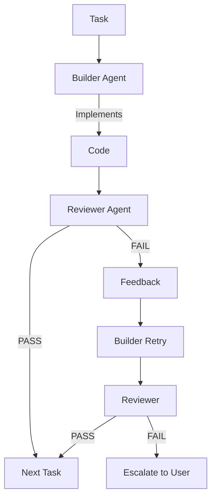

# Builder-Reviewer Agents

rp1 uses a **builder-reviewer architecture** to ensure reliable, high-quality code implementation. Instead of a single agent that writes and hopes for the best, two specialized agents work in an adversarial cooperation pattern — one builds, one critiques.

!!! note "Inspired by Research"
    This architecture is inspired by Block's [Adversarial Cooperation in Code Synthesis](https://block.xyz/documents/adversarial-cooperation-in-code-synthesis.pdf) paper, which demonstrates that adversarial agent pairs produce more reliable code than single-agent approaches.

---

## The Problem with Single-Agent Implementation

Traditional AI coding workflows use one agent to:

1. Read the requirements
2. Write the code
3. Self-assess quality
4. Move on

This creates a blind spot — the same agent that made an implementation choice is asked to evaluate it. Confirmation bias leads to missed edge cases, subtle bugs, and code that "looks right" but doesn't meet requirements.

---

## How Builder-Reviewer Works

The builder-reviewer pattern separates implementation from verification:

### Builder Agent

The builder agent focuses purely on implementation:

- Reads the task specification and design
- Writes code following codebase patterns
- Runs basic validation (syntax, imports)
- Marks task as ready for review

The builder doesn't self-assess quality — that's not its job.

### Reviewer Agent

The reviewer agent focuses purely on verification:

- Reads the original requirements and acceptance criteria
- Examines the implementation with fresh eyes
- Runs tests and validates behavior
- Provides specific, actionable feedback on failures

The reviewer has no investment in the code — its only goal is finding problems.

---

## Why Adversarial Cooperation Works

### Fresh Perspective

The reviewer sees code without the builder's mental model. Assumptions that seemed obvious during implementation get questioned.

### Clear Feedback Loop

When the reviewer finds issues, it provides specific feedback:

- What failed
- Why it failed
- What the expected behavior was

This feedback goes back to the builder, who can fix the specific issue rather than guessing.

### Single Retry with Context

The builder gets one retry with the reviewer's feedback. This focused iteration usually resolves issues. If not, the problem escalates to the user rather than spinning in loops.

### Fail-Safe Escalation

Unresolvable issues don't silently pass — they escalate. This prevents broken code from accumulating.

---

## Adaptive Task Grouping

Not all tasks need the same level of scrutiny. rp1 groups tasks by complexity:

| Complexity | Grouping | Review Depth |
|------------|----------|--------------|
| Simple | Batched (2-3 tasks) | Quick validation |
| Medium | Individual | Standard review |
| Complex | Individual + isolated | Deep analysis |

Simple tasks like "add a config option" can be batched for efficiency. Complex tasks like "implement authentication middleware" get individual attention.

---

## When Builder-Reviewer Is Used

The builder-reviewer architecture is used in:

- **`/build`** — Feature implementation (Step 3: Build)
- **`/build-fast`** — Quick iterations (when worktree mode is enabled)

---

## Benefits

| Benefit | Description |
|---------|-------------|
| **Higher quality** | Two perspectives catch more issues |
| **Faster debugging** | Specific feedback pinpoints problems |
| **Predictable outcomes** | Clear pass/fail gates prevent drift |
| **Safe escalation** | Hard problems reach humans, not workarounds |

---

## Related

- [Command-Agent Pattern](command-agent-pattern.md) — How commands delegate to agents
- [Feature Development Guide](../guides/feature-development.md) — See builder-reviewer in action
- [`/build` Reference](../reference/dev/build.md) — Detailed command documentation
