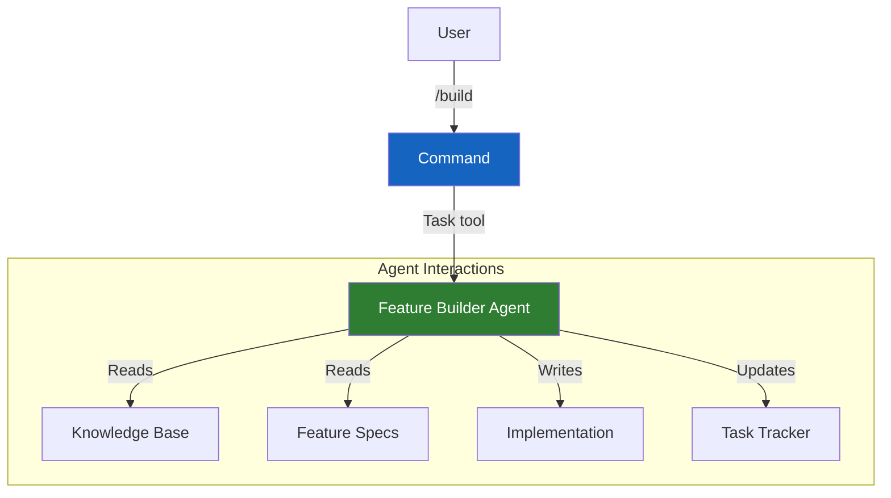

# Command-Agent Pattern

The command-agent pattern is rp1's architectural approach where **thin wrapper commands** delegate to **autonomous agents**. Commands handle user interaction and routing; agents handle the actual work. This separation enables reusable, testable, and maintainable AI workflows.

---

## How It Works

When you run an rp1 command, two things happen:

1. The **command** (50-100 lines) parses your input and routes to the appropriate agent
2. The **agent** (200-350 lines) executes the complete workflow autonomously



---

## Commands: The Thin Wrapper

Commands are intentionally minimal. They:

- Parse user-provided parameters
- Load any required context
- Spawn the appropriate agent via the Task tool
- Return the agent's output to the user

**Example command structure:**

```markdown
# feature-build

Implements features from task lists and design specs.

## Parameters
| Name | Position | Required | Description |
|------|----------|----------|-------------|
| FEATURE_ID | $1 | Yes | Feature identifier |
| MILESTONE_ID | $2 | No | Specific milestone |

## Execution

Spawn the feature-builder agent:

Task tool with subagent_type: rp1-dev:feature-builder
```

Commands contain **no business logic**—they're pure routing.

---

## Agents: The Autonomous Workers

Agents are where the expertise lives. Each agent:

- Follows a **constitutional structure** with numbered sections
- Has **anti-loop directives** for single-pass execution
- Defines **output contracts** specifying what it produces
- Operates **autonomously** without requiring user feedback

**Example agent structure:**

```markdown
# Feature Builder Agent

You are FeatureBuilder, an expert developer that implements
features from pre-defined task lists.

## 0. Parameters
| Name | Position | Default | Purpose |
|------|----------|---------|---------|
| FEATURE_ID | $1 | (required) | Feature to build |

## 1. Context Loading
Load KB files and feature specifications.

## 2. Task Analysis
Review tasks and classify verification types.

## 3. Implementation
For each task:
- Implement according to design
- Run verification
- Update task tracker

## 4. Output
- Updated task files with implementation summaries
- Field notes for discoveries
```

---

## Why This Pattern?

### Separation of Concerns

| Component | Responsibility |
|-----------|----------------|
| Command | User interface, parameter parsing, routing |
| Agent | Business logic, workflow execution, output |

This means:
- Commands can change (new parameters) without touching agent logic
- Agents can be improved without changing the user interface
- Multiple commands can share the same agent

### Reusability

The same agent can be invoked by:
- Different commands with different parameters
- Other agents that need the capability
- Test harnesses for validation

### Testability

Agents are self-contained workflows that can be:
- Tested with mock inputs
- Validated against expected outputs
- Benchmarked for quality

---

## Example: The Feature Workflow

The feature development workflow demonstrates multiple command-agent pairs working together. The `/build` command orchestrates all these steps automatically:

!!! note "Orchestrated by /build"
    While individual commands like `feature-requirements`, `feature-design`, and `feature-build` exist as reference documentation, the recommended entry point is `/build` which orchestrates all steps with smart resumption and builder-reviewer architecture.

```mermaid
flowchart TB
    subgraph "Entry Point"
        BUILD[/build]
    end

    subgraph "Orchestrated Commands"
        C1[feature-requirements]
        C2[feature-design]
        C3[feature-tasks]
        C4[feature-build]
        C5[feature-verify]
    end

    subgraph "Agents (Autonomous Workers)"
        A1[Requirements Collector]
        A2[Design Generator]
        A3[Task Planner]
        A4[Feature Builder]
        A5[Feature Verifier]
    end

    subgraph "Artifacts"
        D1[requirements.md]
        D2[design.md]
        D3[tasks.md]
        D4[Implementation]
        D5[Verification Report]
    end

    BUILD --> C1
    C1 --> A1 --> D1
    C2 --> A2 --> D2
    C3 --> A3 --> D3
    C4 --> A4 --> D4
    C5 --> A5 --> D5

    D1 -.-> C2
    D2 -.-> C3
    D3 -.-> C4
    D4 -.-> C5

    style BUILD fill:#7b1fa2,color:#fff
    style C1 fill:#1565c0,color:#fff
    style C2 fill:#1565c0,color:#fff
    style C3 fill:#1565c0,color:#fff
    style C4 fill:#1565c0,color:#fff
    style C5 fill:#1565c0,color:#fff
    style A1 fill:#2e7d32,color:#fff
    style A2 fill:#2e7d32,color:#fff
    style A3 fill:#2e7d32,color:#fff
    style A4 fill:#2e7d32,color:#fff
    style A5 fill:#2e7d32,color:#fff
```

Each step spawns its agent, which produces artifacts used by subsequent steps. The `/build` command handles resumption automatically based on which artifacts exist.

---

## Key Benefits

<div class="grid cards" markdown>

-   :material-layers: **Clean Architecture**

    ---

    Clear separation between user interface and business logic.

-   :material-recycle: **Reusable Components**

    ---

    Agents can be shared across commands and invoked by other agents.

-   :material-test-tube: **Testable Workflows**

    ---

    Agents are self-contained and can be validated independently.

-   :material-update: **Independent Evolution**

    ---

    Commands and agents can change without affecting each other.

</div>

---

## Related Concepts

- [Constitutional Prompting](constitutional-prompting.md) - How agents are structured
- [Map-Reduce Workflows](map-reduce-workflows.md) - How agents parallelize work

## Learn More

- [Command Reference](../reference/index.md) - All 21 commands
- [Feature Development Tutorial](../guides/feature-development.md) - See the pattern in action
