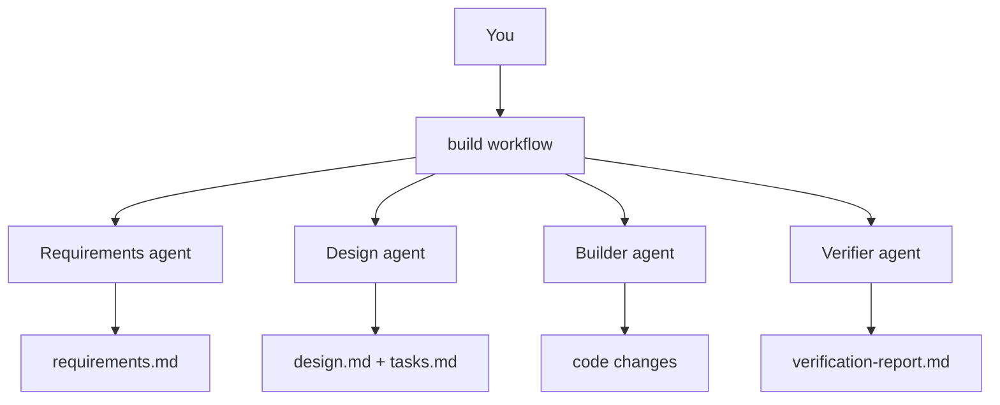

# Skill-Agent Pattern

rp1 workflows stay usable because they separate the user-facing entry point from
the specialist that actually does the work.

When you invoke a workflow such as `build`, `pr-review`, or `knowledge-build`,
you interact with a small entry layer that:

1. Interprets your request
2. Loads the right project context
3. Hands execution to one or more specialized agents

Those agents then do the actual work: reading the knowledge base, inspecting
code, producing artifacts, and reporting progress.

---

## Why It Matters to End Users

This split changes the user experience in a few important ways:

| What You See | What the Pattern Enables |
|--------------|--------------------------|
| One short command | Complex work can still fan out behind the scenes |
| Consistent output shape | The same workflow behaves predictably across runs |
| Better resumability | Work is preserved in artifacts instead of living only in the chat thread |
| Better context discipline | Agents load only the KB and files they need |

---

## Example: Feature Delivery

The feature workflow is a good example of the pattern in practice:

```mermaid
flowchart TB
    U[You] --> W[build workflow]
    W --> R[Requirements agent]
    W --> D[Design agent]
    W --> B[Builder agent]
    W --> V[Verifier agent]

    R --> A1[requirements.md]
    D --> A2[design.md + tasks.md]
    B --> A3[code changes]
    V --> A4[verification-report.md]
```

You still run one workflow:

| Host | Example |
|------|---------|
| Claude Code | `/build my-feature` |
| OpenCode | `/rp1-dev-build my-feature` |
| Codex | `$rp1-dev-build my-feature` |

But the work is delegated to specialists that focus on one stage at a time.

---

## Why rp1 Uses Specialists

### Better context loading

Different stages need different information. A verifier does not need the same
context as a designer, and a KB builder does not need the same context as a PR
reviewer.

### Clearer artifacts

Each stage can leave behind durable files such as `requirements.md`,
`design.md`, `tasks.md`, or `verification-report.md`. That makes workflows easy
to review and easy to resume later.

### Less prompt drift

Instead of asking one general-purpose assistant to do everything, rp1 routes the
work to narrower specialists with more constrained jobs.

---

## What This Looks Like in Practice

You will usually notice the pattern in three places:

- Workflows ask for fewer repeated explanations because they can load the KB and
  existing artifacts directly.
- Long-running tasks can expose clear stages such as planning, building, and
  review.
- Final outputs are usually files under `.rp1/` rather than only a chat
  response.

---

## Related

- [Feature Development Guide](../guides/feature-development.md) - See the
  pattern in the main delivery workflow
- [Builder-Reviewer Agents](builder-reviewer-agents.md) - How rp1 quality-gates
  implementation
- [Knowledge-Aware Agents](knowledge-aware-agents.md) - How workflows stay
  grounded in your codebase
