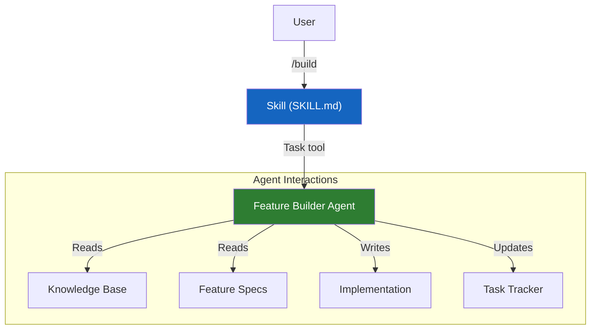

# Skill-Agent Pattern

The skill-agent pattern is rp1's architectural approach where **skills** (defined in [SKILL.md format](skill-format.md)) delegate to **autonomous agents**. Skills handle user interaction and routing; agents handle the actual work. This separation enables reusable, testable, and maintainable AI workflows.

!!! note "Terminology Update"
    This pattern was previously called the "command-agent pattern." All rp1 commands have been migrated to the SKILL.md canonical format. Skills are now the single artifact type for all invocable prompts.

---

## How It Works

When you invoke an rp1 skill, two things happen:

1. The **skill** (SKILL.md file) parses your input and routes to the appropriate agent
2. The **agent** (200-350 lines) executes the complete workflow autonomously


```mermaid
flowchart TB
    User[User] -->|/build| Skill["Skill (SKILL.md)"]
    Skill -->|Task tool| Agent[Feature Builder Agent]

    subgraph "Agent Interactions"
        Agent -->|Reads| KB[Knowledge Base]
        Agent -->|Reads| Specs[Feature Specs]
        Agent -->|Writes| Code[Implementation]
        Agent -->|Updates| Tasks[Task Tracker]
    end

    style Skill fill:#1565c0,color:#fff
    style Agent fill:#2e7d32,color:#fff
```

---

## Skills: The Entry Point

Skills are defined as SKILL.md files in the [canonical format](skill-format.md). They are intentionally minimal wrappers that:

- Extract parameters from user input via model-driven parsing (the `## Parameters` section)
- Load any required context
- Spawn the appropriate agent via the Task tool
- Return the agent's output to the user

**Example skill structure** (`plugins/dev/skills/build/SKILL.md`):

```yaml
---
name: build
description: "End-to-end feature development workflow with 6 steps."
allowed-tools: Bash(echo *), Read, Write, Edit, Glob, Grep, Task
metadata:
  version: 3.0.0
  argument-hint: "<feature-id> [requirements] [--afk]"
---
```

```markdown
## Parameters

Extract these parameters from the user's input:

| Parameter | Required | Default | Description |
|-----------|----------|---------|-------------|
| `FEATURE_ID` | Yes | - | Feature identifier |
| `MILESTONE_ID` | No | - | Specific milestone |

## Execution

Spawn the feature-builder agent via Task tool with subagent_type: rp1-dev:feature-builder
```

Skills contain **no business logic** -- they are pure routing.

---

## Agents: The Autonomous Workers

Agents are where the expertise lives. Each agent:

- Follows a **constitutional structure** with numbered sections
- Has **anti-loop directives** for single-pass execution
- Defines **output contracts** specifying what it produces
- Operates **autonomously** without requiring user feedback

**Example agent structure:**

```markdown
# Feature Builder Agent

You are FeatureBuilder, an expert developer that implements
features from pre-defined task lists.

## 0. Parameters
| Name | Position | Default | Purpose |
|------|----------|---------|---------|
| FEATURE_ID | $1 | (required) | Feature to build |

## 1. Context Loading
Load KB files and feature specifications.

## 2. Task Analysis
Review tasks and classify verification types.

## 3. Implementation
For each task:
- Implement according to design
- Run verification
- Update task tracker

## 4. Output
- Updated task files with implementation summaries
- Field notes for discoveries
```

---

## Why This Pattern?

### Separation of Concerns

| Component | Responsibility |
|-----------|----------------|
| Skill (SKILL.md) | User interface, parameter extraction, routing |
| Agent | Business logic, workflow execution, output |

This means:
- Skills can change (new parameters) without touching agent logic
- Agents can be improved without changing the user interface
- Multiple skills can share the same agent

### Reusability

The same agent can be invoked by:
- Different skills with different parameters
- Other agents that need the capability
- Test harnesses for validation

### Testability

Agents are self-contained workflows that can be:
- Tested with mock inputs
- Validated against expected outputs
- Benchmarked for quality

---

## Example: The Feature Workflow

The feature development workflow demonstrates multiple skill-agent pairs working together. The `/build` skill orchestrates all steps automatically:

```mermaid
flowchart TB
    subgraph "Entry Point"
        BUILD[/build]
    end

    subgraph "Workflow Steps"
        S1[Requirements]
        S2[Design]
        S3[Build]
        S4[Verify]
        S5[Follow-up]
        S6[Archive]
    end

    subgraph "Agents (Autonomous Workers)"
        A1[Requirements Collector]
        A2[Design Generator]
        A3[Task Builder]
        A4[Task Reviewer]
        A5[Feature Verifier]
    end

    subgraph "Artifacts"
        D1[requirements.md]
        D2[design.md + tasks.md]
        D3[Implementation]
        D4[Verification Report]
    end

    BUILD --> S1
    S1 --> A1 --> D1
    S2 --> A2 --> D2
    S3 --> A3
    A3 --> A4
    A4 --> D3
    S4 --> A5 --> D4

    D1 -.-> S2
    D2 -.-> S3
    D3 -.-> S4

    style BUILD fill:#7b1fa2,color:#fff
    style S1 fill:#1565c0,color:#fff
    style S2 fill:#1565c0,color:#fff
    style S3 fill:#1565c0,color:#fff
    style S4 fill:#1565c0,color:#fff
    style S5 fill:#1565c0,color:#fff
    style S6 fill:#1565c0,color:#fff
    style A1 fill:#2e7d32,color:#fff
    style A2 fill:#2e7d32,color:#fff
    style A3 fill:#2e7d32,color:#fff
    style A4 fill:#2e7d32,color:#fff
    style A5 fill:#2e7d32,color:#fff
```

Each step spawns its agent, which produces artifacts used by subsequent steps. The `/build` skill handles resumption automatically based on which artifacts exist.

---

## Key Benefits

<div class="grid cards" markdown>

-   :material-layers: **Clean Architecture**

    ---

    Clear separation between user interface and business logic.

-   :material-recycle: **Reusable Components**

    ---

    Agents can be shared across commands and invoked by other agents.

-   :material-test-tube: **Testable Workflows**

    ---

    Agents are self-contained and can be validated independently.

-   :material-update: **Independent Evolution**

    ---

    Skills and agents can change without affecting each other.

</div>

---

## Related Concepts

- [SKILL.md Format](skill-format.md) - The canonical format for all rp1 skills
- [Constitutional Prompting](constitutional-prompting.md) - How agents are structured
- [Map-Reduce Workflows](map-reduce-workflows.md) - How agents parallelize work

## Learn More

- [Skill Reference](../reference/index.md) - All 31 skills across base, dev, and utils plugins
- [Feature Development Tutorial](../guides/feature-development.md) - See the pattern in action
