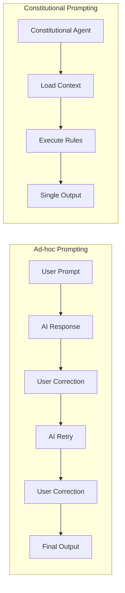

# Constitutional Prompting

Constitutional prompting is rp1's core pattern for encoding expert knowledge into AI-executable workflows. Instead of crafting prompts on-the-fly and iterating until you get the right output, constitutional prompts define the **rules, structure, and constraints** upfront—enabling consistent, single-pass execution.

---

## The Problem

Traditional AI-assisted development often looks like this:

```
You: "Write a function to validate email addresses"
AI: [generic implementation]
You: "No, use the same pattern as our other validators"
AI: [still doesn't match your conventions]
You: "Look at src/validators/phone.ts for the pattern"
AI: [closer, but missing error handling]
You: "Add proper error messages like we use elsewhere"
AI: [finally acceptable after 4+ iterations]
```

This **iteration loop** wastes time and mental energy. Each prompt requires you to:

- Remember what context to provide
- Catch what the AI missed
- Guide it toward your codebase's patterns
- Verify the output meets your standards

---

## How Constitutional Prompting Works

Constitutional prompts flip the script. Instead of ad-hoc conversations, they encode:

1. **Expert knowledge** - Best practices distilled into the prompt itself
2. **Codebase context** - Automatic loading of your project's patterns
3. **Execution rules** - Built-in anti-loop directives for single-pass completion
4. **Output contracts** - Defined structure for consistent results



---

## Example: Before and After

### Before: Ad-hoc Feature Development

```
You: "I need to add a dark mode toggle"
AI: [writes generic toggle component]
You: "We use React context for state"
AI: [rewrites with context]
You: "Follow our component naming conventions"
AI: [renames things]
You: "Add tests like our other components"
AI: [adds tests]
You: "The test patterns don't match our setup"
AI: [fixes tests]
```

**Result**: 5+ iterations, inconsistent output, no documentation

### After: Constitutional Feature Development

=== "Claude Code"

    ```bash
    /build dark-mode
    ```

=== "OpenCode"

    ```bash
    /rp1-dev/build dark-mode
    ```

**Result**: Single command orchestrates all steps (requirements, design, build, verify) in single passes, produces documented artifacts

---

## Key Components

### Anti-Loop Directives

Constitutional agents include explicit instructions to prevent iteration:

> "Execute the complete workflow in a single pass. Do NOT ask for clarification or wait for feedback. Make reasonable decisions when information is ambiguous."

This forces the agent to make decisions rather than punting to the user.

### Numbered Workflow Sections

Each agent follows a structured workflow:

```
## 1. Context Loading
Load knowledge base and understand codebase patterns.

## 2. Analysis
Analyze requirements and identify approach.

## 3. Implementation
Execute the defined workflow steps.

## 4. Output
Produce the specified artifacts.
```

### Output Contracts

Agents define exactly what they produce:

```markdown
## Output Format
- requirements.md: Feature requirements document
- design.md: Technical design specification
- tasks.md: Implementation task breakdown
```

---

## Key Benefits

<div class="grid cards" markdown>

-   :material-lightning-bolt: **Faster Execution**

    ---

    Single-pass completion means no back-and-forth. Get results in one command.

-   :material-check-all: **Consistent Output**

    ---

    The same command produces the same structure every time. No surprises.

-   :material-brain: **Encoded Expertise**

    ---

    Best practices are built into the prompts. You don't need to remember them.

-   :material-file-document: **Documented Artifacts**

    ---

    Every step produces documentation, not just code.

</div>

---

## Related Concepts

- [Knowledge-Aware Agents](knowledge-aware-agents.md) - How agents understand your codebase
- [Command-Agent Pattern](command-agent-pattern.md) - The architecture behind rp1 commands

## Learn More

- [Feature Development Tutorial](../guides/feature-development.md) - See constitutional prompting in action
- [Command Reference](../reference/index.md) - Explore all 21 constitutional commands
