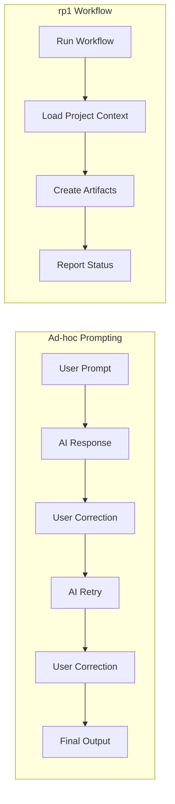

# Consistent Workflows

rp1 workflows are structured prompts for common development jobs. Instead of
asking an assistant to improvise every step, you run a workflow that already
knows the expected path, evidence, artifacts, and quality checks for the job.

---

## The Problem With Ad-Hoc Prompting

Traditional AI-assisted development often looks like this:

```
You: "Write a function to validate email addresses"
AI: [generic implementation]
You: "No, use the same pattern as our other validators"
AI: [still doesn't match your conventions]
You: "Look at src/validators/phone.ts for the pattern"
AI: [closer, but missing error handling]
You: "Add proper error messages like we use elsewhere"
AI: [finally acceptable after 4+ iterations]
```

This **iteration loop** wastes time and mental energy. Each prompt requires you to:

- Remember what context to provide
- Catch what the AI missed
- Guide it toward your codebase's patterns
- Verify the output meets your standards

---

## How rp1 Workflows Help

rp1 workflows replace repeated prompting with job-specific instructions:

1. **A clear job** - Ship a feature, review a PR, investigate a bug, write docs, or build context.
2. **Project context** - Workflows load the project knowledge they need before acting.
3. **Durable artifacts** - Important work is written to files that can be reviewed and resumed.
4. **Quality gates** - Build and review workflows keep validation visible instead of burying it in chat.


```mermaid
flowchart LR
    subgraph "Ad-hoc Prompting"
        A1[User Prompt] --> A2[AI Response]
        A2 --> A3[User Correction]
        A3 --> A4[AI Retry]
        A4 --> A5[User Correction]
        A5 --> A6[Final Output]
    end

    subgraph "rp1 Workflow"
        C1[Run Workflow] --> C2[Load Project Context]
        C2 --> C3[Create Artifacts]
        C3 --> C4[Report Status]
    end
```

---

## Example: Before And After

### Before: Ad-hoc Feature Development

```
You: "I need to add a dark mode toggle"
AI: [writes generic toggle component]
You: "We use React context for state"
AI: [rewrites with context]
You: "Follow our component naming conventions"
AI: [renames things]
You: "Add tests like our other components"
AI: [adds tests]
You: "The test patterns don't match our setup"
AI: [fixes tests]
```

**Result**: 5+ iterations, inconsistent output, no documentation

### After: rp1 Feature Workflow

=== "Claude Code"

    ```bash
    /build dark-mode
    ```

=== "OpenCode"

    ```bash
    /rp1-dev-build dark-mode
    ```

=== "Codex"

    ```bash
    $rp1-dev-build dark-mode
    ```

**Result**: One workflow guides requirements, planning, implementation, review,
and release readiness. The intermediate files remain available after the chat
session.

---

## What You Should Expect

<div class="grid cards" markdown>

-   :material-lightning-bolt: **Faster Execution**

    ---

    You spend less time re-explaining the same workflow steps.

-   :material-check-all: **Consistent Output**

    ---

    The same workflow produces a recognizable set of artifacts and status updates.

-   :material-brain: **Encoded Expertise**

    ---

    The workflow carries the expected process so you can focus on the decision.

-   :material-file-document: **Documented Artifacts**

    ---

    Requirements, designs, tasks, reports, and reviews are kept as project files.

</div>

---

## Related Concepts

- [Project Context](knowledge-aware-agents.md) - How workflows understand your codebase
- [Workflow Delegation](command-agent-pattern.md) - Advanced explanation of how rp1 routes work internally

## Learn More

- [Feature Development Guide](../guides/feature-development.md) - See the main delivery workflow
- [First Workflow](../getting-started/first-workflow.md) - Choose your first tracked workflow
- [Command Reference](../reference/index.md) - Explore workflow references
