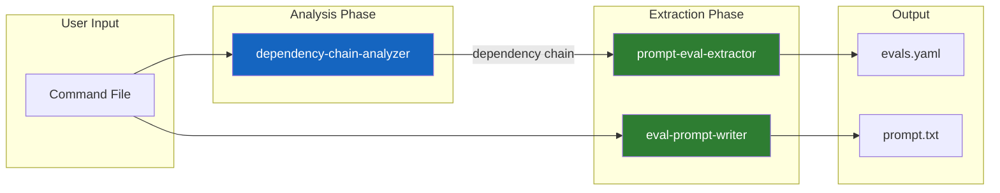
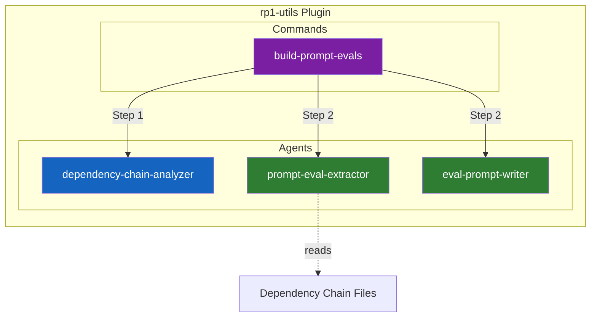

# Eval System

The eval system generates comprehensive test assertions from agent prompts for use with [promptfoo](https://promptfoo.dev/). It analyzes command dependency chains to ensure eval coverage spans the complete command -> agent -> skill hierarchy.

---

## How It Works

When you run `/build-prompt-evals` on a command file, the system:

1. **Analyzes dependencies** - Discovers all sub-agents and skills referenced by the command
2. **Extracts assertions** - Generates eval assertions from each file in the dependency chain
3. **Writes test prompts** - Creates minimal prompts optimized for evaluation

```mermaid
sequenceDiagram
    participant User
    participant BPE as build-prompt-evals
    participant DCA as dependency-chain-analyzer
    participant PEE as prompt-eval-extractor
    participant EPW as eval-prompt-writer
    participant FS as File System

    User->>BPE: /build-prompt-evals <file>
    BPE->>BPE: Detect file mode

    rect rgb(40, 60, 80)
        Note over BPE,DCA: Dependency Analysis Phase
        BPE->>DCA: Analyze dependencies
        DCA->>FS: Read command file
        DCA->>FS: Read agent files (recursive)
        DCA-->>BPE: Dependency chain JSON
    end

    rect rgb(60, 80, 60)
        Note over BPE,EPW: Parallel Extraction Phase
        par Extract Assertions
            BPE->>PEE: Extract (content, chain)
            PEE->>FS: Read all chain files
            PEE-->>BPE: evals.yaml
        and Write Test Prompt
            BPE->>EPW: Write prompt
            EPW-->>BPE: prompt.txt
        end
    end

    BPE-->>User: Output locations
```



---

## Dependency-Aware Extraction

The key innovation is **dependency chain analysis** before assertion extraction. Commands in rp1 are thin wrappers that delegate to agents, which may reference skills. Testing only the command file misses behavioral assertions defined in sub-agent specifications.

### The Dependency Chain



### Example Chain

For a command like `build-fast.md` that delegates to `task-builder` agent:

| Level | File | Assertions From |
|-------|------|-----------------|
| Command | `commands/build-fast.md` | Parameter handling, delegation patterns |
| Agent | `agents/task-builder.md` | Workflow steps, tool calls, output contracts |
| Skill | `skills/prompt-writer/SKILL.md` | Specialized capability assertions |

---

## Component Architecture



| Component | Purpose |
|-----------|---------|
| **build-prompt-evals** | Command orchestrator; routes to agents |
| **dependency-chain-analyzer** | Discovers sub-agent and skill dependencies |
| **prompt-eval-extractor** | Generates assertions from prompt content |
| **eval-prompt-writer** | Creates minimal test prompts |

---

## Usage Modes

### File Mode (with dependency analysis)

```bash
/build-prompt-evals plugins/dev/commands/build-fast.md
```

1. Analyzes `build-fast.md` for dependencies
2. Discovers `task-builder.md` agent reference
3. Extracts assertions from both files
4. Outputs `build-fast-evals.yaml` with grouped assertions

### Inline Mode (no dependency analysis)

```bash
/build-prompt-evals "You are an assistant that helps with code review"
```

1. Skips dependency analysis (no file to analyze)
2. Extracts assertions from inline text
3. Outputs to current directory

### Custom Output Directory

```bash
/build-prompt-evals my-agent.md --output evals/suites/my-plugin/
```

---

## Output Format

Generated eval files include source attribution for traceability:

```yaml
# --- Assertions from: plugins/dev/commands/build-fast.md ---
- assert_tool_call: Task_spawn
  # source: plugins/dev/commands/build-fast.md

# --- Assertions from: plugins/dev/agents/task-builder.md ---
- assert_tool_call: Write_create
  # source: plugins/dev/agents/task-builder.md
- assert_output: "Implementation complete"
  # source: plugins/dev/agents/task-builder.md
```

---

## Dependency Detection Patterns

The analyzer detects dependencies using these patterns:

| Pattern | Detects | Example |
|---------|---------|---------|
| `Task: plugin:agent` | Agent references in commands | `Task: rp1-dev:task-builder` |
| `Skill: plugin:skill` | Skill references in agents | `Skill: rp1-base:prompt-writer` |

---

## Related Concepts

- [Command-Agent Pattern](command-agent-pattern.md) - How commands delegate to agents
- [Constitutional Prompting](constitutional-prompting.md) - How agents are structured
- [Skills](skills.md) - Reusable agent capabilities

## Learn More

- [rp1-utils Plugin](../../plugins/utils/README.md) - Full command and agent reference
