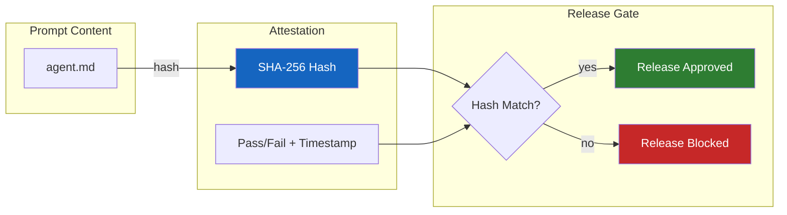
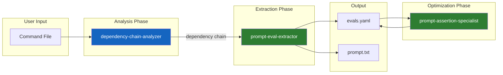
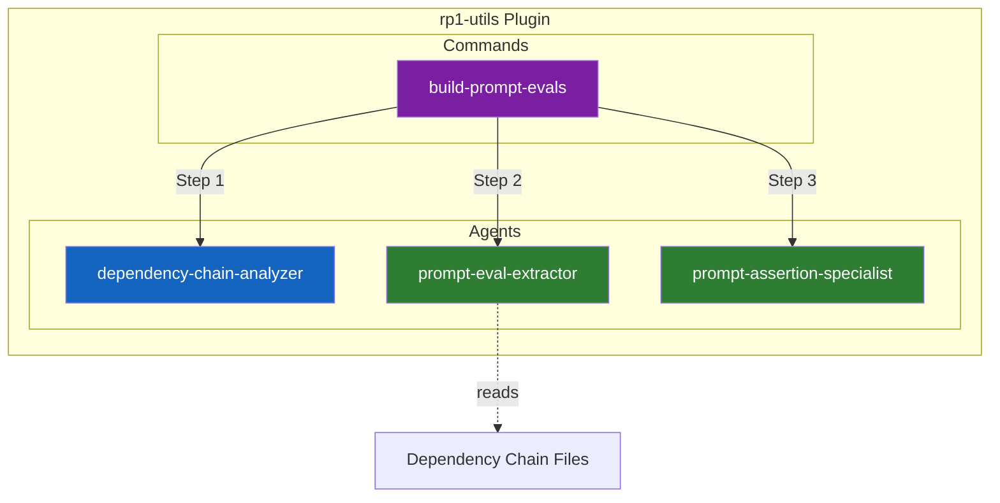

# Eval System

The eval system provides deterministic quality assurance for AI agent prompts through automated assertion generation and content-addressable attestation. It ensures that prompt changes are intentional, tested, and traceable across releases.

---

## Why Evaluations Matter

Agent prompts are code. Like any code, they can regress, drift from intended behavior, or break in subtle ways. The eval system addresses three core challenges:

1. **Prompt Regression** - Changes to agent prompts can silently alter behavior. Evals catch unintended changes before release.
2. **Dependency Blindness** - Commands delegate to agents which invoke skills. Testing only the command misses behavioral contracts defined deeper in the chain.
3. **Release Confidence** - Content-addressable attestations prove that specific prompt versions passed specific test suites, enabling deterministic releases.

---

## Content-Addressable Attestation

The attestation system creates cryptographic links between prompt content and test results:



**Benefits**:
- **Tamper Detection** - Any prompt modification invalidates the attestation
- **Audit Trail** - Historical record of what was tested and when
- **CI/CD Integration** - Automated release gates based on attestation status

---

## Dependency-Aware Extraction

The key innovation is **dependency chain analysis** before assertion extraction. Commands in rp1 are thin wrappers that delegate to agents, which may reference skills. Testing only the command file misses behavioral assertions defined in sub-agent specifications.

### The Dependency Chain



### Example Chain

For a command like `build-fast.md` that delegates to `task-builder` agent:

| Level | File | Assertions From |
|-------|------|-----------------|
| Command | `commands/build-fast.md` | Parameter handling, delegation patterns |
| Agent | `agents/task-builder.md` | Workflow steps, tool calls, output contracts |
| Skill | `skills/prompt-writer/SKILL.md` | Specialized capability assertions |

---

## Component Architecture



| Component | Purpose |
|-----------|---------|
| **build-prompt-evals** | Command orchestrator; routes to agents |
| **dependency-chain-analyzer** | Discovers sub-agent and skill dependencies |
| **prompt-eval-extractor** | Generates assertions and minimal test prompts from prompt content |
| **prompt-assertion-specialist** | Resolves placeholder assertions, consolidates scenarios |

---

## Assertion Types

The system extracts several categories of assertions from prompt content:

| Category | What It Tests | Example |
|----------|---------------|---------|
| **Tool Calls** | Expected tool invocations | Agent must call `Write` tool |
| **Output Contracts** | Required output patterns | Must include "Implementation complete" |
| **Workflow Steps** | Ordered operations | Read files before editing |
| **Error Handling** | Failure behaviors | Graceful degradation patterns |

---

## Source Attribution

Generated assertions maintain traceability to their origin file, enabling debugging and maintenance:

```yaml
# --- Assertions from: plugins/dev/commands/build-fast.md ---
- assert_tool_call: Task_spawn
  # source: plugins/dev/commands/build-fast.md

# --- Assertions from: plugins/dev/agents/task-builder.md ---
- assert_output: "Implementation complete"
  # source: plugins/dev/agents/task-builder.md
```

This attribution ensures that when an assertion fails, developers can trace it back to the specific behavioral contract in the prompt hierarchy.

---

## Related Concepts

- [Command-Agent Pattern](command-agent-pattern.md) - How commands delegate to agents
- [Constitutional Prompting](constitutional-prompting.md) - How agents are structured
- [Skills](skills.md) - Reusable agent capabilities

## Learn More

- [rp1-utils Plugin README](https://github.com/rp1-run/rp1/blob/main/plugins/utils/README.md) - Full command and agent reference
