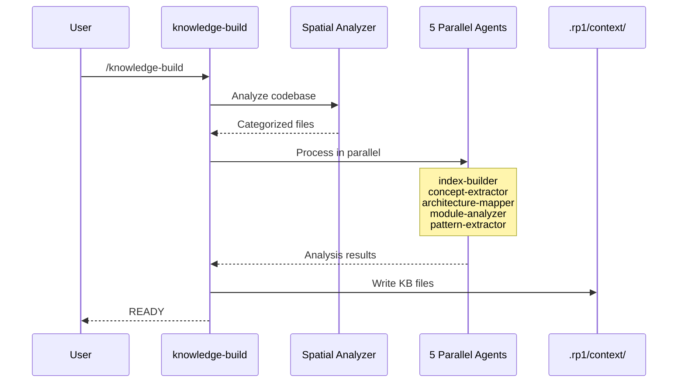
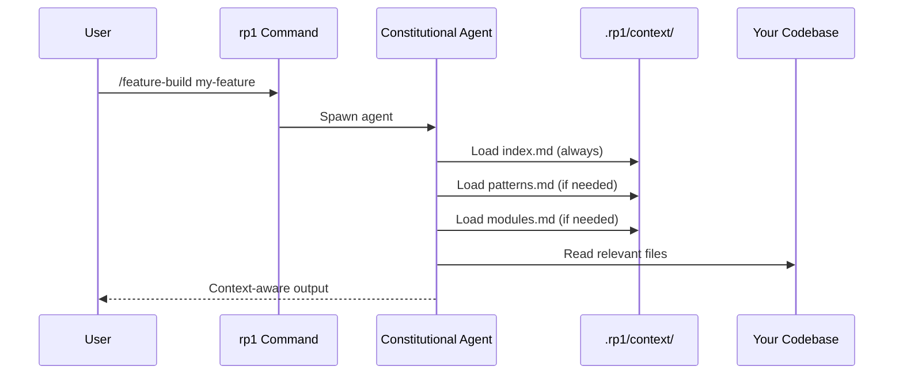

# Knowledge-Aware Agents

Knowledge-aware agents understand your codebase before writing code. By loading a pre-built knowledge base, rp1 agents respect your architecture, follow your patterns, and use your terminology—producing output that fits naturally into your project.

---

## The Problem

Generic AI assistants suffer from **context blindness**:

```
You: "Add a new API endpoint for user preferences"
AI: [creates endpoint with patterns from generic tutorials]
    - Uses different error handling than your codebase
    - Ignores your existing middleware
    - Doesn't follow your naming conventions
    - Misses your authentication patterns
```

Even when you provide context manually, you're limited by:

- Token limits (can't paste your whole codebase)
- Memory of what's relevant
- Time spent gathering context each session

---

## How Knowledge-Aware Agents Work

rp1 solves this with a two-phase approach:

### Phase 1: Knowledge Base Generation

The `knowledge-build` command analyzes your entire codebase and creates a structured knowledge base:



### Phase 2: Self-Contained Context Loading

rp1 commands are **self-contained**: agents load relevant KB context automatically. You never need to run `/knowledge-load` first.



!!! tip "Progressive Loading"
    Most agents use **progressive loading**: start with `index.md`, then load additional files only when needed. This reduces context usage by 50-70% while maintaining quality.

---

## What's in the Knowledge Base?

The knowledge base lives in `.rp1/context/` and contains:

| File | Purpose | Contents |
|------|---------|----------|
| `index.md` | Project overview | Structure, entry points, tech stack |
| `architecture.md` | System architecture | Layers, patterns, integrations |
| `modules.md` | Component breakdown | Modules, dependencies, key files |
| `concept_map.md` | Domain terminology | Business concepts, glossary |
| `patterns.md` | Implementation patterns | Code patterns, idioms, conventions |
| `state.json` | Build metadata (shareable) | Last commit, file counts, repo type |
| `meta.json` | Local metadata (not shared) | Local paths (repo_root) |

---

## Example: Before and After

### Before: Generic Response

```
You: "Add a new validator for phone numbers"
AI: function validatePhone(phone) {
      return /^\d{10}$/.test(phone);
    }
```

Problems:
- Ignores your existing validator patterns
- Doesn't use your error message format
- Missing your standard validation utilities

### After: Knowledge-Aware Response

With KB loaded, the agent knows:
- You use a `Validator` class pattern
- Error messages follow `{field}: {message}` format
- Validators are in `src/validators/`
- You have a `ValidationResult` type

```typescript
// src/validators/phone.ts
import { Validator, ValidationResult } from './base';
import { formatError } from '../utils/errors';

export class PhoneValidator extends Validator<string> {
  validate(value: string): ValidationResult {
    const cleaned = value.replace(/\D/g, '');
    if (cleaned.length !== 10) {
      return this.fail(formatError('phone', 'Must be 10 digits'));
    }
    return this.pass(cleaned);
  }
}
```

---

## When to Rebuild the Knowledge Base

The KB should be rebuilt when your codebase changes significantly:

| Scenario | Action |
|----------|--------|
| First time using rp1 | Run `knowledge-build` |
| Added new architectural patterns | Rebuild |
| Major refactoring | Rebuild |
| Small bug fixes | No rebuild needed |
| Daily development | Incremental builds are fast |

!!! tip "Incremental Builds"
    After the first build (10-15 min), subsequent builds compare against the last analyzed commit and only process changed files (2-5 min).

---

## Key Benefits

<div class="grid cards" markdown>

-   :material-compass: **Pattern Awareness**

    ---

    Agents know your code patterns and follow them automatically.

-   :material-book-open-variant: **Domain Understanding**

    ---

    Your business terminology is understood and used correctly.

-   :material-sitemap: **Architecture Respect**

    ---

    New code fits into your existing architecture, not against it.

-   :material-speedometer: **Faster Onboarding**

    ---

    New team members can explore the KB to understand the codebase.

</div>

---

## Related Concepts

- [Constitutional Prompting](constitutional-prompting.md) - How agents execute without iteration
- [Map-Reduce Workflows](map-reduce-workflows.md) - How KB generation parallelizes

## Learn More

- [`knowledge-build` Reference](../reference/base/knowledge-build.md) - Generate the knowledge base
- [KB Loading Patterns Guide](../guides/kb-loading-patterns.md) - Implement KB loading in your agents
- [`knowledge-load` Reference](../reference/base/knowledge-load.md) - Deprecated loading command
