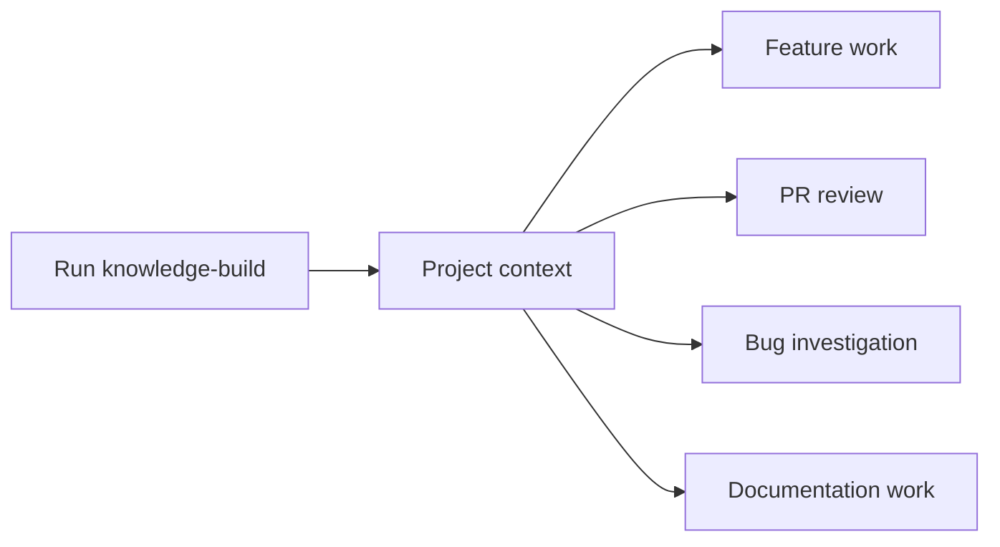
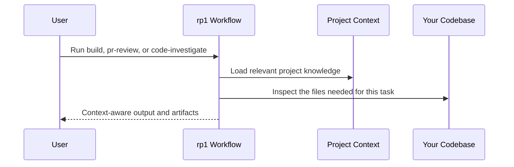

# Project Context

Project context is the shared understanding rp1 builds about your codebase.
Once that context exists, workflows can follow your architecture, terminology,
and patterns without asking you to paste the same background into every chat.

---

## The Problem

Generic AI assistants suffer from **context blindness**:

```
You: "Add a new API endpoint for user preferences"
AI: [creates endpoint with patterns from generic tutorials]
    - Uses different error handling than your codebase
    - Ignores your existing middleware
    - Doesn't follow your naming conventions
    - Misses your authentication patterns
```

Even when you provide context manually, you're limited by:

- Token limits (can't paste your whole codebase)
- Memory of what's relevant
- Time spent gathering context each session

---

## How Project Context Works

rp1 uses a simple user-facing loop:

1. Run `knowledge-build` when you first set up the project or after major architectural changes.
2. rp1 analyzes the repository and writes project context for later workflows.
3. Feature, review, investigation, and documentation workflows load the relevant context before acting.


```mermaid
flowchart LR
    Setup[Run knowledge-build] --> Context[Project context]
    Context --> Feature[Feature work]
    Context --> Review[PR review]
    Context --> Investigate[Bug investigation]
    Context --> Docs[Documentation work]
```

### Self-Contained Context Loading

rp1 workflows are self-contained after project context exists. You do not need a
separate "load the project first" step before each workflow.


```mermaid
sequenceDiagram
    participant User
    participant Workflow as rp1 Workflow
    participant Context as Project Context
    participant Code as Your Codebase

    User->>Workflow: Run build, pr-review, or code-investigate
    Workflow->>Context: Load relevant project knowledge
    Workflow->>Code: Inspect the files needed for this task
    Workflow-->>User: Context-aware output and artifacts
```

!!! tip "Progressive Loading"
    Workflows load the context they need for the current job instead of trying to
    use every project file at once.

---

## What The Context Helps With

| Area | Example |
|------|---------|
| Project structure | Which modules, packages, or apps matter for a task |
| Architecture | Where new behavior should live and what boundaries to respect |
| Patterns | Naming, testing, error handling, state management, and integration style |
| Product language | Domain terms the project already uses |
| User surfaces | CLI, UI, docs, or workflow behavior that users see |

For the raw files and directory layout, see [The `.rp1` Directory](../getting-started/rp1-directory.md). Most users only need to know that context exists and should be refreshed when the project changes significantly.

---

## Example: Before and After

### Before: Generic Response

```
You: "Add a new validator for phone numbers"
AI: function validatePhone(phone) {
      return /^\d{10}$/.test(phone);
    }
```

Problems:
- Ignores your existing validator patterns
- Doesn't use your error message format
- Missing your standard validation utilities

### After: Context-Aware Response

With project context available, the workflow has enough background to know:
- You use a `Validator` class pattern
- Error messages follow `<field>: <message>` format
- Validators are in `src/validators/`
- You have a `ValidationResult` type

```typescript
// src/validators/phone.ts
import { Validator, ValidationResult } from './base';
import { formatError } from '../utils/errors';

export class PhoneValidator extends Validator<string> {
  validate(value: string): ValidationResult {
    const cleaned = value.replace(/\D/g, '');
    if (cleaned.length !== 10) {
      return this.fail(formatError('phone', 'Must be 10 digits'));
    }
    return this.pass(cleaned);
  }
}
```

---

## When to Rebuild the Knowledge Base

Project context should be refreshed when your codebase changes significantly:

| Scenario | Action |
|----------|--------|
| First time using rp1 | Run `knowledge-build` |
| Added new architectural patterns | Rebuild |
| Major refactoring | Rebuild |
| Small bug fixes | No rebuild needed |
| Daily development | Incremental builds are fast |

!!! tip "Incremental Builds"
    After the first build (10-15 min), subsequent builds compare against the last analyzed commit and only process changed files (2-5 min).

---

## Key Benefits

<div class="grid cards" markdown>

-   :material-compass: **Pattern Awareness**

    ---

    Workflows can follow your code patterns automatically.

-   :material-book-open-variant: **Domain Understanding**

    ---

    Your business terminology is understood and used correctly.

-   :material-sitemap: **Architecture Respect**

    ---

    New code fits into your existing architecture, not against it.

-   :material-speedometer: **Faster Onboarding**

    ---

    New team members can start from generated orientation before reading raw source.

</div>

---

## Related Concepts

- [Consistent Workflows](constitutional-prompting.md) - Why rp1 workflows are structured
- [Parallel Analysis](map-reduce-workflows.md) - Advanced explanation of how large analysis jobs split work

## Learn More

- [`knowledge-build` Reference](../reference/base/knowledge-build.md) - Generate project context
- [Feature Development Guide](../guides/feature-development.md) - See project-context-backed
  workflows in practice
