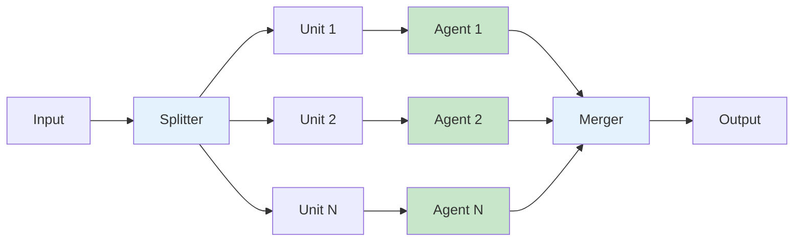
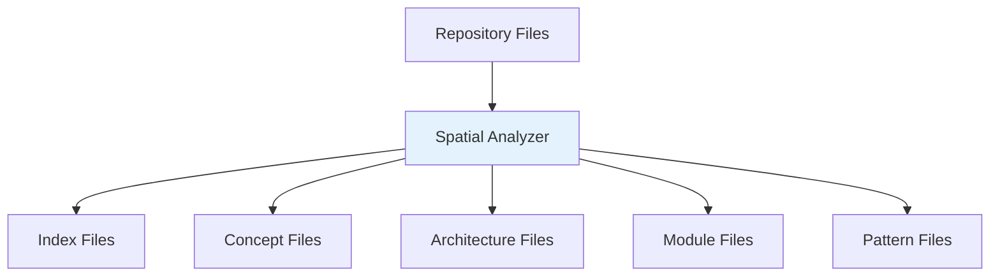
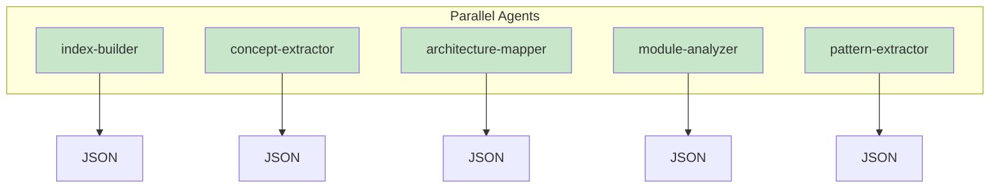
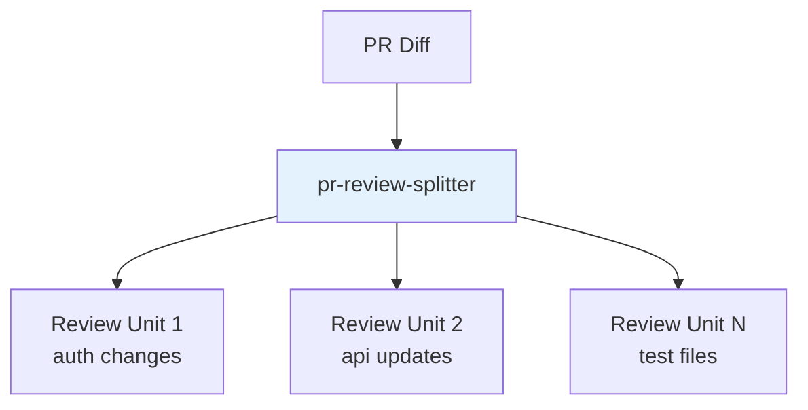
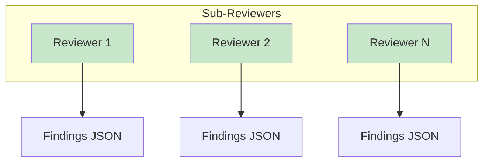
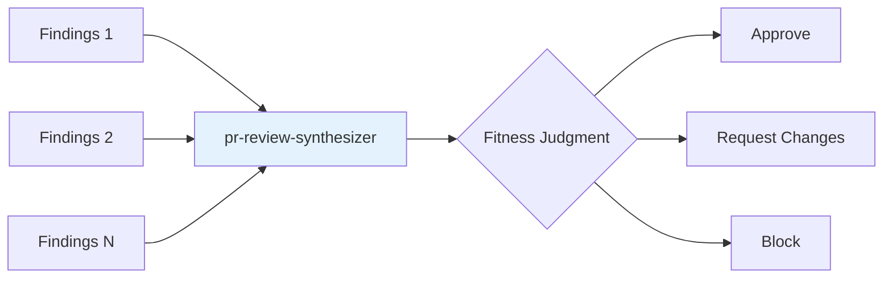

# Map-Reduce Workflows

Map-reduce workflows enable rp1 to process large tasks efficiently by splitting work into parallel units, processing them simultaneously, and merging the results. This pattern powers both knowledge base generation and PR reviews.

---

## The Pattern

Map-reduce consists of three phases:

1. **Map**: Split work into independent units
2. **Process**: Run N agents in parallel
3. **Reduce**: Merge results into final output



---

## Knowledge Base Generation

The `knowledge-build` command uses map-reduce to analyze your codebase:

### Phase 1: Map (Spatial Analysis)

The spatial analyzer scans your repository and categorizes files by KB section:



**What it produces:**
- Ranked file lists (importance 0-5)
- Categorization by KB section
- Dependency mapping

### Phase 2: Process (5 Parallel Agents)

Five specialized agents process their assigned files simultaneously:

| Agent | Input | Output |
|-------|-------|--------|
| index-builder | Entry points, configs | `index.md` data |
| concept-extractor | Domain files | `concept_map.md` data |
| architecture-mapper | Core modules | `architecture.md` data |
| module-analyzer | All modules | `modules.md` data |
| pattern-extractor | Source files | `patterns.md` data |



### Phase 3: Reduce (Merge)

The orchestrator merges JSON outputs into final KB files:

```
.rp1/context/
├── index.md         ← from index-builder
├── concept_map.md   ← from concept-extractor
├── architecture.md  ← from architecture-mapper
├── modules.md       ← from module-analyzer
├── patterns.md      ← from pattern-extractor
├── state.json       ← build metadata (shareable)
└── meta.json        ← local paths (not shared)
```

---

## PR Review

The `pr-review` command uses map-reduce to review pull requests:

### Phase 1: Map (Diff Splitting)

The splitter segments the PR diff into reviewable units:



**What it does:**
- Groups related file changes
- Filters generated/low-value files
- Creates focused review units

### Phase 2: Process (N Sub-Reviewers)

Each review unit is analyzed by a sub-reviewer across 5 dimensions:

| Dimension | Focus |
|-----------|-------|
| Correctness | Logic errors, edge cases |
| Security | Vulnerabilities, auth issues |
| Performance | Bottlenecks, inefficiencies |
| Maintainability | Code quality, patterns |
| Testing | Coverage, test quality |



**Confidence Gating:**
- 65%+ confidence: Include finding
- 40-64% (critical/high): Investigation protocol
- Below 40%: Exclude from report

### Phase 3: Reduce (Synthesis)

The synthesizer merges findings into a holistic judgment:



**Output:**
- Consolidated findings by severity
- Cross-file issue detection
- Overall fitness judgment (approve/request_changes/block)

---

## Performance Benefits

### KB Generation

| Scenario | Without Map-Reduce | With Map-Reduce |
|----------|-------------------|-----------------|
| First build | 30-45 minutes | 10-15 minutes |
| Incremental | 10-15 minutes | 2-5 minutes |

**Why faster:**
- 5 agents work simultaneously
- Each focuses on specific file types
- No redundant processing

### PR Review

| Scenario | Sequential | Parallel |
|----------|-----------|----------|
| Small PR (5 files) | Similar | Similar |
| Medium PR (20 files) | 3x slower | Baseline |
| Large PR (100+ files) | 10x slower | Manageable |

**Why better:**
- Large diffs split into parallel units
- Sub-reviewers work independently
- Synthesis catches cross-file issues

---

## Key Benefits

<div class="grid cards" markdown>

-   :material-speedometer: **Parallelization**

    ---

    Multiple agents work simultaneously, reducing wall-clock time.

-   :material-magnify-expand: **Scalability**

    ---

    Large codebases and PRs are handled by splitting work.

-   :material-focus-auto: **Specialization**

    ---

    Each agent focuses on its area of expertise.

-   :material-merge: **Holistic Results**

    ---

    Merge phase combines insights for complete picture.

</div>

---

## Related Concepts

- [Knowledge-Aware Agents](knowledge-aware-agents.md) - How KB is used by agents
- [Constitutional Prompting](constitutional-prompting.md) - How agents execute

## Learn More

- [`knowledge-build` Reference](../reference/base/knowledge-build.md) - KB generation command
- [`pr-review` Reference](../reference/dev/pr-review.md) - PR review command
