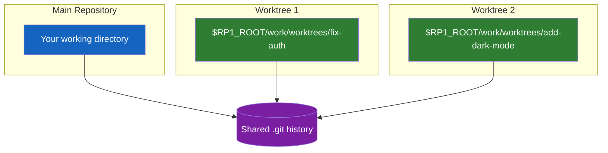

# Parallel Worktrees

rp1 uses **git worktrees** to enable parallel task execution. Each task runs in its own isolated directory with a dedicated branch, so you can work on multiple features simultaneously without branch switching or stashing.

!!! tip "Ready to use it?"
    For practical usage instructions, see the [Parallel Development Guide](../guides/parallel-development.md).

---

## The Problem with Sequential Work

Traditional AI coding workflows are sequential:

1. Start a feature on a branch
2. Wait for completion
3. Review and merge
4. Start the next feature

This creates bottlenecks. While waiting for one task, your main working directory is occupied. You can't easily start another task without stashing changes or creating merge conflicts.

---

## How Worktrees Solve This

Git worktrees create **additional working directories** linked to the same repository. Each worktree has its own:

- Working directory with full file tree
- Checked-out branch
- Index (staging area)

But they share the same `.git` history, so commits in any worktree are immediately available everywhere.

---

## Worktree Isolation Benefits

### Protected Uncommitted Work

Your main directory's uncommitted changes are never touched. Agents work on the last committed state (HEAD), so your in-progress work remains safe.

### Disabled Git Hooks

Worktrees have git hooks disabled (`core.hooksPath=/dev/null`). This prevents:

- Pre-commit hooks from blocking agent commits
- Slow linters from running on every commit
- Unexpected hook behavior in isolated environments

### Clean Experimentation

If a task goes wrong, the worktree can be deleted without affecting anything else. The branch is preserved for debugging if needed.

---

## Related

- [Parallel Development Guide](../guides/parallel-development.md) - Practical usage instructions
- [Map-Reduce Workflows](map-reduce-workflows.md) - Another parallelization pattern in rp1
- [`/build-fast`](../reference/dev/build-fast.md) - Primary command using worktrees
