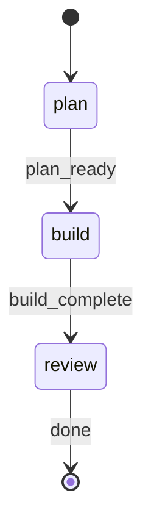
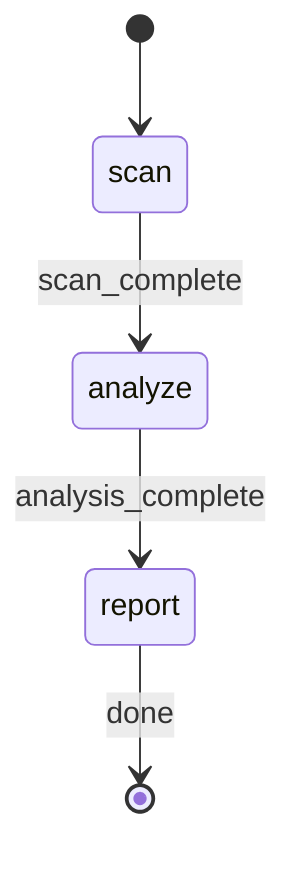

# Declarative State Machines

rp1 supports declarative workflow state management via co-located Mermaid state diagrams. Skills that define a `state.mmd` file get validated state transitions, dashboard visibility with step timelines, and run isolation -- without any changes to CLI, API, or UI code.

---

## How It Works

A skill opts in to state management by placing a `state.mmd` file alongside its `SKILL.md`:

```
plugins/dev/skills/build/
  SKILL.md
  state.mmd        <-- opt-in to state management
```

The system parses the state diagram into a typed model and uses it for:
- **Transition validation**: The CLI rejects invalid state transitions
- **Dashboard step timelines**: Steps are derived dynamically from the state machine
- **Run isolation**: Each workflow invocation is tracked independently via run IDs
- **WebSocket events**: Real-time progress updates pushed to the dashboard

Skills without `state.mmd` are completely unaffected -- no tracking, no validation, no dashboard presence.

---

## Creating a state.mmd File

Use standard [Mermaid stateDiagram-v2](https://mermaid.js.org/syntax/stateDiagram.html) syntax:



### Supported Syntax

| Syntax | Example | Purpose |
|--------|---------|---------|
| Initial transition | `[*] --> state_id` | Marks the starting state(s) |
| Terminal transition | `state_id --> [*]` | Marks ending state(s) |
| Simple transition | `source --> target` | State-to-state edge |
| Labeled transition | `source --> target : label` | Edge with description (informational) |
| State declaration | `state state_id : Description` | State with display label |
| Comment | `%% comment text` | Ignored by parser |

### Not Supported

These features are intentionally out of scope:
- Nested/composite states (`state Parent { ... }`)
- Fork/join (`<<fork>>`, `<<join>>`)
- Concurrent regions
- Notes, direction directives

### Rules

1. **State IDs must match step field values** used in `rp1 agent-tools work update --step` commands
2. **At least one initial state** is required (`[*] --> state_id`)
3. **Terminal states** are optional but recommended (`state_id --> [*]`)
4. **Transition labels** are informational -- validation operates on state-to-state edges, not labels

---

## Adding the STATE-MACHINE Section

Skills with a `state.mmd` file must include a `STATE-MACHINE` section in their `SKILL.md`. This section replaces scattered "Report status" directives and instructs the agent to follow the state graph:

```markdown
## STATE-MACHINE

Read the co-located `state.mmd` file in this skill's directory. This defines the workflow graph.

**On each phase transition**, report via:
```
rp1 agent-tools work update \
  --project {PROJECT_PATH} \
  --feature {FEATURE_ID} \
  --workflow {SKILL_NAME} \
  --run-id {RUN_ID} \
  --step {CURRENT_STATE} \
  --status {STATUS_VALUE}
```

- Generate `RUN_ID` as a UUID at workflow start
- Follow transition edges in the graph; do not skip states
- On error, follow failure transitions defined in the graph
```

The section is under 15 lines and provides the agent with everything it needs to report validated transitions.

---

## Two-Layer State Model

The system maintains two orthogonal state dimensions for state-machine-enabled workflows:

| Dimension | What it represents | Values | Storage |
|-----------|--------------------|--------|---------|
| **StatusValue** | Activity category (WHAT is happening) | started, in_progress, waiting-input, needs-review, completed, failed | `status` column |
| **WorkflowState** | Workflow phase (WHERE in the workflow) | Defined by state.mmd (e.g., requirements, design, build) | `step` column |

These are independent: a workflow can be "in_progress" at the "design" phase, or "waiting-input" at the "requirements" phase.

---

## CLI Usage

### Reporting State Transitions

```bash
rp1 agent-tools work update \
  --project "$(pwd)" \
  --feature my-feature \
  --workflow build \
  --run-id "550e8400-e29b-41d4-a716-446655440000" \
  --step design \
  --status in_progress
```

| Flag | Required | Description |
|------|----------|-------------|
| `--workflow` | Yes (for state-machine skills) | Skill name whose state.mmd to validate against |
| `--run-id` | Optional | UUID grouping updates into a discrete workflow run |
| `--step` | Yes | The workflow state (must be a valid state ID from state.mmd) |
| `--status` | Yes | Activity status (started, in_progress, etc.) |
| `--ttl` | Optional | TTL in seconds for expiry (default: 28800 = 8 hours) |

### Transition Validation

Invalid transitions are rejected:

```
Error: Invalid transition from 'requirements' to 'verify'.
Valid next states: design
```

The first update for a run must target an initial state (one reached via `[*] -->` in the diagram).

### Run Isolation

Each `--run-id` creates an independent workflow invocation. Multiple concurrent runs of the same workflow on the same feature are tracked separately:

```bash
# Run A at "verify" phase
rp1 agent-tools work update --workflow build --run-id run-A --step verify --status in_progress

# Run B at "design" phase (independent)
rp1 agent-tools work update --workflow build --run-id run-B --step design --status in_progress
```

### Cleaning Up Stale Runs

Agents that crash mid-workflow leave rows with an `expires_at` timestamp. These rows are automatically filtered on read. For manual cleanup:

```bash
# Preview what would be deleted
rp1 agent-tools work cleanup --dry-run

# Delete all expired runs
rp1 agent-tools work cleanup

# Delete runs expired more than 24 hours ago
rp1 agent-tools work cleanup --older-than 24
```

---

## Examples

### Existing State Machines

| Skill | States | Shape |
|-------|--------|-------|
| build | requirements, design, tasks, build, verify, archive | Linear with verify->build retry loop |
| build-fast | plan, build, review | Linear (3 steps) |
| pr-review | split, review, synthesize, post | Linear (4 steps) |
| deep-research | clarify, plan, explore, synthesize, report | Linear (5 steps) |
| blueprint | detect, charter, prd | Branching (detect -> charter or prd) |

### Adding State Tracking to a New Skill

1. Create `state.mmd` in the skill directory:

```
plugins/dev/skills/code-audit/state.mmd
```



2. Add the `STATE-MACHINE` section to `SKILL.md` (see template above)

3. The skill now appears in the dashboard with a 3-step timeline -- no API or UI code changes needed.

---

## Related Concepts

- [SKILL.md Format](skill-format.md) -- How skills are structured
- [Skill-Agent Pattern](command-agent-pattern.md) -- How skills delegate to agents
- [Web UI Dashboard](webui.md) -- Where workflow progress is displayed
