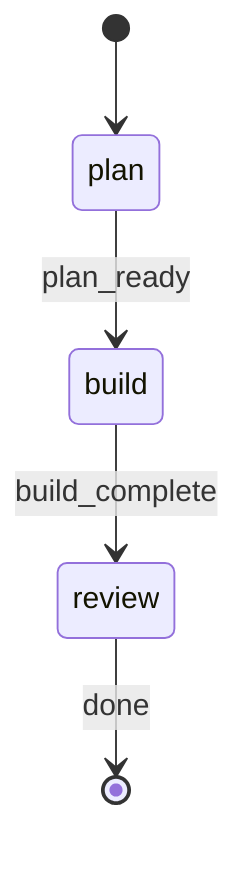
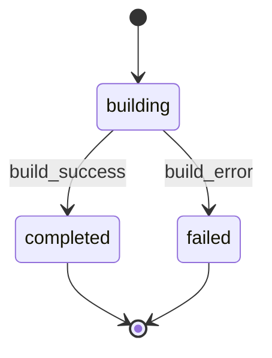
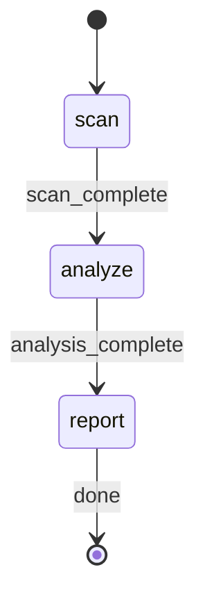

# Declarative State Machines

rp1 supports declarative workflow state management via embedded Mermaid state diagrams. Skills and agents that include a `## STATE-MACHINE` section with a `stateDiagram-v2` block get validated state transitions, dashboard visibility with step timelines, and run isolation -- without any changes to CLI, API, or UI code.

---

## How It Works

A skill or agent opts in to state management by embedding a `stateDiagram-v2` mermaid block inside a `## STATE-MACHINE` section in its markdown file:

```markdown
## STATE-MACHINE



**On each phase transition**, report via:
...
```

The system extracts and parses the state diagram into a typed model and uses it for:
- **Transition validation**: The CLI rejects invalid state transitions
- **Dashboard step timelines**: Steps are derived dynamically from the state machine
- **Run isolation**: Each workflow invocation is tracked independently via run IDs
- **WebSocket events**: Real-time progress updates pushed to the dashboard
- **Agent sub-state tracking**: Agents report state validated against their own state machine, nested within the parent workflow

Skills and agents without a `## STATE-MACHINE` section are completely unaffected -- no tracking, no validation, no dashboard presence.

---

## Defining a State Machine

Embed a standard [Mermaid stateDiagram-v2](https://mermaid.js.org/syntax/stateDiagram.html) block inside a `## STATE-MACHINE` section:


### Supported Syntax

| Syntax | Example | Purpose |
|--------|---------|---------|
| Initial transition | `[*] --> state_id` | Marks the starting state(s) |
| Terminal transition | `state_id --> [*]` | Marks ending state(s) |
| Simple transition | `source --> target` | State-to-state edge |
| Labeled transition | `source --> target : label` | Edge with description (informational) |
| State declaration | `state state_id : Description` | State with display label |
| Comment | `%% comment text` | Ignored by parser |

### Not Supported

These features are intentionally out of scope:
- Nested/composite states (`state Parent { ... }`)
- Fork/join (`<<fork>>`, `<<join>>`)
- Concurrent regions
- Notes, direction directives

### Rules

1. **State IDs must match step field values** used in `rp1 agent-tools emit --step` commands
2. **At least one initial state** is required (`[*] --> state_id`)
3. **Terminal states** are optional but recommended (`state_id --> [*]`)
4. **Transition labels** are informational -- validation operates on state-to-state edges, not labels
5. **One state machine per file** -- the extractor uses the first `stateDiagram-v2` block in the `## STATE-MACHINE` section

---

## Skill State Machines

Skills define their state machine directly in `SKILL.md`:

```markdown
## STATE-MACHINE


**On each phase transition**, report via:
rp1 agent-tools emit \
  --type status_change \
  --run-id {RUN_ID} \
  --step {CURRENT_STATE} \
  --data '{"status": "running"}'

- Generate `RUN_ID` as a UUID at workflow start
- Report each step with `--data '{"status": "running"}'` when entering it
- For non-terminal states: moving to the next state implies the previous completed
- For terminal states (those with `→ [*]` transitions): report with `--data '{"status": "completed"}'` when the step's work finishes
- Follow transition edges in the graph; do not skip states
```

---

## Agent State Machines

Agents can also define state machines, enabling validated state tracking at the agent level. Agent state machines are embedded in the agent `.md` file:

```markdown
## STATE-MACHINE



**On each transition**, report via:
rp1 agent-tools emit \
  --type status_change \
  --run-id {RUN_ID} \
  --step {CURRENT_STATE} \
  --unit {TASK_ID} \
  --data '{"status": "running"}'
```

### Agent Status Reporting

Agents report status using the same `emit` command. The `--unit` flag can be used for per-task tracking:

```bash
rp1 agent-tools emit \
  --type status_change \
  --run-id "550e8400-e29b-41d4-a716-446655440000" \
  --step building \
  --unit T1 \
  --data '{"status": "running"}'
```

- `--run-id` associates the event with the parent workflow run
- `--unit` enables per-task tracking within the agent

### Per-Task Tracking with `--unit`

When an agent processes multiple tasks (e.g., task-builder implementing T1, T2, T3), each task's state is tracked independently using the `--unit` flag:

```bash
# T1 starts building
rp1 agent-tools emit --type status_change --run-id run-1 \
  --step building --unit T1 --data '{"status": "running"}'

# T1 completes
rp1 agent-tools emit --type status_change --run-id run-1 \
  --step completed --unit T1 --data '{"status": "completed"}'

# T2 starts building (independent of T1)
rp1 agent-tools emit --type status_change --run-id run-1 \
  --step building --unit T2 --data '{"status": "running"}'
```

- Each task progresses through the workflow independently
- The dashboard shows per-task state within the agent's nested view

### Parent Skill Context

Parent skills that spawn agents with state machines must pass workflow context so agent updates are attributed to the correct run:

| Parameter | Purpose |
|-----------|---------|
| WORKFLOW | Parent skill name (e.g., "build") |
| RUN_ID | Parent workflow's run UUID |
| FEATURE_ID | Feature identifier |

---

## Two-Layer State Model

The system maintains two orthogonal state dimensions for state-machine-enabled workflows:

| Dimension | What it represents | Values | Storage |
|-----------|--------------------|--------|---------|
| **StatusValue** | Activity category (WHAT is happening) | not_started, running, waiting, completed, failed, skipped | `status` column |
| **WorkflowState** | Workflow phase (WHERE in the workflow) | Defined by state diagram (e.g., requirements, design, build) | `step` column |

These are independent: a workflow can be "in_progress" at the "design" phase, or "waiting-input" at the "requirements" phase.

---

## CLI Usage

### Reporting State Transitions (Skills)

```bash
rp1 agent-tools emit \
  --type status_change \
  --run-id "550e8400-e29b-41d4-a716-446655440000" \
  --step design \
  --data '{"status": "running"}'
```

### Reporting State Transitions (Agents)

```bash
rp1 agent-tools emit \
  --type status_change \
  --run-id "550e8400-e29b-41d4-a716-446655440000" \
  --step building \
  --unit T1 \
  --data '{"status": "running"}'
```

### CLI Flags

| Flag | Required | Description |
|------|----------|-------------|
| `--type` | Yes | Event type (e.g., `status_change`) |
| `--run-id` | Yes | UUID grouping events into a discrete workflow run |
| `--step` | Yes (for status_change) | The workflow/agent state (must be a valid state ID) |
| `--unit` | No | Task/unit identifier for per-task tracking |
| `--data` | Yes (for status_change) | JSON payload with status (e.g., `'{"status": "running"}'`) |
| `--project` | No | Project path (defaults to cwd) |

### Transition Validation

Invalid transitions are rejected:

```
Error: Invalid transition from 'requirements' to 'verify'.
Valid next states: design
```

The first update for a run must target an initial state (one reached via `[*] -->` in the diagram).

### Run Isolation

Each `--run-id` creates an independent workflow invocation. Multiple concurrent runs of the same workflow on the same feature are tracked separately:

```bash
# Run A at "verify" phase
rp1 agent-tools emit --type status_change --run-id run-A --step verify --data '{"status": "running"}'

# Run B at "design" phase (independent)
rp1 agent-tools emit --type status_change --run-id run-B --step design --data '{"status": "running"}'
```

### Cleaning Up Stale Runs

Agents that crash mid-workflow leave rows with an `expires_at` timestamp. These rows are automatically filtered on read. For manual cleanup:

```bash
# Preview what would be deleted
rp1 agent-tools work cleanup --dry-run

# Delete all expired runs
rp1 agent-tools work cleanup

# Delete runs expired more than 24 hours ago
rp1 agent-tools work cleanup --older-than 24
```

---

## Examples

### Existing State Machines

**Skills**:

| Skill | States | Shape |
|-------|--------|-------|
| build | requirements, design, tasks, build, verify, archive | Linear with verify->build retry loop |
| build-fast | plan, build, review | Linear (3 steps) |
| pr-review | split, review, synthesize, post | Linear (4 steps) |
| deep-research | clarify, plan, explore, synthesize, report | Linear (5 steps) |
| blueprint | detect, charter, prd | Branching (detect -> charter or prd) |

**Agents**:

| Agent | States | Shape |
|-------|--------|-------|
| task-builder | building, completed, failed | Linear with error branch |
| task-reviewer | reviewing, completed, failed | Linear with error branch |
| feature-verifier | verifying, completed, failed | Linear with error branch |
| hypothesis-tester | testing, completed, failed | Linear with error branch |

### Adding State Tracking to a New Skill

1. Add a `## STATE-MACHINE` section to your `SKILL.md`:

```markdown
## STATE-MACHINE


```

2. Include the CLI command template for reporting transitions (see template above).

3. The skill now appears in the dashboard with a 3-step timeline -- no API or UI code changes needed.

### Adding State Tracking to an Agent

1. Add a `## STATE-MACHINE` section to the agent `.md` file with the state diagram and CLI template using `--agent`.

2. Ensure the parent skill passes `WORKFLOW`, `RUN_ID`, and `FEATURE_ID` to the agent.

3. Agent state transitions appear nested within the parent workflow's phase on the dashboard.

### Registering Artifacts

Skills that produce output files (reports, design docs, task files) should register them explicitly so the dashboard can display them:

```bash
rp1 agent-tools work artifact \
  --project "$(pwd)" \
  --feature {FEATURE_ID} \
  --run-id {RUN_ID} \
  --path {relative_path_to_artifact} \
  [--type markdown|code|diagram|diff|report|other]
```

- `--path` is relative to the project root (e.g., `.rp1/work/features/my-feature/tasks.md`)
- `--type` is auto-classified from the file extension if omitted
- Artifacts are stored in the `artifacts` table in `~/.rp1/status.db`
- The dashboard queries this table instead of scanning the filesystem

---

## Related Concepts

- [SKILL.md Format](skill-format.md) -- How skills are structured
- [Skill-Agent Pattern](command-agent-pattern.md) -- How skills delegate to agents
- [Web UI Dashboard](../web-ui/v2-dashboard.md) -- Where workflow progress is displayed
