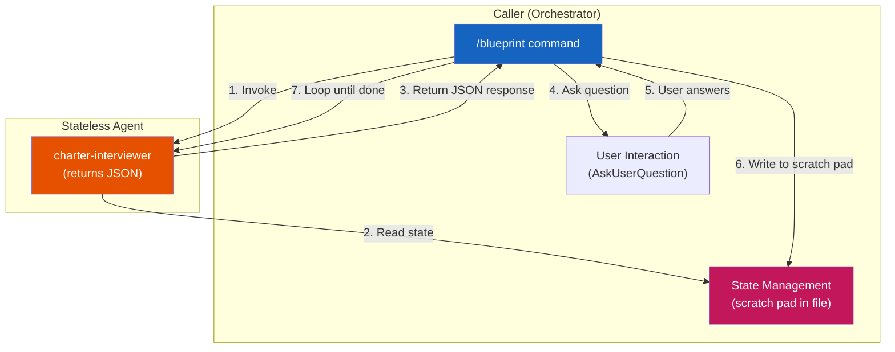
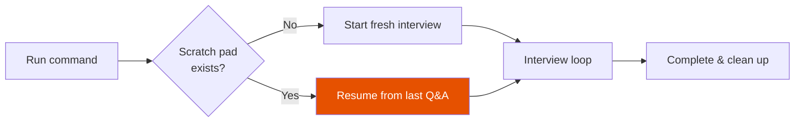

# Stateless Agent Pattern

The Stateless Agent pattern enables **resumable interview workflows** in rp1. When you're interrupted during a guided interview (like charter creation), you can pick up exactly where you left off. The agent reads its state from a visible "scratch pad" section rather than relying on conversation memory.

---

## How It Works

In the standard command-agent pattern, agents execute autonomously and maintain state in conversation context. This works well for single-pass workflows but breaks down when:

- The session is interrupted (timeout, crash, user pause)
- The workflow spans multiple invocations
- Users need visibility into accumulated state

The Stateless Agent pattern solves this by separating **orchestration** (the caller) from **analysis** (the agent):



---

## User-Visible Behavior

When you run a command that uses the Stateless Agent pattern (like `/blueprint`), you'll notice a **Scratch Pad** section at the bottom of the document being created:

```markdown
## Scratch Pad

<!-- Interview state - will be removed upon completion -->
<!-- Mode: CREATE -->
<!-- Started: 2025-12-27T10:30:00Z -->

### Q1: Brain Dump
**Asked**: Tell me everything about this project...
**Answer**: We're building a task management app for remote teams...

### Q2: Target Users
**Asked**: Who are the primary users?
**Answer**: Product managers and team leads in companies with 10-50 employees.
```

This scratch pad:

- **Shows your progress**: See all questions asked and answers given
- **Persists to disk**: Survives crashes, timeouts, and session interruptions
- **Enables resume**: Re-running the command continues where you left off
- **Gets cleaned up**: Removed automatically when the interview completes successfully

---

## Resume Capability

If your session is interrupted, simply re-run the same command:

```bash
# Session 1: Start blueprint, interrupted after Q2
/rp1-dev:blueprint

# Session 2: Resume from where you left off
/rp1-dev:blueprint
```

When you resume:

1. The command detects the existing scratch pad
2. The agent reads prior Q&A history
3. Interview continues from the next question
4. Previously answered questions are **not** re-asked



---

## Comparison with Standard Agents

| Aspect | Standard Agent | Stateless Agent |
|--------|----------------|-----------------|
| State storage | Conversation context | File-based scratch pad |
| Resumability | No | Yes |
| User visibility | Hidden | Visible scratch pad |
| Session dependency | Tied to session | Session-independent |
| Complexity | Lower | Higher (orchestration loop) |

---

## Example: Charter Interview

The `/blueprint` command uses the Stateless Agent pattern for charter creation:

1. **Mode Detection**: Command checks if charter.md exists, has scratch pad
2. **Initialize**: Creates charter with scratch pad section
3. **Interview Loop**: Repeatedly invokes charter-interviewer agent
4. **Response Handling**: Agent returns JSON with next question or completion
5. **User Interaction**: Command asks user, writes answer to scratch pad
6. **Completion**: Scratch pad removed, charter finalized

The charter-interviewer agent is **stateless**—it reads the scratch pad, analyzes gaps, and returns a JSON response. It never asks questions directly.

---

## Key Benefits

<div class="grid cards" markdown>

-   :material-restart: **Resumability**

    ---

    Interrupted sessions can continue from where they left off.

-   :material-eye: **Transparency**

    ---

    Users see accumulated state in the scratch pad during interviews.

-   :material-shield: **Robustness**

    ---

    State persists even if the AI session crashes.

-   :material-test-tube: **Testability**

    ---

    Agents are pure functions: input state, output JSON response.

</div>

---

## Related Concepts

- [Command-Agent Pattern](command-agent-pattern.md) - The base pattern that Stateless Agents extend
- [Constitutional Prompting](constitutional-prompting.md) - How agents are structured

## Learn More

- [Feature Development Tutorial](../guides/feature-development.md) - See workflows in action
- [`blueprint` Reference](../reference/dev/blueprint.md) - Command using Stateless Agents
