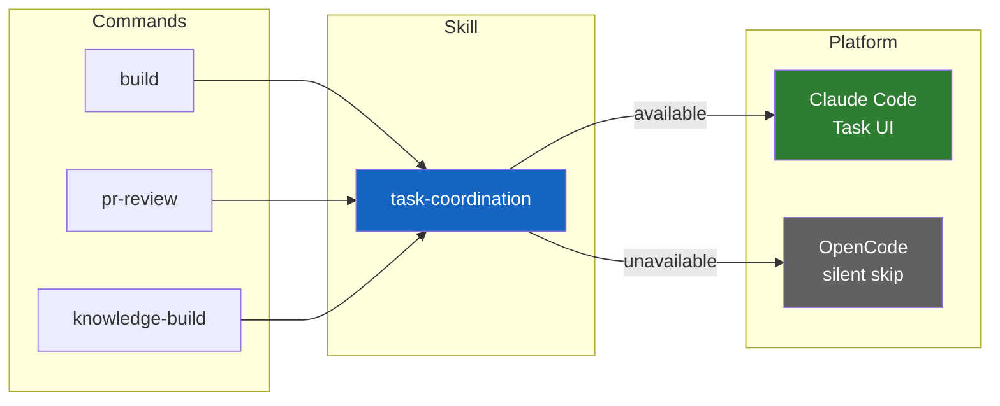
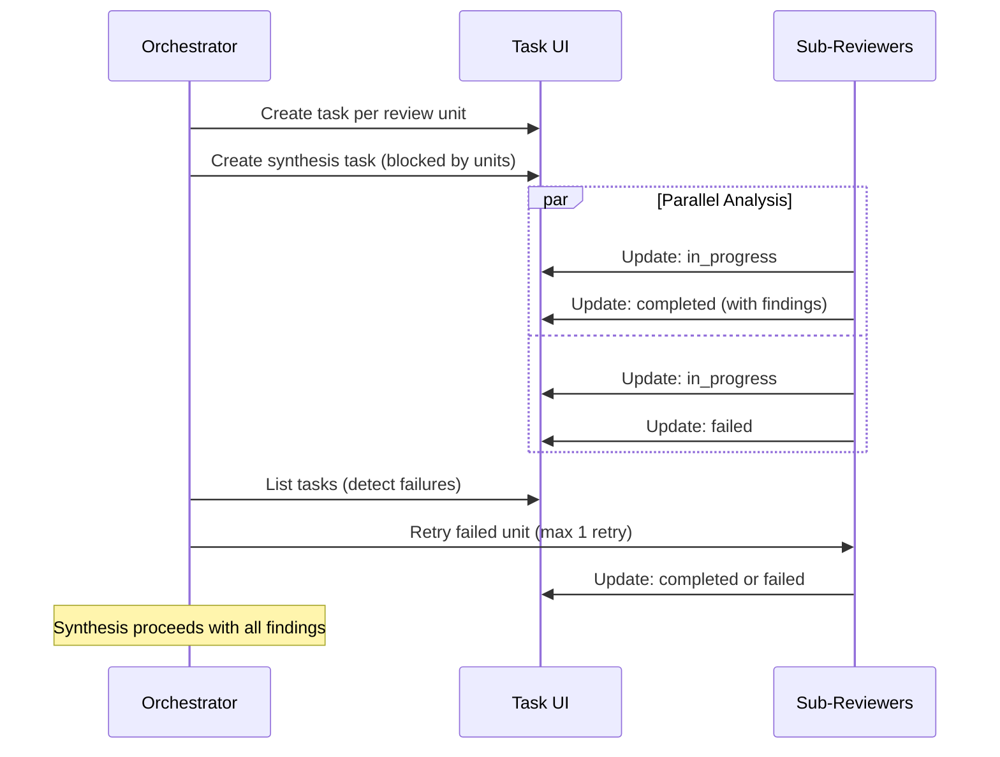

# Task Coordination

Task coordination enables rp1's orchestrator commands to surface real-time progress in Claude Code's native task UI. On platforms without Task tools (OpenCode), all coordination silently skips with zero behavioral change.

---

## The Problem

rp1's orchestrator commands (`build`, `pr-review`, `knowledge-build`) execute multi-step workflows that run for 5-15 minutes. During execution, users have limited visibility into which step is active, which have completed, and whether any have failed. Claude Code provides native Task management tools that can surface this progress directly in the IDE.

---

## The Solution

A **task-coordination skill** (`rp1-base:task-coordination`) abstracts Claude Code's Task tools behind a platform-agnostic interface. Commands load the skill and call its operations at step/phase boundaries. The skill handles feature detection and no-op fallback automatically.

---

## Two Task Systems

rp1 has two distinct "task" concepts that serve different purposes:

| Aspect | tasks.md | Claude Tasks |
|--------|----------|--------------|
| **Purpose** | Durable planning artifact | Ephemeral runtime coordination |
| **Lifecycle** | Persists across sessions | Lives for one workflow execution |
| **Created by** | feature-tasker agent | task-coordination skill |
| **Consumed by** | task-builder, task-reviewer | Claude Code task UI |
| **Content** | Implementation tasks with acceptance criteria | Progress status with activity text |

These systems are complementary. `tasks.md` defines *what* to build. Claude Tasks show *how the build is progressing* in real time.

---

## Feature Detection

The skill uses a **first-call probe** pattern instead of a separate detection step:

1. On the first `createWorkflowTask` call, attempt `TaskCreate` with the real task parameters
2. If it succeeds: `TASK_TOOLS_AVAILABLE = true` -- store the task ID and proceed
3. If it fails: `TASK_TOOLS_AVAILABLE = false` -- all subsequent operations silently skip

This avoids creating dummy probe tasks. The first real workflow task doubles as the detection mechanism.

---

## Progress Visibility

### Build Command (6 Steps)

Each step of the build workflow creates and updates a task:

| Step | Task Subject | Activity Text |
|------|-------------|---------------|
| 1 | Step 1/6: Requirements | Gathering requirements for {feature} |
| 2 | Step 2/6: Design | Creating technical design |
| 3 | Step 3/6: Tasks | Generating implementation tasks |
| 4 | Step 4/6: Build | Implementing tasks |
| 5 | Step 5/6: Verify | Running verification checks |
| 6 | Step 6/6: Archive | Archiving feature |

### PR Review Command (4 Phases)

| Phase | Task Subject | Activity Text |
|-------|-------------|---------------|
| P1 | PR Review: Splitting | Segmenting diff into review units |
| P2 | PR Review: Detailed Analysis | Analyzing N review units |
| P3 | PR Review: Synthesis | Synthesizing cross-file findings |
| P4 | PR Review: Reporting | Generating review report |

### Knowledge-Build Command (5 Tasks)

| Phase | Task Subject | Activity Text |
|-------|-------------|---------------|
| 1 | KB: Spatial Analysis | Categorizing repository files |
| 2a | KB: Concept Extraction | Extracting domain concepts |
| 2b | KB: Architecture Mapping | Mapping system architecture |
| 2c | KB: Module Analysis | Analyzing module structure |
| 2d | KB: Pattern Extraction | Extracting implementation patterns |

Phase 2 tasks are created after Phase 1 completes, since they depend on spatial analysis output.

---

## PR Review Per-Unit Retry

When Task tools are available, PR review gains per-unit retry capability:

When Task tools are unavailable, PR review falls through to the existing threshold-based failure handling with no behavior change.

---

## No-Op Fallback

The no-op path is the default safety net:

| Operation | No-Op Behavior |
|-----------|----------------|
| createWorkflowTask | Returns null |
| updateTaskProgress | Skips (task ID is null) |
| listTasks | Returns empty array |
| getTask | Returns null |

Rules:
- Zero errors, zero output on the no-op path
- No warnings about unavailability
- Workflow logic handles null task IDs gracefully

---

## Coexistence with work-status

Both the `task-coordination` and `work-status` skills fire at step/phase boundaries. They serve different purposes and neither blocks the other:

| Skill | Purpose | Transport |
|-------|---------|-----------|
| work-status | Status Dashboard visibility | rp1 CLI -> SQLite |
| task-coordination | Claude Code native task UI | TaskCreate/TaskUpdate tools |

---

## Related Concepts

- [Map-Reduce Workflows](map-reduce-workflows.md) - How PR review and KB generation parallelize work
- [Builder-Reviewer Agents](builder-reviewer-agents.md) - How the build command implements tasks
- [Skills](skills.md) - How skills provide reusable capabilities to agents

## Learn More

- [`build` Reference](../reference/dev/build.md) - Build command documentation
- [`pr-review` Reference](../reference/dev/pr-review.md) - PR review command documentation
- [`knowledge-build` Reference](../reference/base/knowledge-build.md) - KB generation command documentation
