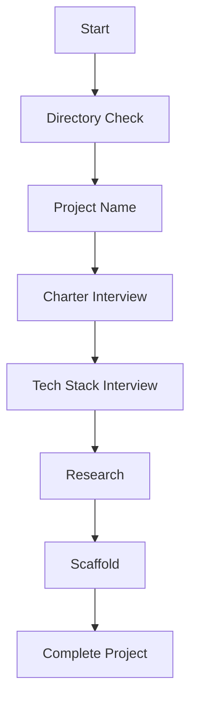

# Bootstrap Tutorial

Create a complete project from scratch with rp1's guided bootstrap workflow. This tutorial walks you through starting a greenfield project with proper structure, documentation, and runnable code.

**Time to complete**: ~15-20 minutes

---

## What You'll Learn

- How rp1 detects greenfield vs brownfield projects
- Using the `/bootstrap` command to create new projects
- The charter interview process for capturing project vision
- Tech stack selection and best practices research
- The structure of a bootstrapped project

## Prerequisites

!!! warning "Before You Begin"
    - rp1 installed ([Installation](../getting-started/installation.md))
    - An empty directory or a "projects" folder where you want to create your project
    - Network connectivity (for best practices research)

---

??? info "How Greenfield Detection Works"
    When you run `rp1 init` in a directory, rp1 automatically detects whether you're in a **greenfield** (new project) or **brownfield** (existing codebase) context.

    **Detection Rules:**

    | Directory State | Classification | Suggested Action |
    |-----------------|----------------|------------------|
    | Empty directory | Greenfield | `/bootstrap` |
    | Git repo with source files | Brownfield | `/knowledge-build` |
    | Git repo, only `.git` folder | Greenfield | `/bootstrap` |
    | No git, but has source files | Brownfield | `/knowledge-build` |

    **What You'll See:**

    When `rp1 init` detects a greenfield context:

    ```
    Greenfield project detected

    This directory appears to be empty or starting fresh.

    Next steps:
    - /bootstrap - Create a complete project with guided setup
    ```

---

## Step-by-Step Walkthrough

### Step 1: Start Bootstrap

From an empty directory or your projects folder:

=== "Claude Code"

    ```bash
    /bootstrap my-awesome-app
    ```

=== "OpenCode"

    ```bash
    /rp1-dev/bootstrap my-awesome-app
    ```

If you omit the project name, bootstrap will prompt you for one.

### Step 2: Directory Setup

Bootstrap handles two scenarios:

**Empty Directory**:

```
The current directory is empty. Would you like to:

1. Create project files here (in current directory)
2. Create a new subdirectory called "my-awesome-app"

Reply with "here" or "subdirectory" (or 1/2).
```

**Non-Empty Directory** (e.g., `~/projects/`):

```
The current directory contains existing files:

- project-a/
- project-b/
- notes.md

To avoid conflicts, I'll create your project in a new subdirectory: ./my-awesome-app/

This will NOT modify any existing files in the current directory.

Proceed with creating ./my-awesome-app/? (yes/no)
```

!!! tip "Common Pattern"
    Many developers run `/bootstrap` from their `~/projects/` folder. Bootstrap automatically creates a new subdirectory in this case.

### Step 3: Charter Interview

The charter interviewer asks up to 5 questions to capture your project vision.

**Question 1** (always asked):

```
Tell me everything that's in your head about this project. What are you trying to build?
Who is it for? What problem does it solve? Any ideas about how it should work?

Just dump everything out - we'll organize it together.
```

**Follow-up questions** (up to 4 more):
Based on your response, the interviewer asks targeted questions to fill gaps:

- What's the core problem you're solving?
- Who are the primary users?
- What does success look like?
- Any technical constraints or preferences?

**What to expect**:

After the interview, a charter document is generated at `.rp1/context/charter.md`:

```markdown
# Project Charter: my-awesome-app

**Version**: 1.0.0
**Status**: Draft
**Created**: 2025-01-15

## Vision
[Your project vision from the interview]

## Problem Statement
[The problem you're solving]

## Target Users
[Primary users and their needs]

## Success Criteria
[How success will be measured]

## TBD Items
- [ ] Items marked for later refinement
```

!!! info "Incomplete Information"
    If you're unsure about some aspects, that's okay. The charter will include TBD placeholders that you can refine later with `/blueprint update`.

### Step 4: Tech Stack Interview

The bootstrap scaffolder asks up to 5 questions about your technology preferences:

- **Language**: TypeScript, Python, Rust, Go, etc.
- **Framework**: React, FastAPI, Axum, etc.
- **Package Manager**: npm, pip, cargo, etc.
- **Testing**: Jest, pytest, etc.
- **Build Tools**: Vite, webpack, etc.

**Example exchange**:

```
Based on your charter, I'm thinking about the tech stack.

What programming language would you like to use? If you have
preferences for frameworks, testing tools, or other technologies,
feel free to mention those too.
```

### Step 5: Best Practices Research

Bootstrap performs web research to find:

- Latest stable versions of your chosen technologies
- Current recommended project structure
- Modern configuration patterns
- Testing best practices

This ensures your project starts with up-to-date standards.

### Step 6: Confirmation

Before creating any files, bootstrap shows a summary:

```
Ready to scaffold your project!

Project: my-awesome-app
Location: /Users/you/projects/my-awesome-app

Tech Stack:
- Language: TypeScript
- Framework: React with Vite
- Package Manager: npm
- Testing: Vitest
- Styling: Tailwind CSS

Files to create:
- .rp1/context/charter.md
- .rp1/context/preferences.md
- AGENTS.md, CLAUDE.md
- package.json
- src/main.tsx, src/App.tsx
- tests/App.test.tsx
- README.md
- vite.config.ts, tsconfig.json, etc.

Proceed? (yes/no)
```

### Step 7: Project Generation

After confirmation, bootstrap:

1. Initializes git repository
2. Creates `.rp1/` directory structure
3. Generates `AGENTS.md` and `CLAUDE.md`
4. Creates package manifest with dependencies
5. Generates minimal "hello world" application
6. Creates initial test file
7. Writes README with getting started instructions
8. Installs dependencies
9. Makes initial commit

---

## Generated Project Structure

After bootstrap completes, your project looks like this:

```
my-awesome-app/
├── .git/
├── .rp1/
│   └── context/
│       ├── charter.md          # Project vision
│       └── preferences.md      # Tech decisions
├── AGENTS.md                   # AI assistant guide
├── CLAUDE.md                   # Claude Code config
├── README.md                   # Getting started
├── package.json                # Dependencies
├── src/
│   ├── main.tsx               # Entry point
│   └── App.tsx                # Main component
├── tests/
│   └── App.test.tsx           # Initial test
├── vite.config.ts             # Build config
├── tsconfig.json              # TypeScript config
└── .gitignore
```

!!! note "Stack Variations"
    The exact files vary based on your tech stack. A Python project would have `pyproject.toml`, `src/main.py`, etc.

---

## What Happens Next

After bootstrap completes:

```
Bootstrap complete!

Project: my-awesome-app
Location: /Users/you/projects/my-awesome-app

Next Steps:
1. cd my-awesome-app
2. Review the generated code
3. Run the application (see README.md for commands)
4. Start building your features!

Useful Commands:
- /build my-feature - Build a new feature (full workflow)
- /build-fast "task" - Quick fixes under 2 hours
- /blueprint update - Refine your charter
- /knowledge-build - Generate knowledge base (after adding more code)
```

### Verify Your Project

Example commands (actual commands depend on your chosen tech stack):

```bash
cd my-awesome-app
bun run dev      # Start development server
bun test         # Run tests
```

### Continue Building

Your project is now ready for the standard rp1 workflow. Start with:

```
/build my-feature
```

The `/build` command orchestrates requirements, design, build, verify, and archive steps automatically. See the [Feature Development](feature-development.md) guide for details.

---

## Summary

The bootstrap workflow:

| Step | What Happens | Output |
|------|--------------|--------|
| 1. Directory | Choose location | Target path |
| 2. Charter | Vision interview | charter.md |
| 3. Tech Stack | Stack selection | preferences.md |
| 4. Research | Best practices | Up-to-date versions |
| 5. Confirm | Review summary | User approval |
| 6. Scaffold | Generate project | Complete codebase |

---

## Troubleshooting

??? question "Bootstrap is asking for project name in a non-empty directory"

    This is expected behavior. When run in a directory with existing files, bootstrap always creates a subdirectory to avoid conflicts with existing content.

??? question "Can I bootstrap in a directory with some files?"

    Yes. Bootstrap will show you the existing files, ask for confirmation, and create your project in a new subdirectory.

??? question "My charter has TBD placeholders"

    That's okay. If you weren't sure about some aspects during the interview, you can refine the charter later:
    ```bash
    /blueprint update
    ```

??? question "Can I change the tech stack after bootstrapping?"

    The generated code is yours to modify. However, for significant stack changes, it may be easier to re-run `/bootstrap` in a new directory.

??? question "Bootstrap failed partway through"

    If the charter interview succeeded but scaffolding failed, you can:
    1. Delete the partially created directory
    2. Run `/bootstrap` again

??? question "I want to skip the interviews"

    Bootstrap is designed for guided project creation. If you want minimal scaffolding, consider:
    - Using your framework's CLI directly (e.g., `npm create vite`)
    - Then running `rp1 init` to add rp1 configuration

---

## The Bootstrap Flow



| Phase | Purpose | Duration |
|-------|---------|----------|
| Directory Check | Determine target location | Instant |
| Project Name | Identify the project | ~30 seconds |
| Charter Interview | Capture project vision | 2-5 minutes |
| Tech Stack Interview | Select technologies | 2-5 minutes |
| Research | Find best practices | ~30 seconds |
| Scaffold | Generate project files | ~2 minutes |

---

## Next Steps

Now that your project is bootstrapped, continue building:

[Start Feature Development :material-arrow-right:](feature-development.md){ .md-button .md-button--primary }

**Or explore other guides:**

- [Bug Investigation](bug-investigation.md) - Debug and fix issues systematically
- [PR Review](pr-review.md) - Automated code review workflow
- [Team Onboarding](team-onboarding.md) - Bring your team up to speed
