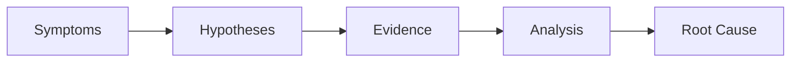

# Bug Investigation Tutorial

Systematically investigate bugs using rp1's hypothesis-driven debugging workflow. This tutorial walks you through diagnosing a production issue from symptoms to root cause.

**Time to complete**: ~20-30 minutes

---

## What You'll Learn

- How rp1's bug investigation command works
- The hypothesis-driven approach to debugging
- Evidence gathering and root cause analysis
- Using knowledge base context for codebase understanding
- Interpreting investigation reports

## Prerequisites

!!! warning "Before You Begin"
    - rp1 installed ([Installation](../getting-started/installation.md))
    - Knowledge base generated (`/knowledge-build`)
    - A bug or issue you want to investigate

---

## The Scenario

We'll investigate an **API timeout issue** in a web application. This example was chosen because:

- Timeout bugs are common in production systems
- They require understanding multiple layers (network, database, application)
- The root cause often isn't obvious from the symptoms

**Symptoms**: Users report that the `/api/orders` endpoint intermittently returns 504 Gateway Timeout errors, typically during peak hours.

---

## The Investigation Workflow



| Phase | Purpose | Output |
|-------|---------|--------|
| Symptoms | Define what you're seeing | Problem description |
| Hypotheses | Generate possible causes | Ranked hypothesis list |
| Evidence | Gather supporting data | Code analysis, logs, patterns |
| Analysis | Evaluate each hypothesis | Confirmation or elimination |
| Root Cause | Identify the actual cause | Investigation report |

---

## Step 1: Start the Investigation

Launch the bug investigator with a description of the issue:

=== "Claude Code"

    ```bash
    /code-investigate "API timeout on /api/orders endpoint during peak hours, returning 504 errors intermittently"
    ```

=== "OpenCode"

    ```bash
    /rp1-dev/code-investigate "API timeout on /api/orders endpoint during peak hours, returning 504 errors intermittently"
    ```

**What happens:**

rp1's bug investigator agent:

1. Loads your knowledge base context
2. Analyzes the symptom description
3. Searches your codebase for relevant code
4. Generates initial hypotheses

**What to expect:**

```
🔍 Bug Investigation Started

Problem: API timeout on /api/orders endpoint during peak hours

Loading knowledge base context...
✓ Architecture understood
✓ Relevant modules identified

Searching codebase for relevant code...
✓ Found: src/api/orders.ts
✓ Found: src/services/orderService.ts
✓ Found: src/db/queries/orderQueries.ts

Generating hypotheses...
```

!!! tip "Checkpoint"
    The investigator should identify files related to the orders endpoint. If it's searching in wrong locations, rebuild your knowledge base with `/knowledge-build`.

---

## Step 2: Review Hypotheses

The investigator generates ranked hypotheses based on your codebase:

**What to expect:**

```
📋 Hypotheses Generated (4)

H1 [HIGH]: Database query N+1 problem
   - Evidence: orderQueries.ts uses sequential queries in a loop
   - Confidence: 75%
   - Would explain: Load-dependent timeouts

H2 [MEDIUM]: Missing database index
   - Evidence: orders table queried by customer_id without index check
   - Confidence: 60%
   - Would explain: Slow queries during high volume

H3 [MEDIUM]: Connection pool exhaustion
   - Evidence: Pool size set to 10, no queue configuration
   - Confidence: 55%
   - Would explain: Intermittent failures under load

H4 [LOW]: External API call blocking
   - Evidence: orderService calls inventory API synchronously
   - Confidence: 40%
   - Would explain: Variable response times
```

**Understanding confidence scores:**

- **75%+**: Strong evidence in codebase, likely cause
- **50-74%**: Supporting evidence, needs verification
- **Below 50%**: Possible but less likely given available evidence

---

## Step 3: Evidence Gathering

The investigator gathers evidence for each hypothesis by examining your code:

**What to expect:**

````
🔎 Gathering Evidence for H1: Database query N+1 problem

Analyzing: src/db/queries/orderQueries.ts

Found pattern at lines 45-52:
```typescript
async function getOrdersWithItems(customerIds: string[]) {
  const orders = await db.query('SELECT * FROM orders WHERE customer_id IN (?)', [customerIds]);

  // N+1 pattern detected: loop with individual queries
  for (const order of orders) {
    order.items = await db.query('SELECT * FROM order_items WHERE order_id = ?', [order.id]);
  }

  return orders;
}
```

Evidence strength: STRONG
- Sequential queries inside loop (line 48-50)
- No batch loading of order items
- Query count = 1 + N (where N = number of orders)
````

!!! info "How Evidence is Gathered"
    The investigator uses your knowledge base to understand your architecture, then performs targeted code searches. It examines actual code patterns, not just file names.

---

## Step 4: Hypothesis Testing

The investigator systematically tests each hypothesis:

**What to expect:**

```
🧪 Testing Hypotheses

H1 [Database N+1]: CONFIRMED ✅
   - Code shows sequential queries in loop
   - 100 orders = 101 database queries
   - Peak hours have ~500 orders/minute
   - Estimated query load: 50,000 queries/minute at peak

H2 [Missing Index]: PARTIAL ✓
   - Index exists on customer_id (found in migrations)
   - But compound index (customer_id, created_at) missing
   - May contribute but not primary cause

H3 [Connection Pool]: UNLIKELY ✗
   - Pool size is 10, but connection time is fast
   - Pool would reject, not timeout
   - Error pattern doesn't match pool exhaustion

H4 [External API]: ELIMINATED ✗
   - Inventory API call is after order fetch
   - Timeout occurs before this code path
   - Confirmed via error timestamps
```

---

## Step 5: Root Cause Report

The investigation concludes with a comprehensive report:

**What to expect:**

```
📊 Investigation Report

Problem: API timeout on /api/orders during peak hours

ROOT CAUSE: Database N+1 Query Pattern

Location: src/db/queries/orderQueries.ts:45-52

Summary:
The getOrdersWithItems function executes 1 query to fetch orders,
then N additional queries to fetch items for each order. During peak
hours (~500 orders/minute), this generates ~50,000 queries/minute,
overwhelming the database connection and causing timeouts.

Contributing Factor:
Missing compound index on (customer_id, created_at) causes table scans
on the initial orders query.

Recommended Fixes:

1. PRIMARY: Refactor to batch query
   ```sql
   SELECT * FROM order_items WHERE order_id IN (?, ?, ...)
   ```

2. SECONDARY: Add compound index
   ```sql
   CREATE INDEX idx_orders_customer_date ON orders(customer_id, created_at);
   ```

Verification Steps:
1. Add query logging to confirm query count
2. Test with production-like data volume
3. Monitor response times after fix

Files to Modify:
- src/db/queries/orderQueries.ts (primary fix)
- migrations/xxx_add_compound_index.sql (secondary fix)

Output: .rp1/work/investigations/api-timeout-orders/report.md
```

!!! tip "Checkpoint"
    The investigation report should identify a clear root cause with specific file locations and line numbers. If the report is vague, provide more context about your symptoms.

---

## Acting on Findings

After the investigation, you have several options. Always reference the investigation report to give the agent full context.

### Option A: Quick Fix

If the fix is straightforward, implement it directly:

```bash
/build-fast "Fix the N+1 query" \
  .rp1/work/investigations/api-timeout-orders/report.md
```

### Option B: Formal Feature

For larger fixes, use the feature workflow:

```bash
/build fix-orders-performance \
  .rp1/work/investigations/api-timeout-orders/report.md
```

### Option C: Further Investigation

If the root cause isn't clear, investigate specific areas:

```bash
/code-investigate "Deep dive into connection pool behavior" \
  .rp1/work/investigations/api-timeout-orders/report.md
```

### Option D: Deep Research

If the issue spans multiple repositories, external services, or requires broader research:

```bash
/deep-research "How does payment service interact with orders API?" \
  .rp1/work/investigations/api-timeout-orders/report.md
```

This is useful for cross-service communication, third-party integrations, or understanding external systems. See [Deep Research](../reference/base/deep-research.md) for more details.

---

## Summary

You've learned the bug investigation workflow:

| Phase | What Happens | Key Insight |
|-------|--------------|-------------|
| Start | Describe symptoms | Be specific about when/where |
| Hypotheses | Agent generates theories | Ranked by confidence |
| Evidence | Code analysis | Actual patterns found |
| Testing | Evaluate each hypothesis | Confirm or eliminate |
| Report | Root cause identified | Actionable fix paths |

### Key Benefits

- **Systematic** - No guessing, evidence-based analysis
- **Context-aware** - Uses your KB to understand architecture
- **Documented** - Full report for team review
- **Actionable** - Specific files and line numbers

---

## Next Steps

- **Fix the bug**: Use [build-fast](../reference/dev/build-fast.md) for simple fixes
- **Larger fixes**: Use the [Feature Development](feature-development.md) workflow
- **Review the PR**: After fixing, use [PR Review](pr-review.md) to verify the change
- **Reference**: See [code-investigate](../reference/dev/code-investigate.md) for full command options

---

## Troubleshooting

??? question "Investigation isn't finding relevant files"

    Your knowledge base may be outdated. Regenerate it:
    ```bash
    /knowledge-build
    ```

    Or provide more specific context in your problem description.

??? question "Hypotheses don't match my intuition"

    The investigator generates hypotheses based on code evidence. If you suspect something specific, include it:
    ```bash
    /code-investigate "API timeout - I suspect it's related to the Redis cache invalidation"
    ```

??? question "Report suggests multiple possible causes"

    This is common for complex bugs. The report ranks causes by confidence. Start with the highest-confidence fix and verify if it resolves the issue.

??? question "Can I investigate without a knowledge base?"

    Yes, but results will be less accurate. The KB provides architectural context that helps the investigator understand your codebase patterns.
