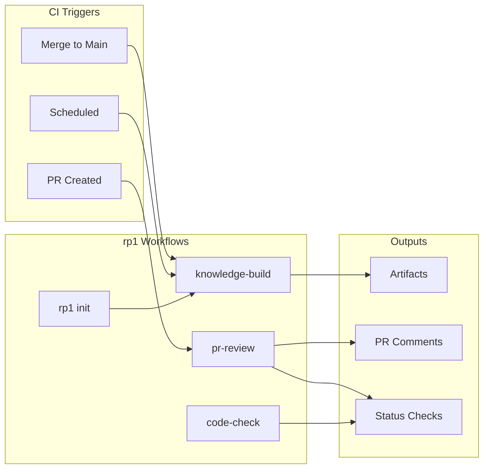

# CI/CD Integration

Automate rp1 workflows in your CI/CD pipeline. This guide covers setup, common workflows, and best practices for integrating rp1 into GitHub Actions, GitLab CI, and other platforms.

**Time to complete**: ~20-30 minutes

---

## What You'll Learn

- Setting up rp1 in CI environments
- Automating KB rebuilds on merge
- Running PR reviews automatically
- Exit codes and error handling
- Artifact storage strategies
- Platform-specific configurations

## Prerequisites

!!! warning "Before You Begin"
    - rp1 installed locally and working ([Installation](../getting-started/installation.md))
    - Familiarity with your CI platform (GitHub Actions, GitLab CI, etc.)
    - Repository with existing `.rp1/` configuration

---

## Overview

rp1 supports non-interactive execution for CI/CD environments. When run without a TTY or with the `--yes` flag, commands use sensible defaults and produce parseable output.



### Key Concepts

| Concept | Description |
|---------|-------------|
| **Non-interactive mode** | Uses `--yes` flag or auto-detects non-TTY |
| **Exit codes** | `0` for success, `1` for failure |
| **Artifacts** | `.rp1/` directory contents for caching/storage |
| **Status checks** | Use exit codes to pass/fail CI checks |

---

## Non-Interactive Mode

### Enabling Non-Interactive Mode

Non-interactive mode is enabled automatically in non-TTY environments or explicitly via flags:

```bash
# Explicit flag
rp1 init --yes

# Automatic (non-TTY detection)
rp1 init | tee output.log
```

### Non-Interactive Defaults

When running non-interactively, these defaults apply:

| Prompt | Default Value |
|--------|---------------|
| Git root choice | Continue in current directory |
| Re-initialization | Skip (no changes) |
| Gitignore preset | Recommended |

### Exit Codes

All rp1 commands use standard exit codes:

| Code | Meaning | CI Interpretation |
|------|---------|-------------------|
| `0` | Success | Check passes |
| `1` | Failure | Check fails |

**Using in scripts:**

```bash
if rp1 init --yes; then
    echo "rp1 initialized"
else
    echo "Initialization failed" >&2
    exit 1
fi
```

### Environment Variables

| Variable | Default | Description |
|----------|---------|-------------|
| `RP1_ROOT` | `.rp1/` | Custom location for rp1 data |
| `CI` | - | Most CI platforms set this automatically |

---

## GitHub Actions Examples

### Workflow 1: KB Rebuild on Merge

Automatically rebuild the knowledge base when code changes merge to main:

```yaml
name: Rebuild Knowledge Base

on:
  push:
    branches: [main]
    paths-ignore:
      - '.rp1/context/**'  # Avoid infinite loops
      - 'docs/**'

jobs:
  rebuild-kb:
    runs-on: ubuntu-latest
    permissions:
      contents: write

    steps:
      - uses: actions/checkout@v4
        with:
          fetch-depth: 0

      - name: Install rp1
        run: curl -fsSL https://rp1.run/install.sh | sh

      - name: Initialize rp1
        run: rp1 init --yes

      - name: Setup Claude Code
        run: |
          # Install Claude Code CLI (required for KB build)
          # Configure API key
          echo "ANTHROPIC_API_KEY=${{ secrets.ANTHROPIC_API_KEY }}" >> $GITHUB_ENV

      - name: Rebuild Knowledge Base
        run: |
          # Run knowledge-build via Claude Code
          claude --print "/knowledge-build"

      - name: Commit KB Updates
        run: |
          git config user.name "github-actions[bot]"
          git config user.email "github-actions[bot]@users.noreply.github.com"
          git add .rp1/context/
          git diff --staged --quiet || git commit -m "chore: rebuild knowledge base [skip ci]"
          git push
```

!!! warning "API Keys"
    Store your `ANTHROPIC_API_KEY` as a GitHub secret. Never commit API keys to your repository.

### Workflow 2: PR Review Automation

Run automated PR reviews on pull requests:

```yaml
name: PR Review

on:
  pull_request:
    types: [opened, synchronize]

jobs:
  review:
    runs-on: ubuntu-latest
    permissions:
      pull-requests: write
      contents: read

    steps:
      - uses: actions/checkout@v4
        with:
          fetch-depth: 0

      - name: Install rp1
        run: curl -fsSL https://rp1.run/install.sh | sh

      - name: Initialize rp1
        run: rp1 init --yes

      - name: Setup Claude Code
        env:
          ANTHROPIC_API_KEY: ${{ secrets.ANTHROPIC_API_KEY }}
        run: |
          # Configure Claude Code for CI

      - name: Run PR Review
        env:
          ANTHROPIC_API_KEY: ${{ secrets.ANTHROPIC_API_KEY }}
          GH_TOKEN: ${{ secrets.GITHUB_TOKEN }}
        run: |
          claude --print "/pr-review ${{ github.event.pull_request.number }}"

      - name: Upload Review Artifacts
        uses: actions/upload-artifact@v4
        if: always()
        with:
          name: pr-review-${{ github.event.pull_request.number }}
          path: .rp1/work/pr-reviews/
          retention-days: 30
```

### Workflow 3: Code Quality Check

Run code quality checks on every push:

```yaml
name: Code Quality

on:
  push:
    branches: [main, 'feature/**']
  pull_request:

jobs:
  quality:
    runs-on: ubuntu-latest

    steps:
      - uses: actions/checkout@v4

      - name: Install rp1
        run: curl -fsSL https://rp1.run/install.sh | sh

      - name: Initialize rp1
        run: rp1 init --yes

      - name: Run Code Check
        env:
          ANTHROPIC_API_KEY: ${{ secrets.ANTHROPIC_API_KEY }}
        run: |
          claude --print "/code-check"
```

---

## Platform Examples

=== "GitLab CI"

    ```yaml
    # .gitlab-ci.yml

    stages:
      - setup
      - review
      - build

    variables:
      RP1_ROOT: ".rp1"

    .rp1-setup: &rp1-setup
      before_script:
        - curl -fsSL https://rp1.run/install.sh | sh
        - rp1 init --yes

    rebuild-kb:
      stage: build
      <<: *rp1-setup
      only:
        - main
      script:
        - claude --print "/knowledge-build"
      artifacts:
        paths:
          - .rp1/context/
        expire_in: 1 week

    pr-review:
      stage: review
      <<: *rp1-setup
      only:
        - merge_requests
      script:
        - claude --print "/pr-review"
      artifacts:
        paths:
          - .rp1/work/pr-reviews/
        expire_in: 30 days
    ```

=== "CircleCI"

    ```yaml
    # .circleci/config.yml

    version: 2.1

    executors:
      rp1-executor:
        docker:
          - image: cimg/base:stable

    commands:
      setup-rp1:
        steps:
          - run:
              name: Install rp1
              command: curl -fsSL https://rp1.run/install.sh | sh
          - run:
              name: Initialize rp1
              command: rp1 init --yes

    jobs:
      rebuild-kb:
        executor: rp1-executor
        steps:
          - checkout
          - setup-rp1
          - run:
              name: Rebuild Knowledge Base
              command: claude --print "/knowledge-build"
          - store_artifacts:
              path: .rp1/context/
              destination: knowledge-base

      pr-review:
        executor: rp1-executor
        steps:
          - checkout
          - setup-rp1
          - run:
              name: Run PR Review
              command: claude --print "/pr-review"
          - store_artifacts:
              path: .rp1/work/pr-reviews/
              destination: pr-review

    workflows:
      main:
        jobs:
          - rebuild-kb:
              filters:
                branches:
                  only: main
          - pr-review:
              filters:
                branches:
                  ignore: main
    ```

=== "Jenkins"

    ```groovy
    // Jenkinsfile

    pipeline {
        agent any

        environment {
            ANTHROPIC_API_KEY = credentials('anthropic-api-key')
            RP1_ROOT = '.rp1'
        }

        stages {
            stage('Setup') {
                steps {
                    sh 'curl -fsSL https://rp1.run/install.sh | sh'
                    sh 'rp1 init --yes'
                }
            }

            stage('KB Rebuild') {
                when {
                    branch 'main'
                }
                steps {
                    sh 'claude --print "/knowledge-build"'
                }
                post {
                    always {
                        archiveArtifacts artifacts: '.rp1/context/**', fingerprint: true
                    }
                }
            }

            stage('PR Review') {
                when {
                    changeRequest()
                }
                steps {
                    sh 'claude --print "/pr-review"'
                }
                post {
                    always {
                        archiveArtifacts artifacts: '.rp1/work/pr-reviews/**'
                    }
                }
            }
        }

        post {
            failure {
                echo 'rp1 workflow failed'
            }
        }
    }
    ```

---

## Error Handling

### Graceful Failure Patterns

Structure your CI jobs to handle failures gracefully:

```yaml
- name: Run rp1 Workflow
  id: rp1
  continue-on-error: true
  run: |
    claude --print "/pr-review" 2>&1 | tee review-output.txt
    echo "exit_code=$?" >> $GITHUB_OUTPUT

- name: Handle Failure
  if: steps.rp1.outputs.exit_code != '0'
  run: |
    echo "::warning::rp1 workflow failed, check artifacts"
    # Upload logs, notify team, etc.

- name: Upload Logs
  if: always()
  uses: actions/upload-artifact@v4
  with:
    name: rp1-logs
    path: review-output.txt
```

### Common Failure Scenarios

| Scenario | Exit Code | Resolution |
|----------|-----------|------------|
| API key missing | 1 | Check `ANTHROPIC_API_KEY` secret |
| Rate limited | 1 | Add retry logic or increase delays |
| Context too large | 1 | Split into smaller operations |
| Network timeout | 1 | Increase timeout, add retries |

### Retry Logic

Add retry logic for transient failures:

```yaml
- name: Run with Retry
  uses: nick-fields/retry@v2
  with:
    timeout_minutes: 10
    max_attempts: 3
    retry_wait_seconds: 30
    command: claude --print "/knowledge-build"
```

---

## Artifact Storage

### What to Store

| Artifact | Purpose | Retention |
|----------|---------|-----------|
| `.rp1/context/` | Knowledge base for caching | Long-term |
| `.rp1/work/pr-reviews/` | PR review reports | 30 days |
| `.rp1/work/features/` | Feature artifacts | Until archived |
| Output logs | Debugging | 7 days |

### Caching Strategies

Cache the knowledge base to speed up subsequent runs:

=== "GitHub Actions"

    ```yaml
    - name: Cache KB
      uses: actions/cache@v4
      with:
        path: .rp1/context/
        key: rp1-kb-${{ hashFiles('src/**', 'lib/**') }}
        restore-keys: |
          rp1-kb-
    ```

=== "GitLab CI"

    ```yaml
    cache:
      key: rp1-kb-${CI_COMMIT_REF_SLUG}
      paths:
        - .rp1/context/
      policy: pull-push
    ```

### Artifact Upload Patterns

Store review artifacts for audit trails:

```yaml
- name: Upload Artifacts
  uses: actions/upload-artifact@v4
  with:
    name: rp1-artifacts-${{ github.run_id }}
    path: |
      .rp1/work/pr-reviews/
      .rp1/work/features/*/verification-report.md
    retention-days: 90
    if-no-files-found: ignore
```

---

## Best Practices

### Security

!!! danger "Never commit secrets"
    - Store API keys as CI secrets, never in code
    - Use environment variables for sensitive configuration
    - Audit artifact contents before public storage

### Performance

1. **Cache the KB**: Avoid rebuilding on every run
2. **Incremental builds**: Only rebuild KB when source changes
3. **Parallel jobs**: Run independent checks concurrently
4. **Artifact retention**: Clean up old artifacts automatically

### Workflow Design

1. **Trigger appropriately**: PR reviews on PRs, KB rebuild on merge
2. **Fail fast**: Exit early on critical failures
3. **Log verbosely**: Capture output for debugging
4. **Notify on failure**: Alert team to broken workflows

### Path Filtering

Avoid unnecessary runs with path filtering:

```yaml
on:
  push:
    paths:
      - 'src/**'
      - 'lib/**'
      - '!**/*.md'
      - '!.rp1/**'
```

---

## Summary

You've learned how to integrate rp1 into CI/CD pipelines:

| Topic | Key Points |
|-------|------------|
| Non-interactive mode | `--yes` flag, exit codes, sensible defaults |
| KB rebuilds | Trigger on merge, cache results, commit changes |
| PR reviews | Run on PRs, store artifacts, handle failures |
| Error handling | Retry logic, graceful failures, logging |
| Artifacts | Cache KB, store reviews, set retention policies |

---

## Next Steps

- [Feature Development](feature-development.md) - Use the full feature workflow
- [PR Review](pr-review.md) - Understand the PR review process
- [Scaling with Teams](scaling-with-teams.md) - Team adoption patterns
- [init Reference](../reference/cli/init.md) - Detailed init command documentation

---

## Troubleshooting

??? question "rp1 init fails in CI"

    Common causes:

    1. **Missing git repository**: Ensure `actions/checkout` runs first
    2. **Permission issues**: Check directory permissions
    3. **Missing dependencies**: Verify curl is available

    ```yaml
    - uses: actions/checkout@v4  # Must run first
    - run: rp1 init --yes
    ```

??? question "API key not working in CI"

    1. Verify the secret is set correctly in your CI platform
    2. Check the environment variable name matches exactly
    3. Ensure the secret has proper permissions (not restricted to specific branches)

    ```yaml
    env:
      ANTHROPIC_API_KEY: ${{ secrets.ANTHROPIC_API_KEY }}
    ```

??? question "KB rebuild takes too long"

    1. Use caching to avoid full rebuilds:

        ```yaml
        - uses: actions/cache@v4
          with:
            path: .rp1/context/
            key: rp1-kb-${{ hashFiles('src/**') }}
        ```

    2. Increase runner resources if available
    3. Consider scheduled rebuilds instead of per-commit

??? question "PR review not posting comments"

    1. Ensure `GITHUB_TOKEN` has `pull-requests: write` permission
    2. Check that `gh` CLI is available or authenticated
    3. Verify the PR number is passed correctly

    ```yaml
    permissions:
      pull-requests: write
    ```

??? question "Artifacts not uploading"

    1. Check the path exists before upload
    2. Use `if-no-files-found: ignore` to handle missing files
    3. Verify artifact name doesn't conflict with existing uploads

    ```yaml
    - uses: actions/upload-artifact@v4
      if: always()
      with:
        name: unique-name-${{ github.run_id }}
        path: .rp1/work/
        if-no-files-found: ignore
    ```

??? question "CI job hangs waiting for input"

    rp1 detected a TTY when it shouldn't have. Force non-interactive mode:

    ```bash
    rp1 init --yes
    ```

    Or ensure output is piped:

    ```bash
    rp1 init 2>&1 | tee output.log
    ```
