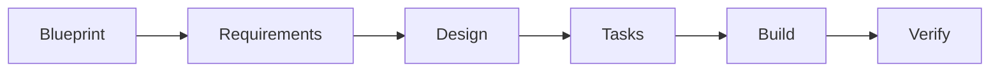

# Feature Development Tutorial

Build your first feature with rp1's complete development workflow. This tutorial walks you through the entire journey from idea to verified implementation.

**Time to complete**: ~30-45 minutes

---

## What You'll Learn

- How rp1's 6-step feature workflow connects together
- Using blueprint to capture project vision
- Generating requirements, design, and tasks
- Building and verifying features
- The artifacts produced at each step

## Prerequisites

!!! warning "Before You Begin"
    - rp1 installed ([Quick Start](../getting-started/quickstart.md))
    - Knowledge base generated (`/knowledge-build`)
    - A codebase you want to enhance

---

## The Scenario

We'll build a **dark mode toggle** feature for a settings page. This example was chosen because:

- It's universally applicable (most apps have settings)
- It touches UI, state management, and storage
- It's small enough to complete in one session

**Starting point**: You have a settings page, but no dark mode support.

---

## The 6-Step Workflow



| Step | Purpose | Output |
|------|---------|--------|
| Blueprint | Capture project vision | charter.md, PRD |
| Requirements | Define what to build | requirements.md |
| Design | Define how to build it | design.md |
| Tasks | Break into actionable items | tasks.md |
| Build | Implement the code | Working feature |
| Verify | Validate against criteria | Verification report |

---

## Step 1: Blueprint (Optional)

!!! info "When to Use Blueprint"
    Blueprint is ideal for new projects or major initiatives. For small features in existing projects, you can skip to Step 2.

If you're starting a new project, run the blueprint wizard:

=== "Claude Code"

    ```bash
    /blueprint
    ```

=== "OpenCode"

    ```bash
    /rp1-dev/blueprint
    ```

The wizard guides you through:

1. What problem are you solving?
2. Who will use this?
3. Why build this now?
4. What's in/out of scope?
5. How will you measure success?

**What to expect:**

The wizard asks questions and creates:
- `.rp1/work/charter.md` - Project vision
- `.rp1/work/prds/main.md` - Product requirements

!!! tip "Checkpoint"
    After blueprint: `ls .rp1/work/` should show `charter.md` and `prds/` directory.

---

## Step 2: Feature Requirements

Define what the dark mode toggle needs to do:

=== "Claude Code"

    ```bash
    /feature-requirements dark-mode-toggle
    ```

=== "OpenCode"

    ```bash
    /rp1-dev/feature-requirements dark-mode-toggle
    ```

**What happens:**

The command asks clarifying questions:
- Who needs dark mode? (all users? accessibility settings?)
- What should the toggle control? (just this app? system preference?)
- Should the preference persist? (localStorage? user account?)
- Any constraints? (must work offline, accessibility requirements)

Answer the questions, and rp1 generates a comprehensive requirements document.

**What to expect:**

```
✅ Requirements generated

Output: .rp1/work/features/dark-mode-toggle/requirements.md

Contents:
- Feature overview
- Business context
- 4 functional requirements (REQ-001 to REQ-004)
- 3 user stories
- Acceptance criteria

Next step: /feature-design dark-mode-toggle
```

!!! tip "Checkpoint"
    Open `requirements.md` and verify it captures what you described.

---

## Step 3: Feature Design

Transform requirements into a technical design:

=== "Claude Code"

    ```bash
    /feature-design dark-mode-toggle
    ```

=== "OpenCode"

    ```bash
    /rp1-dev/feature-design dark-mode-toggle
    ```

**What happens:**

rp1 analyzes your requirements and your codebase (via the KB) to create a design that fits your architecture. It considers:

- Your existing patterns and conventions
- Component structure
- State management approach
- Storage mechanisms

**What to expect:**

```
✅ Technical design generated

Output:
- .rp1/work/features/dark-mode-toggle/design.md
- .rp1/work/features/dark-mode-toggle/design-decisions.md

Design includes:
- Architecture diagram
- Component specifications
- State management approach
- Storage strategy
- Testing approach

Next step: /feature-tasks dark-mode-toggle
```

!!! tip "Checkpoint"
    Review `design.md` to ensure it aligns with your codebase patterns.

---

## Step 4: Feature Tasks

Break the design into actionable tasks:

=== "Claude Code"

    ```bash
    /feature-tasks dark-mode-toggle
    ```

=== "OpenCode"

    ```bash
    /rp1-dev/feature-tasks dark-mode-toggle
    ```

**What happens:**

rp1 analyzes the design and creates a structured task breakdown with:
- Clear task descriptions
- Acceptance criteria per task
- Dependencies between tasks
- Effort estimates

**What to expect:**

```
✅ Task breakdown complete

Feature: dark-mode-toggle
Tasks: 6
Milestones: 1

Tasks:
- [ ] Create theme context provider
- [ ] Add dark mode CSS variables
- [ ] Implement toggle component
- [ ] Add localStorage persistence
- [ ] Integrate into settings page
- [ ] Write tests

Output: .rp1/work/features/dark-mode-toggle/tasks.md

Next step: /feature-build dark-mode-toggle
```

!!! tip "Checkpoint"
    Review tasks and verify they cover all requirements.

---

## Step 5: Feature Build

Implement the feature from the task list:

=== "Claude Code"

    ```bash
    /feature-build dark-mode-toggle
    ```

=== "OpenCode"

    ```bash
    /rp1-dev/feature-build dark-mode-toggle
    ```

**What happens:**

rp1 works through each task:
1. Reads the task description
2. Implements according to the design
3. Runs tests and linting
4. Updates the task file with implementation details
5. Documents any discoveries in field notes

**What to expect:**

This is the longest step. rp1 provides progress updates:

```
Building feature: dark-mode-toggle

[1/6] Creating theme context provider...
  ✓ Created src/contexts/ThemeContext.tsx
  ✓ Tests passing

[2/6] Adding dark mode CSS variables...
  ✓ Updated src/styles/variables.css
  ✓ Lint clean

...

✅ Implementation complete

Tasks completed: 6/6
Tests: 12/12 passing
Coverage: 94%

Next step: /feature-verify dark-mode-toggle
```

!!! tip "Checkpoint"
    - All tasks marked complete in `tasks.md`
    - Code changes in your codebase
    - Tests passing

---

## Step 6: Feature Verify

Validate the implementation against requirements:

=== "Claude Code"

    ```bash
    /feature-verify dark-mode-toggle
    ```

=== "OpenCode"

    ```bash
    /rp1-dev/feature-verify dark-mode-toggle
    ```

**What happens:**

rp1 performs comprehensive validation:
1. Checks each acceptance criterion
2. Verifies requirements coverage
3. Runs the test suite
4. Reviews field notes for intentional deviations
5. Produces a verification report

**What to expect:**

```
✅ Feature Verification Complete

Feature: dark-mode-toggle
Status: READY FOR MERGE

Requirements Coverage:
- REQ-001: ✓ PASS (toggle component renders)
- REQ-002: ✓ PASS (theme changes on toggle)
- REQ-003: ✓ PASS (preference persists)
- REQ-004: ✓ PASS (respects system preference)

Acceptance Criteria: 12/12 passed
Tests: 12/12 passing
Coverage: 94%

Report: .rp1/work/features/dark-mode-toggle/verification-report.md
```

---

## Summary

You've completed the full feature development workflow:

| Step | Command | Artifact |
|------|---------|----------|
| 1. Blueprint | `blueprint` | charter.md, PRD |
| 2. Requirements | `feature-requirements` | requirements.md |
| 3. Design | `feature-design` | design.md |
| 4. Tasks | `feature-tasks` | tasks.md |
| 5. Build | `feature-build` | Implementation |
| 6. Verify | `feature-verify` | verification-report.md |

### Key Benefits

- **Single-pass execution** - Each command completes without iteration
- **Documented artifacts** - Every step produces documentation
- **Context-aware** - rp1 respects your codebase patterns
- **Traceable** - Requirements map to design to tasks to code

---

## Next Steps

- **Archive the feature**: After merging, run `feature-archive dark-mode-toggle`
- **Try another workflow**: Explore [PR Review](../reference/dev/pr-review.md) or [Code Investigation](../reference/dev/code-investigate.md)
- **Learn the concepts**: Understand [Constitutional Prompting](../concepts/constitutional-prompting.md)

---

## Troubleshooting

??? question "Requirements phase is asking too many questions"

    Provide more context upfront. Include initial requirements in the command:
    ```bash
    /feature-requirements dark-mode "Add a toggle in settings to switch between light and dark theme, persisting preference"
    ```

??? question "Design doesn't match my architecture"

    Rebuild your knowledge base to ensure rp1 has current codebase context:
    ```bash
    /knowledge-build
    ```

??? question "Build phase is failing tests"

    Check if your test configuration is detectable. rp1 auto-detects common setups (Jest, pytest, etc.). If yours is custom, you may need to run tests manually.

??? question "Can I skip steps?"

    Yes, but with caution. You can skip:
    - Blueprint (for small features in existing projects)
    - validate-hypothesis (unless you have risky assumptions)

    Don't skip requirements, design, or tasks—these provide the context for build and verify.
