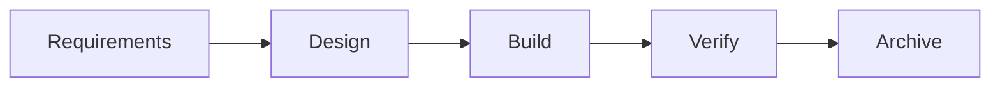
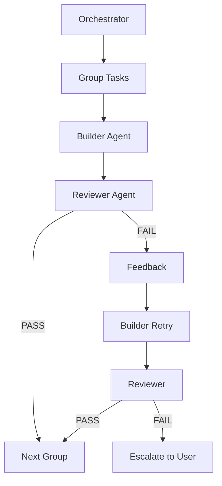

# Feature Development Tutorial

Build your first feature with rp1's complete development workflow. This tutorial walks you through the entire journey from idea to verified implementation.

**Time to complete**: ~30-45 minutes

---

## What You'll Learn

- How rp1's 5-step feature workflow connects together
- Using blueprint to capture project vision
- Generating requirements and design (with auto-generated tasks)
- Building with the builder-reviewer architecture
- Verifying and archiving features
- The artifacts produced at each step

## Prerequisites

!!! warning "Before You Begin"
    - rp1 installed ([Quick Start](../getting-started/quickstart.md))
    - Knowledge base generated (`/knowledge-build`)
    - A codebase you want to enhance

---

## The Scenario

We'll build a **dark mode toggle** feature for a settings page. This example was chosen because:

- It's universally applicable (most apps have settings)
- It touches UI, state management, and storage
- It's small enough to complete in one session

**Starting point**: You have a settings page, but no dark mode support.

---

## The 5-Step Workflow



| Step | Purpose | Output |
|------|---------|--------|
| Requirements | Define what to build | requirements.md |
| Design | Define how to build it | design.md + tasks.md |
| Build | Implement the code | Working feature |
| Verify | Validate against criteria | Verification report |
| Archive | Store completed feature | Archived artifacts |

!!! info "Tasks Auto-Generate After Design"
    Unlike previous versions, you no longer need a separate `/feature-tasks` step. Running `/feature-design` automatically generates both `design.md` and `tasks.md`. The `/feature-tasks` command is still available for regenerating or updating tasks if needed.

---

## Optional: Blueprint

!!! info "When to Use Blueprint"
    Blueprint is ideal for new projects or major initiatives. For small features in existing projects, you can skip to Step 1.

If you're starting a new project, run the blueprint wizard:

=== "Claude Code"

    ```bash
    /blueprint
    ```

=== "OpenCode"

    ```bash
    /rp1-dev/blueprint
    ```

The wizard guides you through:

1. What problem are you solving?
2. Who will use this?
3. Why build this now?
4. What's in/out of scope?
5. How will you measure success?

**What to expect:**

The wizard asks questions and creates:
- `.rp1/work/charter.md` - Project vision
- `.rp1/work/prds/main.md` - Product requirements

!!! tip "Checkpoint"
    After blueprint: `ls .rp1/work/` should show `charter.md` and `prds/` directory.

---

## Step 1: Feature Requirements

Define what the dark mode toggle needs to do:

=== "Claude Code"

    ```bash
    /feature-requirements dark-mode-toggle
    ```

=== "OpenCode"

    ```bash
    /rp1-dev/feature-requirements dark-mode-toggle
    ```

**What happens:**

The command asks clarifying questions:
- Who needs dark mode? (all users? accessibility settings?)
- What should the toggle control? (just this app? system preference?)
- Should the preference persist? (localStorage? user account?)
- Any constraints? (must work offline, accessibility requirements)

Answer the questions, and rp1 generates a comprehensive requirements document.

**What to expect:**

```
Requirements generated

Output: .rp1/work/features/dark-mode-toggle/requirements.md

Contents:
- Feature overview
- Business context
- 4 functional requirements (REQ-001 to REQ-004)
- 3 user stories
- Acceptance criteria

Next step: /feature-design dark-mode-toggle
```

!!! tip "Checkpoint"
    Open `requirements.md` and verify it captures what you described.

---

## Step 2: Feature Design

Transform requirements into a technical design:

=== "Claude Code"

    ```bash
    /feature-design dark-mode-toggle
    ```

=== "OpenCode"

    ```bash
    /rp1-dev/feature-design dark-mode-toggle
    ```

**What happens:**

rp1 analyzes your requirements and your codebase (via the KB) to create a design that fits your architecture. It considers:

- Your existing patterns and conventions
- Component structure
- State management approach
- Storage mechanisms

**What to expect:**

```
Technical design generated

Output:
- .rp1/work/features/dark-mode-toggle/design.md
- .rp1/work/features/dark-mode-toggle/tasks.md (auto-generated)

Design includes:
- Architecture diagram
- Component specifications
- State management approach
- Storage strategy
- Testing approach

Tasks include:
- [ ] Create theme context provider [complexity:medium]
- [ ] Add dark mode CSS variables [complexity:simple]
- [ ] Implement toggle component [complexity:medium]
- [ ] Add localStorage persistence [complexity:simple]
- [ ] Integrate into settings page [complexity:simple]
- [ ] Write tests [complexity:medium]

Next step: /feature-build dark-mode-toggle
```

!!! tip "Checkpoint"
    Review `design.md` to ensure it aligns with your codebase patterns. Review `tasks.md` to verify task breakdown is appropriate.

---

## Optional: Validate Hypothesis

!!! info "When to Use"
    Use `/validate-hypothesis` when your design contains risky assumptions that should be tested before full implementation.

If your design includes untested assumptions (e.g., "CSS custom properties work with the existing theming system"), you can validate them:

=== "Claude Code"

    ```bash
    /validate-hypothesis dark-mode-toggle
    ```

=== "OpenCode"

    ```bash
    /rp1-dev/validate-hypothesis dark-mode-toggle
    ```

This creates minimal proof-of-concept code to validate critical design decisions before committing to full implementation.

---

## Step 3: Feature Build

Implement the feature from the task list:

=== "Claude Code"

    ```bash
    /feature-build dark-mode-toggle
    ```

=== "OpenCode"

    ```bash
    /rp1-dev/feature-build dark-mode-toggle
    ```

**What happens:**

rp1 uses a **builder-reviewer architecture** for reliable implementation:



1. **Orchestrator** groups tasks by complexity
2. **Builder** implements tasks according to design
3. **Reviewer** validates implementation against criteria
4. If issues found, builder gets **one retry with feedback**
5. Persistent failures escalate to user

**Builder-Reviewer Benefits:**

- **Quality gate**: Every task is verified before moving on
- **Adaptive grouping**: Simple tasks are batched, complex tasks run solo
- **Feedback loop**: Builder learns from reviewer feedback
- **Fail-safe**: Unresolvable issues escalate rather than silently fail

**What to expect:**

```
Building feature: dark-mode-toggle

[Group 1/3] Tasks T1, T2 (simple)
  Builder: Implementing...
  Reviewer: Validating... PASS

[Group 2/3] Task T3 (medium)
  Builder: Implementing...
  Reviewer: Validating... FAIL (missing edge case)
  Builder: Retrying with feedback...
  Reviewer: Validating... PASS

[Group 3/3] Tasks T4, T5, T6 (simple/medium)
  Builder: Implementing...
  Reviewer: Validating... PASS

Build Complete

Tasks completed: 6/6
Tests: 12/12 passing
Coverage: 94%

Next step: /feature-verify dark-mode-toggle
```

!!! tip "Checkpoint"
    - All tasks marked complete in `tasks.md`
    - Code changes in your codebase
    - Tests passing

---

## Step 4: Feature Verify

Validate the implementation against requirements:

=== "Claude Code"

    ```bash
    /feature-verify dark-mode-toggle
    ```

=== "OpenCode"

    ```bash
    /rp1-dev/feature-verify dark-mode-toggle
    ```

**What happens:**

rp1 performs comprehensive validation:
1. Checks each acceptance criterion
2. Verifies requirements coverage
3. Runs the test suite
4. Reviews field notes for intentional deviations
5. Produces a verification report

**What to expect:**

```
Feature Verification Complete

Feature: dark-mode-toggle
Status: READY FOR MERGE

Requirements Coverage:
- REQ-001: PASS (toggle component renders)
- REQ-002: PASS (theme changes on toggle)
- REQ-003: PASS (preference persists)
- REQ-004: PASS (respects system preference)

Acceptance Criteria: 12/12 passed
Tests: 12/12 passing
Coverage: 94%

Report: .rp1/work/features/dark-mode-toggle/verification-report.md
```

---

## Step 5: Feature Archive

After merging your feature, archive it:

=== "Claude Code"

    ```bash
    /feature-archive dark-mode-toggle
    ```

=== "OpenCode"

    ```bash
    /rp1-dev/feature-archive dark-mode-toggle
    ```

**What happens:**

rp1 moves all feature artifacts to the archive:
- Compresses artifacts for storage
- Preserves requirements, design, tasks, and verification report
- Clears working directory for next feature

**What to expect:**

```
Feature Archived

Feature: dark-mode-toggle
Location: .rp1/archive/features/dark-mode-toggle/

Archived artifacts:
- requirements.md
- design.md
- tasks.md
- verification-report.md
- field-notes.md
```

---

## Summary

You've completed the full feature development workflow:

| Step | Command | Artifact |
|------|---------|----------|
| Optional | `blueprint` | charter.md, PRD |
| 1. Requirements | `feature-requirements` | requirements.md |
| 2. Design | `feature-design` | design.md + tasks.md |
| Optional | `validate-hypothesis` | Proof-of-concept |
| 3. Build | `feature-build` | Implementation |
| 4. Verify | `feature-verify` | verification-report.md |
| 5. Archive | `feature-archive` | Archived artifacts |

### Key Benefits

- **Single-pass execution** - Each command completes without iteration
- **Documented artifacts** - Every step produces documentation
- **Context-aware** - rp1 respects your codebase patterns
- **Traceable** - Requirements map to design to tasks to code
- **Quality-gated builds** - Builder-reviewer ensures implementation quality
- **Auto-generated tasks** - Design produces tasks automatically

---

## Next Steps

- **Try another workflow**: Explore [PR Review](../reference/dev/pr-review.md) or [Code Investigation](../reference/dev/code-investigate.md)
- **Learn the concepts**: Understand [Constitutional Prompting](../concepts/constitutional-prompting.md)
- **Regenerate tasks**: If needed, use `/feature-tasks` to update task breakdown

---

## Troubleshooting

??? question "Requirements phase is asking too many questions"

    Provide more context upfront. Include initial requirements in the command:
    ```bash
    /feature-requirements dark-mode "Add a toggle in settings to switch between light and dark theme, persisting preference"
    ```

??? question "Design doesn't match my architecture"

    Rebuild your knowledge base to ensure rp1 has current codebase context:
    ```bash
    /knowledge-build
    ```

??? question "Build phase is failing repeatedly"

    The builder-reviewer architecture retries once with feedback. If issues persist:

    1. Check the reviewer feedback for specific problems
    2. Verify your test configuration is detectable
    3. Consider using `--mode ask` to handle failures interactively
    4. Update design.md if the approach needs adjustment

??? question "Can I skip steps?"

    Yes, but with caution. You can skip:

    - **Blueprint** - For small features in existing projects
    - **validate-hypothesis** - Unless you have risky design assumptions
    - **feature-tasks** - Tasks auto-generate after design; only needed for regeneration

    Don't skip requirements, design, build, or verify—these form the core workflow.

??? question "Can I regenerate tasks after design changes?"

    Yes. If you update `design.md`, run `/feature-tasks` to regenerate the task breakdown:
    ```bash
    /feature-tasks dark-mode-toggle
    ```
