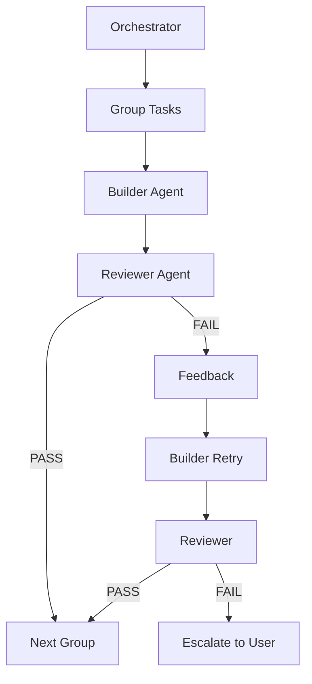

# Feature Development Tutorial

Build your first feature with rp1's complete development workflow. This tutorial walks you through the entire journey from idea to verified implementation.

**Time to complete**: ~30-45 minutes

---

## What You'll Learn

- How rp1's 6-step feature workflow connects together
- Using `/build` as the single entry point for feature development
- How the builder-reviewer architecture ensures implementation quality
- The artifacts produced at each step
- Supporting commands for mid-stream changes and unarchiving

## Prerequisites

!!! warning "Before You Begin"
    - rp1 installed ([Installation](../getting-started/installation.md))
    - Knowledge base generated (`/knowledge-build`)
    - A codebase you want to enhance

---

## When to Use /build vs /build-fast

Choose the right command for your task:

| Criteria | /build | /build-fast |
|----------|--------|-------------|
| **Task size** | Multi-day features | Under 2 hours |
| **Documentation** | Full artifacts (requirements, design, tasks) | Minimal (summary only) |
| **Scope** | Complex, multi-component | Well-defined, single focus |
| **Planning needed** | Yes - requirements + design | No - direct implementation |
| **Examples** | New authentication system, API redesign | Bug fix, add config option, small refactor |

**Decision flow**:

1. Can you describe the task in one sentence? --> Consider `/build-fast`
2. Will it take more than 2 hours? --> Use `/build`
3. Does it touch multiple components? --> Use `/build`
4. Is it a bug fix or small enhancement? --> Use `/build-fast`

!!! tip "When in doubt"
    Start with `/build-fast`. If scope grows during implementation, the command will suggest switching to the full workflow.

    ```bash
    /build-fast "Add dark mode toggle to settings page"
    ```

    [Learn more about build-fast :material-arrow-right:](../reference/dev/build-fast.md)

---

## The Scenario

We'll build a **dark mode toggle** feature for a settings page. This example was chosen because:

- It's universally applicable (most apps have settings)
- It touches UI, state management, and storage
- It's small enough to complete in one session

**Starting point**: You have a settings page, but no dark mode support.

---

## The 6-Step Workflow


| Step | Purpose | Output |
|------|---------|--------|
| Requirements | Define what to build | requirements.md |
| Design | Define how to build it | design.md + tasks.md |
| Build | Implement the code | Working feature |
| Verify | Validate against criteria | Verification report |
| Archive | Store completed feature | Archived artifacts |
| Follow-up | Handle documentation and remaining tasks | Updated docs, closed issues |

## Using /build

The `/build` command is the **single entry point** for feature development. It orchestrates all 6 steps automatically:

=== "Claude Code"

    ```bash
    /build my-feature              # Interactive mode
    /build my-feature --afk        # Autonomous mode
    ```

=== "OpenCode"

    ```bash
    /rp1-dev/build my-feature              # Interactive mode
    /rp1-dev/build my-feature --afk        # Autonomous mode
    ```

!!! note "Individual Step Commands Removed"
    Previous versions exposed individual commands like `/feature-requirements`, `/feature-design`, `/feature-build`, etc. These are no longer available as standalone commands. Use `/build` which orchestrates all steps automatically with smart resumption.

**Why /build?**

- **Single command**: One entry point for the entire workflow
- **Smart resumption**: Detects existing artifacts and resumes from the right step
- **AFK mode**: Run autonomously without user interaction (ideal for CI/CD or overnight runs)
- **Consistent quality**: Builder-reviewer architecture ensures implementation quality

**When to use --afk mode:**

- Autonomous development sessions (start before lunch, review after)
- CI/CD pipelines for automated feature scaffolding
- Batch processing multiple features
- When you trust the AI to make reasonable decisions

**Resumption scenarios:**

| Existing Artifacts | /build Resumes From |
|-------------------|---------------------|
| None | requirements |
| requirements.md | design |
| requirements.md + design.md | build |
| requirements.md + design.md + tasks.md (completed) | verify |
| All + verification-report.md | archive |
| All archived | follow-up |

---

??? info "Optional: Blueprint - for projects without a charter"
    Blueprint is ideal for new projects, major initiatives, or existing projects that lack a formal charter. For small features where project context is already established, skip to Step 1.

    If you don't have a project charter yet, run the blueprint wizard:

    === "Claude Code"

        ```bash
        /blueprint
        ```

    === "OpenCode"

        ```bash
        /rp1-dev/blueprint
        ```

    The wizard guides you through:

    1. What problem are you solving?
    2. Who will use this?
    3. Why build this now?
    4. What's in/out of scope?
    5. How will you measure success?

    **What to expect:**

    The wizard asks questions and creates:

    - `.rp1/context/charter.md` - Project vision
    - `.rp1/work/prds/main.md` - Product requirements

    **Checkpoint:** After blueprint, `ls .rp1/context/` should show `charter.md` and `ls .rp1/work/` should show `prds/` directory.

---

## What /build Does at Each Step

When you run `/build dark-mode-toggle`, the command orchestrates these steps automatically:

### Step 1: Requirements

**What happens:**

The requirements step asks clarifying questions:

- Who needs dark mode? (all users? accessibility settings?)
- What should the toggle control? (just this app? system preference?)
- Should the preference persist? (localStorage? user account?)
- Any constraints? (must work offline, accessibility requirements)

Answer the questions, and rp1 generates a comprehensive requirements document.

**Output:** `.rp1/work/features/dark-mode-toggle/requirements.md`

Contents include feature overview, business context, functional requirements (REQ-001 to REQ-004), user stories, and acceptance criteria.

### Step 2: Design

**What happens:**

rp1 analyzes your requirements and your codebase (via the KB) to create a design that fits your architecture. It considers:

- Your existing patterns and conventions
- Component structure
- State management approach
- Storage mechanisms

**Output:**

- `.rp1/work/features/dark-mode-toggle/design.md` - Architecture, component specs, state management, testing approach
- `.rp1/work/features/dark-mode-toggle/tasks.md` - Auto-generated task breakdown with complexity tags

??? info "Implementation DAG"
    For features with multiple components, the design includes an **Implementation DAG** (Directed Acyclic Graph) section that identifies:

    - **Parallel groups**: Tasks that can execute simultaneously
    - **Dependencies**: Which tasks must complete before others can start
    - **Critical path**: The longest dependency chain

    This enables the build phase to parallelize independent tasks. See [DAG Format Reference](../reference/dag-format.md) for the complete specification.

    Example DAG output:
    ```markdown
    ## Implementation DAG

    **Parallel Groups**:
    1. [T1, T2] - Theme provider and CSS variables are independent
    2. [T3] - Toggle component depends on theme system

    **Dependencies**:
    - T3 -> [T1, T2] (toggle needs theme system ready)

    **Critical Path**: T1 -> T3
    ```

??? info "Optional: Validate Hypothesis"
    If the design contains risky assumptions, use `/validate-hypothesis dark-mode-toggle` to test them before build continues. This creates temporary proof-of-concept code, validates the assumption, and writes findings back to your design document.

### Step 3: Build

**What happens:**

rp1 uses a **builder-reviewer architecture** for reliable implementation:



1. **Orchestrator** groups tasks by complexity
2. **Builder** implements tasks according to design
3. **Reviewer** validates implementation against criteria
4. If issues found, builder gets **one retry with feedback**
5. Persistent failures escalate to user

**Builder-Reviewer Benefits:**

- **Quality gate**: Every task is verified before moving on
- **Adaptive grouping**: Simple tasks are batched, complex tasks run solo
- **Feedback loop**: Builder learns from reviewer feedback
- **Fail-safe**: Unresolvable issues escalate rather than silently fail

**Output:** Working feature implementation with all tasks completed in `tasks.md`.

### Step 4: Verify

**What happens:**

rp1 performs comprehensive validation:

1. Checks each acceptance criterion
2. Verifies requirements coverage
3. Runs the test suite
4. Reviews field notes for intentional deviations
5. Produces a verification report

**Output:** `.rp1/work/features/dark-mode-toggle/verification-report.md`

### Step 5: Archive

**What happens:**

rp1 moves all feature artifacts to the archive:

- Compresses artifacts for storage
- Preserves requirements, design, tasks, and verification report
- Clears working directory for next feature

**Output:** `.rp1/archive/features/dark-mode-toggle/` containing all archived artifacts.

### Step 6: Follow-up

**What happens:**

rp1 handles post-implementation tasks:

- Updates documentation affected by the feature
- Closes related issues or tasks
- Notifies relevant stakeholders

**Output:** Updated documentation, closed issues.

---

## Summary

You've learned the 6-step feature development workflow:

| Step | What Happens | Artifact |
|------|--------------|----------|
| Optional | Blueprint captures project vision | charter.md, PRD |
| 1. Requirements | Define what to build | requirements.md |
| 2. Design | Define how to build it | design.md + tasks.md |
| Optional | Validate risky assumptions | Proof-of-concept |
| 3. Build | Implement with builder-reviewer | Implementation |
| 4. Verify | Validate against criteria | verification-report.md |
| 5. Archive | Store completed feature | Archived artifacts |
| 6. Follow-up | Update docs, close issues | Updated documentation |

### Key Benefits

- **Single entry point** - `/build` orchestrates the entire workflow
- **Smart resumption** - Detects existing artifacts and continues from the right step
- **Documented artifacts** - Every step produces documentation
- **Context-aware** - rp1 respects your codebase patterns
- **Traceable** - Requirements map to design to tasks to code
- **Quality-gated builds** - Builder-reviewer ensures implementation quality
- **Auto-generated tasks** - Design produces tasks automatically

---

## Supporting Commands

While `/build` handles the complete workflow, these commands help with specific situations:

| Command | Purpose |
|---------|---------|
| `/feature-edit feature-id "description"` | Incorporate mid-stream changes during build |
| `/feature-unarchive feature-id` | Restore an archived feature to active state |
| `/validate-hypothesis feature-id` | Test risky design assumptions before build |

## Next Steps

- **Try another workflow**: Explore [PR Review](../reference/dev/pr-review.md) or [Code Investigation](../reference/dev/code-investigate.md)
- **Learn the concepts**: Understand [Constitutional Prompting](../concepts/constitutional-prompting.md)

---

## Troubleshooting

??? question "Requirements phase is asking too many questions"

    Provide more context when starting the build. The `/build` command accepts context that gets passed to the requirements step.

??? question "Design doesn't match my architecture"

    Rebuild your knowledge base to ensure rp1 has current codebase context:
    ```bash
    /knowledge-build
    ```

??? question "Build phase is failing repeatedly"

    The builder-reviewer architecture retries once with feedback. If issues persist:

    1. Check the reviewer feedback for specific problems
    2. Verify your test configuration is detectable
    3. Update design.md manually if the approach needs adjustment, then re-run `/build` to resume

??? question "Can I skip steps?"

    `/build` uses smart resumption - it detects existing artifacts and skips to the appropriate step automatically. If you have `requirements.md` already, it skips to design. If you have `design.md`, it skips to build.

    You can also use `--afk` mode to run autonomously without prompts.

??? question "How do I make mid-stream changes?"

    Use `/feature-edit feature-id "description of change"` to incorporate discoveries or corrections during the build phase. This updates the relevant documentation and tasks.
