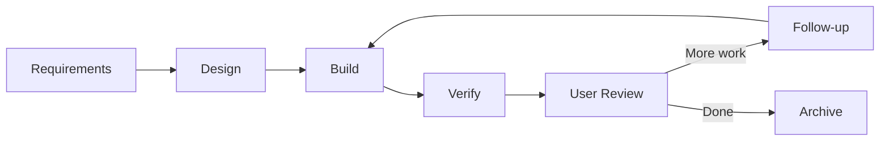
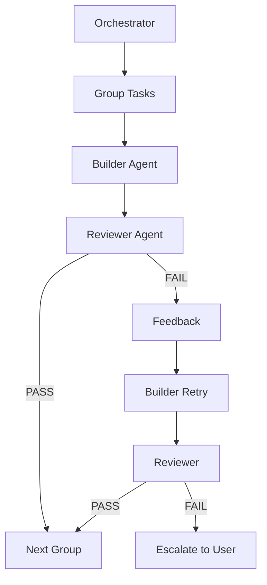

# Feature Development Tutorial

Build your first feature with rp1's complete development workflow. This tutorial walks you through the entire journey from idea to verified implementation.

**Time to complete**: ~30-45 minutes

---

## What You'll Learn

- How rp1's 6-step feature workflow connects together
- Using `/build` as the single entry point for feature development
- How the builder-reviewer architecture ensures implementation quality
- The artifacts produced at each step
- Supporting commands for mid-stream changes and unarchiving

## Prerequisites

!!! warning "Before You Begin"
    - rp1 installed ([Installation](../getting-started/installation.md))
    - A codebase you want to enhance

!!! tip "Generate Your Knowledge Base First"
    Run `/knowledge-build` before starting feature development. This gives rp1 deep understanding of your codebase — architecture, patterns, and conventions — so generated code fits naturally.

    ```bash
    /knowledge-build
    ```

    [Command reference :material-arrow-right:](../reference/base/knowledge-build.md) · [Learn about knowledge-aware agents :material-arrow-right:](../concepts/knowledge-aware-agents.md)

---

## When to Use /build vs /build-fast

Choose the right command based on task complexity:

| Criteria | /build | /build-fast |
|----------|--------|-------------|
| **Complexity** | Multi-component features | Single-focus changes |
| **Documentation** | Full artifacts (requirements, design, tasks) | Quick-build summary (what was done, how it was verified) |
| **Scope** | Cross-cutting, architectural | Well-defined, isolated |
| **Planning needed** | Yes - requirements + design | No - direct implementation |
| **Examples** | New authentication system, API redesign | Bug fix, add config option, small refactor |

**Decision flow**:

1. Can you describe the task in one sentence? → Consider `/build-fast`
2. Does it touch multiple components or systems? → Use `/build`
3. Does it require architectural decisions? → Use `/build`
4. Is it a bug fix or isolated enhancement? → Use `/build-fast`

!!! tip "When in doubt"
    Start with `/build-fast`. If scope grows during implementation, the command will suggest switching to the full workflow.

    ```bash
    /build-fast "Add dark mode toggle to settings page"
    ```

    [Learn more about build-fast :material-arrow-right:](../reference/dev/build-fast.md)

---

## The Scenario

We'll build a **user authentication system** with login, registration, and session management.

??? info "Why this example?"
    - It's universally applicable (most apps need authentication)
    - It touches multiple components: API, database, UI, middleware
    - It requires architectural decisions (JWT vs sessions, OAuth providers)
    - It has security considerations that benefit from structured planning

**Starting point**: You have a basic app with no user accounts.

---

## The 6-Step Workflow



| Step | Purpose | Output |
|------|---------|--------|
| Requirements | Define what to build | requirements.md |
| Design | Define how to build it | design.md + tasks.md |
| Build | Implement the code | Working feature |
| Verify | Validate against criteria | Verification report |
| User Review | Manual verification checkpoint | User decision |
| Follow-up | Add more tasks if needed | Loops back to Build |
| Archive | Store completed feature | Archived artifacts |

## Using /build

The `/build` command is the **single entry point** for feature development. It orchestrates all 6 steps automatically:

=== "Claude Code"

    ```bash
    /build my-feature              # Interactive mode
    /build my-feature --afk        # Autonomous mode
    ```

=== "OpenCode"

    ```bash
    /rp1-dev/build my-feature              # Interactive mode
    /rp1-dev/build my-feature --afk        # Autonomous mode
    ```

!!! note "Individual Step Commands Removed"
    Previous versions exposed individual commands like `/feature-requirements`, `/feature-design`, `/feature-build`, etc. These are no longer available as standalone commands. Use `/build` which orchestrates all steps automatically with smart resumption.

**Why /build?**

- **Single command**: One entry point for the entire workflow
- **Smart resumption**: Detects existing artifacts and resumes from the right step
- **AFK mode** (Away From Keyboard): Run autonomously without user interaction (ideal for CI/CD or overnight runs)
- **Consistent quality**: Builder-reviewer architecture ensures implementation quality

**When to use --afk mode:**

- Autonomous development sessions (start before lunch, review after)
- CI/CD pipelines for automated feature scaffolding
- Batch processing multiple features
- When you trust the AI to make reasonable decisions

!!! note "Your code is safe"
    Even in AFK mode, all changes are isolated to a separate branch. Nothing is merged until you review and approve. See [Parallel Development](parallel-development.md) for details.

**Resumption scenarios:**

| Existing Artifacts | /build Resumes From |
|-------------------|---------------------|
| None | requirements |
| requirements.md | design |
| requirements.md + design.md | build |
| requirements.md + design.md + tasks.md (completed) | verify |
| All + verification-report.md | archive |
| All archived | follow-up |

---

???+ tip "Optional but Highly Recommended: Start with Blueprint"
    **Why Blueprint matters:** When you define your project's vision, constraints, and target audience upfront, every future feature inherits this context. Agents make better decisions because they understand the "why" behind your product.

    Run the blueprint wizard once per project:

    === "Claude Code"

        ```bash
        /blueprint
        ```

    === "OpenCode"

        ```bash
        /rp1-dev/blueprint
        ```

    **Tip:** You can pass existing context to speed up the process — a public URL, pasted product document, or any relevant background:

    ```bash
    /blueprint "https://notion.so/your-team/product-vision-abc123"  # must be public or have MCP configured
    /blueprint "We're building a B2B SaaS for inventory management targeting small retail businesses..."
    ```

    The wizard guides you through:

    1. What problem are you solving?
    2. Who will use this?
    3. Why build this now?
    4. What's in/out of scope?
    5. How will you measure success?

    **What you get:**

    - `.rp1/context/charter.md` - Project vision, constraints, and audience
    - `.rp1/work/prds/main.md` - Product requirements document

    These artifacts inform all subsequent `/build` commands, ensuring features align with your product direction.

    Once your blueprint is created, continue with `/build` to start your first feature.

    [Blueprint command reference :material-arrow-right:](../reference/dev/blueprint.md)

---

## What /build Does at Each Step

When you run `/build user-auth`, the command orchestrates these steps automatically:

### Step 1: Requirements

**What happens:**

The requirements step asks clarifying questions:

- What authentication methods? (email/password, OAuth, magic links?)
- What user data to store? (profile info, preferences?)
- Session management approach? (JWT, server sessions?)
- Security requirements? (2FA, password policies, rate limiting?)

Answer the questions, and rp1 generates a comprehensive requirements document.

**Output:** `.rp1/work/features/user-auth/requirements.md`

Contents include feature overview, business context, functional requirements, user stories, and acceptance criteria.

### Step 2: Design

**What happens:**

rp1 analyzes your requirements and your codebase (via the KB) to create a design that fits your architecture. It considers:

- Your existing patterns and conventions
- Component structure
- State management approach
- Storage mechanisms

**Output:**

- `.rp1/work/features/user-auth/design.md` - Architecture, component specs, data models, API design, security approach
- `.rp1/work/features/user-auth/tasks.md` - Auto-generated task breakdown with complexity tags

??? info "Implementation DAG"
    For features with multiple components, the design includes an **Implementation DAG** (Directed Acyclic Graph) section that identifies:

    - **Parallel groups**: Tasks that can execute simultaneously
    - **Dependencies**: Which tasks must complete before others can start
    - **Critical path**: The longest dependency chain

    This enables the build phase to parallelize independent tasks. See [DAG Format Reference](../reference/dag-format.md) for the complete specification.

    Example DAG output:
    ```markdown
    ## Implementation DAG

    **Parallel Groups**:
    1. [T1, T2] - Theme provider and CSS variables are independent
    2. [T3] - Toggle component depends on theme system

    **Dependencies**:
    - T3 -> [T1, T2] (toggle needs theme system ready)

    **Critical Path**: T1 -> T3
    ```

??? info "Automatic and Manual Hypothesis Validation"
    When the design phase detects risky assumptions — unfamiliar APIs, unproven integration patterns, or uncertain performance characteristics — it may automatically trigger hypothesis validation before proceeding. This creates temporary proof-of-concept code in a `/tmp` directory, validates the assumption, and writes findings back to your design document.

    You can also manually validate assumptions at any time:

    ```bash
    /validate-hypothesis user-auth
    ```

### Step 3: Build

**What happens:**

rp1 uses a **builder-reviewer architecture** for reliable implementation:



1. **Orchestrator** groups tasks by complexity
2. **Builder** implements tasks according to design
3. **Reviewer** validates implementation against criteria
4. If issues found, builder gets **one retry with feedback**
5. Persistent failures escalate to user

**Builder-Reviewer Benefits:**

- **Quality gate**: Every task is verified before moving on
- **Adaptive grouping**: Simple tasks are batched, complex tasks run solo
- **Feedback loop**: Builder learns from reviewer feedback
- **Fail-safe**: Unresolvable issues escalate rather than silently fail

!!! note "Inspired by Research"
    The builder-reviewer architecture is inspired by Block's [Adversarial Cooperation in Code Synthesis](https://block.xyz/documents/adversarial-cooperation-in-code-synthesis.pdf) paper.

**Output:** Working feature implementation with all tasks completed in `tasks.md`.

### Step 4: Verify

**What happens:**

rp1 performs comprehensive validation:

1. Checks each acceptance criterion
2. Verifies requirements coverage
3. Runs the test suite
4. Reviews field notes for intentional deviations
5. Produces a verification report

**Output:** `.rp1/work/features/user-auth/verification-report.md`

### Step 4.1: User Review (Interactive Mode Only)

!!! note "Skipped in AFK Mode"
    In `--afk` mode, this step is skipped and the workflow proceeds directly to Archive.

**What happens:**

After automated verification, rp1 presents a summary of the completed work:

- Branch created with all commits
- Files modified and changes made
- Verification results
- Any field notes or deviations

You're asked to **manually verify** the implementation — test the feature, review the code, check edge cases. Then choose how to proceed:

| Option | What Happens |
|--------|--------------|
| **Follow-up** | Go to Step 5, add more tasks and loop back to Step 3 (Build) |
| **Archive** | Proceed to Step 6, store completed feature |

This checkpoint ensures you've validated the work before it's archived, and gives you the opportunity to add follow-up tasks if needed.

### Step 5: Follow-up

**What happens:**

If you chose Follow-up at the User Review checkpoint, rp1 helps you add more work:

- Add additional tasks discovered during review
- Address edge cases or improvements identified
- Loop back to Step 3 (Build) to implement the new tasks

This cycle continues until you're satisfied with the implementation and choose Archive.

**Output:** Additional tasks added, loops back to Build.

### Step 6: Archive

**What happens:**

Once you're done with all follow-up work, rp1 moves all feature artifacts to the archive:

- Compresses artifacts for storage
- Preserves requirements, design, tasks, and verification report
- Clears working directory for next feature

**Output:** `.rp1/archive/features/user-auth/` containing all archived artifacts.

---

## Summary

You've learned the 6-step feature development workflow:

| Step | What Happens | Artifact |
|------|--------------|----------|
| Optional | Blueprint captures project vision | charter.md, PRD |
| 1. Requirements | Define what to build | requirements.md |
| 2. Design | Define how to build it | design.md + tasks.md |
| Optional | Validate risky assumptions | Proof-of-concept |
| 3. Build | Implement with builder-reviewer | Implementation |
| 4. Verify | Validate against criteria | verification-report.md |
| 4.1 User Review | Manual verification checkpoint | User decision |
| 5. Follow-up | Add more work (loops to Build) | Additional tasks |
| 6. Archive | Store completed feature | Archived artifacts |

### Key Benefits

- **Single entry point** - `/build` orchestrates the entire workflow
- **Smart resumption** - Detects existing artifacts and continues from the right step
- **Documented artifacts** - Every step produces documentation
- **Context-aware** - rp1 respects your codebase patterns
- **Traceable** - Requirements map to design to tasks to code
- **Quality-gated builds** - Builder-reviewer ensures implementation quality
- **Auto-generated tasks** - Design produces tasks automatically

---

## Supporting Commands

While `/build` handles the complete workflow, these commands help with specific situations:

| Command | Purpose |
|---------|---------|
| `/feature-edit feature-id "description"` | Incorporate mid-stream changes during build |
| `/feature-unarchive feature-id` | Restore an archived feature to active state |
| `/validate-hypothesis feature-id` | Test risky design assumptions before build |

## Next Steps

- **Try another workflow**: Explore [PR Review](../reference/dev/pr-review.md) or [Code Investigation](../reference/dev/code-investigate.md)
- **Learn the concepts**: Understand [Constitutional Prompting](../concepts/constitutional-prompting.md)

---

## Troubleshooting

??? question "Requirements phase is asking too many questions"

    Provide more context when starting the build. The `/build` command accepts context that gets passed to the requirements step.

??? question "Design doesn't match my architecture"

    Rebuild your knowledge base to ensure rp1 has current codebase context:
    ```bash
    /knowledge-build
    ```

??? question "Build phase is failing repeatedly"

    The builder-reviewer architecture retries once with feedback. If issues persist:

    1. Check the reviewer feedback for specific problems
    2. Verify your test configuration is detectable
    3. Update design.md manually if the approach needs adjustment, then re-run `/build` to resume

??? question "Can I skip steps?"

    `/build` uses smart resumption - it detects existing artifacts and skips to the appropriate step automatically. If you have `requirements.md` already, it skips to design. If you have `design.md`, it skips to build.

    You can also use `--afk` mode to run autonomously without prompts.

??? question "How do I make mid-stream changes?"

    Use `/feature-edit feature-id "description of change"` to incorporate discoveries or corrections during the build phase. This updates the relevant documentation and tasks.
