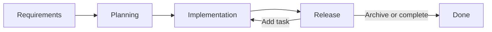
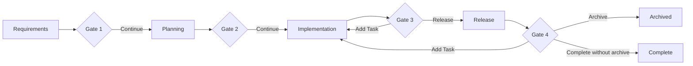
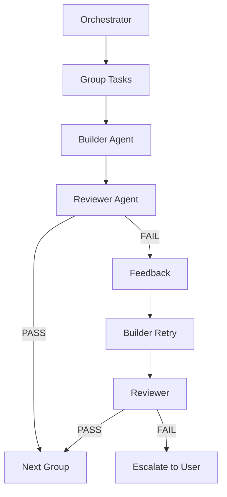

# Feature Development Tutorial

Build your first feature with rp1's complete development workflow. This tutorial walks you through the current Build v2 journey from idea to release decision.

**Time to complete**: ~30-45 minutes

---

## What You'll Learn

- How Build v2 connects requirements, planning, implementation, and release
- When to phase-plan before starting `/build`
- Using `/build` as the single entry point for feature development
- How builder-reviewer task units and release readiness keep quality visible
- The artifacts produced in each parent phase
- How state-first continuation and add-task release decisions work

## Prerequisites

!!! warning "Before You Begin"
    - rp1 installed ([Installation](../getting-started/installation.md))
    - A codebase you want to enhance

!!! tip "Generate Your Knowledge Base First"
    Run `/knowledge-build` before starting feature development. This gives rp1 deep understanding of your codebase — architecture, patterns, and conventions — so generated code fits naturally.

    ```bash
    /knowledge-build
    ```

    [Command reference :material-arrow-right:](../reference/base/knowledge-build.md) · [Learn about knowledge-aware agents :material-arrow-right:](../concepts/knowledge-aware-agents.md)

!!! tip "Host syntax"
    Claude Code uses `/build`, OpenCode uses `/rp1-dev-build`, and Codex uses
    `$rp1-dev-build`.

---

## When to Use /phase-plan vs /build vs /build-fast

Choose the right command based on task complexity:

| Criteria | /phase-plan | /build | /build-fast |
|----------|-------------|--------|-------------|
| **Complexity** | Initiative-sized, phased, or multi-feature | Multi-component single feature | Single-focus changes |
| **Primary input** | Completed PRD or oversized `requirements.md` | Feature ID plus feature requirements | Freeform development request |
| **Documentation** | `phase-plan.md` plus source backlinks | Full feature artifacts (`requirements`, `design`, `tasks`) | Quick-build summary |
| **Scope** | Multiple independently valuable delivery slices | One independently executable feature | Well-defined, isolated |
| **Examples** | Rollout plan, platform migration phases, large PRD handoff | New authentication feature, API redesign | Bug fix, config option, small refactor |

**Decision flow**:

1. Do you already have a completed PRD or oversized `requirements.md`? If not, create one before phase planning.
2. Does the work split into multiple independently valuable features or rollout slices? → Use `/phase-plan`
3. Is the request still one feature, but it touches multiple components or needs design work? → Use `/build`
4. Is it a bug fix or isolated enhancement you can describe quickly? → Use `/build-fast`

!!! tip "When in doubt"
    Start with `/build-fast`. If scope grows during implementation, the command will suggest switching to the full workflow.

    ```bash
    /build-fast "Add dark mode toggle to settings page"
    ```

    [Learn more about build-fast :material-arrow-right:](../reference/dev/build-fast.md)

### When to Insert /phase-plan

Run `/phase-plan` when a PRD or oversized feature requirements artifact is too
large for one clean `/build` run. The workflow writes a durable `phase-plan.md`
next to the source artifact, then gives you child-feature handoffs to feed into
`/build`.

```bash
/phase-plan prds/auth-overhaul.md
```

Each child feature later resumes the normal tracked delivery flow through
`/build`, optionally carrying `PHASE_PLAN_PATH=...` and `PHASE_ID=...` so the
feature's `requirements.md` records its parent phase and manual verification
expectations.

---

## The Scenario

We'll build a **user authentication system** with login, registration, and session management.

??? info "Why this example?"
    - It's universally applicable (most apps need authentication)
    - It touches multiple components: API, database, UI, middleware
    - It requires architectural decisions (JWT vs sessions, OAuth providers)
    - It has security considerations that benefit from structured planning

**Starting point**: You have a basic app with no user accounts.

---

## The Build v2 Lifecycle


```mermaid
flowchart LR
    R[Requirements] --> P[Planning]
    P --> I[Implementation]
    I --> L[Release]
    L -->|Add task| I
    L -->|Archive or complete| Done[Done]
```

| Parent Phase | Purpose | Primary Output |
|--------------|---------|----------------|
| Requirements | Define the user need, scope, constraints, and acceptance criteria | `requirements.md` |
| Planning | Turn requirements into design and an accepted task plan | `design.md`, `tasks.md`, `tasks.json` |
| Implementation | Build task units, review them, and run validation | Working feature plus validation results |
| Release | Review readiness, handle manual verification items, and choose archive or completion | `build-readiness.md`, optional archived artifacts |

## Using /build

The `/build` command is the **single entry point** for feature development. It orchestrates the four parent phases automatically:

=== "Claude Code"

    ```bash
    /build my-feature              # Interactive mode (default)
    /build my-feature --afk        # Autonomous mode
    ```

=== "OpenCode"

    ```bash
    /rp1-dev-build my-feature              # Interactive mode (default)
    /rp1-dev-build my-feature --afk        # Autonomous mode
    ```

!!! note "Individual phase commands removed"
    Previous versions exposed individual commands like `/feature-requirements`, `/feature-design`, `/feature-build`, etc. These are no longer available as standalone commands. Use `/build`, which orchestrates the full lifecycle and resumes from workflow state.

**Why /build?**

- **Single command**: One entry point for the entire workflow
- **State-first resumption**: Reuses the active run for the same feature and continues from the next incomplete phase
- **Interactive by default**: Approval gates let you review and steer at each step
- **AFK mode** (Away From Keyboard): Run autonomously without user interaction (ideal for CI/CD or overnight runs)
- **Consistent quality**: Builder-reviewer architecture ensures implementation quality

### Interactive Mode (Default)

In interactive mode, approval gates appear between major workflow stages:


```mermaid
flowchart LR
    R[Requirements] --> G1{Gate 1}
    G1 -->|Continue| P[Planning]
    P --> G2{Gate 2}
    G2 -->|Continue| I[Implementation]
    I --> G3{Gate 3}
    G3 -->|Release| L[Release]
    G3 -->|Add Task| I
    L --> G4{Gate 4}
    G4 -->|Archive| A[Archived]
    G4 -->|Complete without archive| C[Complete]
    G4 -->|Add Task| I
```

At each gate, you can:

| Option | What Happens |
|--------|--------------|
| **Continue** | Proceed to the next stage |
| **Revise** | Provide feedback and re-run the current stage |
| **Stop** | Exit the workflow (artifacts preserved for later) |
| **Release** | Move from implementation into release readiness when the work is ready |
| **Archive** | Archive completed feature artifacts during release |
| **Complete without archive** | Finish release while leaving artifacts active |

The implementation and release gates also offer **Add Task** to return to implementation when review or manual verification finds more work.

When you select **Stop**, the workflow saves your progress. Resume anytime with `/build my-feature`; rp1 reads the active run's workflow state and continues from the next incomplete parent phase. If registered progress and local files disagree, workflow state wins and rp1 reports the gap instead of guessing from filenames.

### AFK Mode (Autonomous)

When to use `--afk` mode:

- Autonomous development sessions (start before lunch, review after)
- CI/CD pipelines for automated feature scaffolding
- Batch processing multiple features
- When you trust the AI to make reasonable decisions

!!! note "Your code is safe"
    Even in AFK mode, git operations remain opt-in through `--git-*` flags. Changes stay in your working directory unless you explicitly ask rp1 to commit, push, or open a PR.

**State-first resumption scenarios:**

| Registered State | /build Resumes From |
|------------------|---------------------|
| No completed parent phase | Requirements |
| Requirements complete | Planning |
| Planning complete with registered design and task plan | Implementation |
| Implementation complete with readiness context | Release |
| Missing required registered output | Waiting gate for the relevant phase |

---

???+ tip "Optional but Highly Recommended: Start with Blueprint"
    **Why Blueprint matters:** When you define your project's vision, constraints, and target audience upfront, every future feature inherits this context. Agents make better decisions because they understand the "why" behind your product.

    Run the blueprint wizard once per project:

    === "Claude Code"

        ```bash
        /blueprint
        ```

    === "OpenCode"

        ```bash
        /rp1-dev-blueprint
        ```

    **Tip:** You can pass existing context to speed up the process — a public URL, pasted product document, or any relevant background:

    ```bash
    /blueprint "https://notion.so/your-team/product-vision-abc123"  # must be public or have MCP configured
    /blueprint "We're building a B2B SaaS for inventory management targeting small retail businesses..."
    ```

    The wizard guides you through:

    1. What problem are you solving?
    2. Who will use this?
    3. Why build this now?
    4. What's in/out of scope?
    5. How will you measure success?

    **What you get:**

    - `.rp1/context/charter.md` - Project vision, constraints, and audience
    - `.rp1/work/prds/main.md` - Product requirements document

    These artifacts inform all subsequent `/build` commands, ensuring features align with your product direction.

    Once your blueprint is created, continue with `/build` to start your first feature.

    [Blueprint command reference :material-arrow-right:](../reference/dev/blueprint.md)

---

## What /build Does in Each Phase

When you run `/build user-auth`, the command orchestrates these parent phases automatically:

### Phase 1: Requirements

**What happens:**

The requirements step asks clarifying questions:

- What authentication methods? (email/password, OAuth, magic links?)
- What user data to store? (profile info, preferences?)
- Session management approach? (JWT, server sessions?)
- Security requirements? (2FA, password policies, rate limiting?)

Answer the questions, and rp1 generates a comprehensive requirements document.

**Output:** `.rp1/work/features/user-auth/requirements.md`

Contents include feature overview, business context, functional requirements, user stories, and acceptance criteria.

### Phase 2: Planning

**What happens:**

rp1 analyzes your requirements and your codebase context to create a design and accepted task plan that fit your architecture. It considers:

- Your existing patterns and conventions
- Component structure
- State management approach
- Storage mechanisms

**Output:**

- `.rp1/work/features/user-auth/design.md` - Architecture, component specs, data models, API design, security approach
- `.rp1/work/features/user-auth/tasks.md` - Human-readable task plan for review
- `.rp1/work/features/user-auth/tasks.json` - Machine-readable task plan used during implementation

??? info "Implementation DAG"
    For features with multiple components, the design includes an **Implementation DAG** (Directed Acyclic Graph) section that identifies:

    - **Parallel groups**: Tasks that can execute simultaneously
    - **Dependencies**: Which tasks must complete before others can start
    - **Critical path**: The longest dependency chain

    This enables the implementation phase to parallelize independent tasks without
    forcing the whole build to run serially.

    Example DAG output:
    ```markdown
    ## Implementation DAG

    **Parallel Groups**:
    1. [T1, T2] - Theme provider and CSS variables are independent
    2. [T3] - Toggle component depends on theme system

    **Dependencies**:
    - T3 -> [T1, T2] (toggle needs theme system ready)

    **Critical Path**: T1 -> T3
    ```

??? info "Automatic and Manual Hypothesis Validation"
    When the design phase detects risky assumptions — unfamiliar APIs, unproven integration patterns, or uncertain performance characteristics — it may automatically trigger hypothesis validation before proceeding. This creates temporary proof-of-concept code in a `/tmp` directory, validates the assumption, and writes findings back to your design document.

    You can also manually validate assumptions at any time:

    ```bash
    /validate-hypothesis user-auth
    ```

### Phase 3: Implementation

**What happens:**

rp1 uses a **builder-reviewer architecture** for reliable implementation:


```mermaid
flowchart TD
    O[Orchestrator] --> G[Group Tasks]
    G --> B[Builder Agent]
    B --> R[Reviewer Agent]
    R -->|PASS| N[Next Group]
    R -->|FAIL| F[Feedback]
    F --> B2[Builder Retry]
    B2 --> R2[Reviewer]
    R2 -->|PASS| N
    R2 -->|FAIL| E[Escalate to User]
```

1. **Orchestrator** groups tasks by complexity
2. **Builder** implements tasks according to design
3. **Reviewer** validates implementation against criteria
4. If issues found, builder gets **one retry with feedback**
5. Persistent failures escalate to user

**Builder-Reviewer Benefits:**

- **Quality gate**: Every task is verified before moving on
- **Adaptive grouping**: Simple tasks are batched, complex tasks run solo
- **Feedback loop**: Builder learns from reviewer feedback
- **Fail-safe**: Unresolvable issues escalate rather than silently fail

!!! note "Inspired by Research"
    The builder-reviewer architecture is inspired by Block's [Adversarial Cooperation in Code Synthesis](https://block.xyz/documents/adversarial-cooperation-in-code-synthesis.pdf) paper.

**Output:** Working feature implementation with completed task units and validation results.

### Implementation Validation

**What happens:**

Before release, rp1 performs comprehensive validation:

1. Checks each acceptance criterion
2. Verifies requirements coverage
3. Runs the test suite
4. Reviews field notes for intentional deviations
5. Records evidence for release readiness

**Output:** Validation results and, when produced, `.rp1/work/features/user-auth/verification-report.md`.

### Phase 4: Release

!!! note "AFK mode"
    In `--afk` mode, release defaults to archive when readiness allows it. Blocking readiness failures or missing required validation do not silently mark the feature complete.

**What happens:**

After implementation validation, rp1 presents release readiness:

- Files modified and changes made
- Blockers, warnings, and supporting evidence
- Manual verification items
- Field notes and intentional deviations

You manually verify what matters for the feature, then choose how to proceed:

| Option | What Happens |
|--------|--------------|
| **Archive** | Store the completed feature artifacts in the archive |
| **Complete without archive** | Finish release while leaving feature artifacts active |
| **Add Task** | Add follow-up work and return to implementation |
| **Review feedback from Arcade** | Process feedback, then return to the release gate |
| **Stop** | Preserve the run and return later |

This checkpoint keeps manual verification and release decisions explicit. Add-task cycles continue until you are satisfied with the implementation and choose Archive or Complete without archive.

**Output:** `.rp1/work/features/user-auth/build-readiness.md` and, when you choose Archive, archived feature artifacts.

---

## Summary

You've learned the Build v2 feature development workflow:

| Phase | What Happens | Artifact |
|-------|--------------|----------|
| Optional | Blueprint captures project vision | charter.md, PRD |
| Requirements | Define what to build and why | `requirements.md` |
| Planning | Define how to build it and accept the task plan | `design.md`, `tasks.md`, `tasks.json` |
| Optional | Validate risky assumptions | Proof-of-concept findings |
| Implementation | Implement and review task units | Code changes, task status, validation results |
| Release | Review readiness, manual items, and archive or completion choice | `build-readiness.md`, optional archive |

### Key Benefits

- **Single entry point** - `/build` orchestrates the entire workflow
- **State-first resumption** - Continues from registered workflow state instead of filename guesses
- **Documented artifacts** - Every parent phase produces reviewable documentation
- **Context-aware** - rp1 respects your codebase patterns
- **Traceable** - Requirements map to design to tasks to code
- **Quality-gated builds** - Builder-reviewer ensures implementation quality
- **Auto-generated tasks** - Design produces tasks automatically

---

## Supporting Commands

While `/build` handles the complete workflow, these commands help with specific situations:

| Command | Purpose |
|---------|---------|
| `/feature-edit feature-id "description"` | Incorporate mid-stream changes during build |
| `/feature-unarchive feature-id` | Restore an archived feature to active state |
| `/validate-hypothesis feature-id` | Test risky design assumptions before build |

## Next Steps

- **Try another workflow**: Explore [PR Review](../reference/dev/pr-review.md) or [Code Investigation](../reference/dev/code-investigate.md)
- **Learn the concepts**: Understand [Constitutional Prompting](../concepts/constitutional-prompting.md)

---

## Troubleshooting

??? question "Requirements phase is asking too many questions"

    Provide more context when starting the build. The `/build` command accepts context that gets passed to the requirements step.

??? question "Design doesn't match my architecture"

    Rebuild your knowledge base to ensure rp1 has current codebase context:
    ```bash
    /knowledge-build
    ```

??? question "Build phase is failing repeatedly"

    The builder-reviewer architecture retries once with feedback. If issues persist:

    1. Check the reviewer feedback for specific problems
    2. Verify your test configuration is detectable
    3. Update design.md manually if the approach needs adjustment, then re-run `/build` to resume

??? question "Can I skip steps?"

    `/build` uses state-first resumption. It reopens the active run for the same feature and continues from the next incomplete parent phase. If required registered outputs are missing or inconsistent, rp1 waits and reports the contract gap instead of inferring success from local files.

    You can also use `--afk` mode to run autonomously without prompts.

??? question "How do I make mid-stream changes?"

    Use `/feature-edit feature-id "description of change"` to incorporate discoveries or corrections during implementation. This updates the relevant documentation and tasks.
