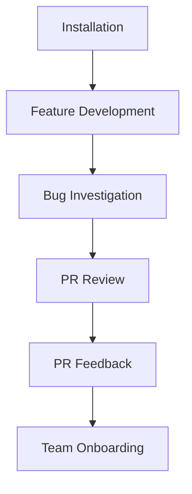

# Guides

Practical tutorials that walk you through complete rp1 workflows from start to finish.

---

## Available Tutorials

-   :material-feature-search-outline: **Feature Development**

    ---

    Build your first feature with rp1's 6-step workflow using the `/build` command: requirements, design, build, verify, archive, and follow-up.

    [:octicons-arrow-right-24: Start tutorial](feature-development.md)

-   :material-bug-outline: **Bug Investigation**

    ---

    Systematically investigate bugs using hypothesis-driven debugging. Gather evidence, test theories, and identify root causes.

    [:octicons-arrow-right-24: Start tutorial](bug-investigation.md)

-   :material-source-pull: **PR Review**

    ---

    Perform thorough code reviews with map-reduce analysis and confidence gating.

    [:octicons-arrow-right-24: Start tutorial](pr-review.md)

-   :material-comment-check-outline: **Addressing PR Feedback**

    ---

    Systematically collect and fix reviewer comments from GitHub PRs.

    [:octicons-arrow-right-24: Start tutorial](pr-feedback.md)

-   :material-account-group: **Team Onboarding**

    ---

    Help new team members get productive quickly with generated knowledge bases and orientation documentation.

    [:octicons-arrow-right-24: Start tutorial](team-onboarding.md)

-   :material-source-branch: **Parallel Development**

    ---

    Run multiple tasks simultaneously using git worktrees for isolated execution.

    [:octicons-arrow-right-24: Start tutorial](parallel-development.md)

---

## Learning Path

New to rp1? Follow this recommended sequence:

1. **[Installation](../getting-started/installation.md)** - Install and configure rp1
2. **[Feature Development](feature-development.md)** - Learn the core workflow
3. **[Bug Investigation](bug-investigation.md)** - Debug issues systematically
4. **[PR Review](pr-review.md)** - Automate code review
5. **[Addressing PR Feedback](pr-feedback.md)** - Handle reviewer comments
6. **[Team Onboarding](team-onboarding.md)** - Share knowledge with your team

---

## Guide Philosophy

rp1 guides are designed to be:

- **Practical** - Real tasks you'll actually do
- **Complete** - Start to finish, no gaps
- **Platform-aware** - Syntax for both Claude Code and OpenCode
- **Checkpoint-driven** - Verify progress at each step
