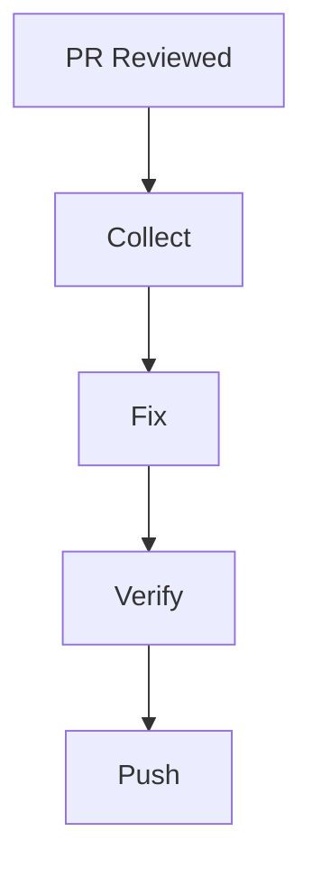

# Addressing PR Feedback

Systematically collect and resolve reviewer comments using rp1's feedback workflow. This guide covers gathering GitHub review comments and implementing fixes.

**Time to complete**: ~15-20 minutes

---

## What You'll Learn

- Collecting and classifying PR review comments
- Prioritizing feedback by severity
- Implementing fixes systematically
- Verifying all feedback is addressed

## Prerequisites

!!! warning "Before You Begin"
    - rp1 installed ([Installation](../getting-started/installation.md))
    - [`gh` CLI](https://cli.github.com/) installed and authenticated
    - A PR with review comments on GitHub

---

## The Feedback Workflow



| Step | Command | Purpose |
|------|---------|---------|
| Collect | `pr-feedback-collect` | Gather and classify review comments |
| Fix | `pr-feedback-fix` | Address comments systematically |

---

## Step 1: Collect Feedback

After your PR has been reviewed on GitHub, collect the feedback:

=== "Claude Code"

    ```bash
    /pr-feedback-collect
    ```

=== "OpenCode"

    ```bash
    /rp1-dev/pr-feedback-collect
    ```

**What happens:**

rp1 uses the `gh` CLI to:

1. Fetch PR review comments
2. Classify by priority and type
3. Extract actionable tasks
4. Generate a structured feedback document

**What to expect:**

```
📥 Collecting PR Feedback

PR: #42 - Add user authentication
Reviewers: @alice, @bob

Fetching comments...
✓ 6 review comments found
✓ 2 general comments found

Classifying feedback...
✓ Critical: 1
✓ High: 2
✓ Medium: 3
✓ Low: 2

Output: .rp1/work/features/{feature-id}/pr_feedback.md
```

The generated feedback document:

```markdown
# PR Feedback: #42 - Add user authentication

## Critical Priority
- [ ] **@alice**: "JWT secret cannot be in source code" (auth.ts:12)

## High Priority
- [ ] **@bob**: "Add token expiration validation" (auth.ts:45)
- [ ] **@alice**: "Need tests for invalid token scenarios" (auth.test.ts)

## Medium Priority
- [ ] **@bob**: "Consider using httpOnly cookies" (auth.ts:67)
...
```

!!! tip "Checkpoint"
    The feedback document organizes comments by priority. Critical items should be addressed first.

---

## Step 2: Fix Feedback

Address reviewer comments systematically:

=== "Claude Code"

    ```bash
    /pr-feedback-fix
    ```

    Or with a feature context:

    ```bash
    /pr-feedback-fix user-auth
    ```

=== "OpenCode"

    ```bash
    /rp1-dev/pr-feedback-fix
    ```

    Or with a feature context:

    ```bash
    /rp1-dev/pr-feedback-fix user-auth
    ```

**What happens:**

rp1 reads the feedback document and:

1. Prioritizes issues by severity
2. Implements fixes for each item
3. Updates the feedback document with completion status
4. Runs tests to verify fixes

**What to expect:**

```
🔧 Addressing PR Feedback

Loading: .rp1/work/features/user-auth/pr_feedback.md
Found: 8 feedback items (1 critical, 2 high, 3 medium, 2 low)

Fixing Critical Issues...
[1/1] Moving JWT secret to environment variable
  ✓ Updated src/middleware/auth.ts
  ✓ Added JWT_SECRET to .env.example
  ✓ Updated documentation

Fixing High Priority Issues...
[1/2] Adding token expiration validation
  ✓ Updated validateToken() in auth.ts
  ✓ Added test cases

[2/2] Adding invalid token test scenarios
  ✓ Added 4 test cases to auth.test.ts
  ✓ All tests passing

Fixing Medium Priority Issues...
...

Summary:
- Critical: 1/1 fixed
- High: 2/2 fixed
- Medium: 3/3 fixed
- Low: 2/2 fixed

Ready to commit and push.
```

!!! tip "Checkpoint"
    After fixing feedback, run `/pr-review` again to verify all issues are resolved.

---

## Summary

| Step | Command | Output |
|------|---------|--------|
| Collect | `pr-feedback-collect` | Structured feedback document |
| Fix | `pr-feedback-fix` | Addressed issues |

---

## Next Steps

- **Verify changes**: Run [PR Review](pr-review.md) to confirm fixes
- **Reference docs**: See [pr-feedback-collect](../reference/dev/pr-feedback-collect.md), [pr-feedback-fix](../reference/dev/pr-feedback-fix.md)

---

## Troubleshooting

??? question "pr-feedback-collect can't find comments"

    Ensure:

    1. You're in a git repository with a remote
    2. The `gh` CLI is authenticated (`gh auth status`)
    3. The PR exists and has comments

??? question "Some feedback items weren't fixed"

    The fixer prioritizes by severity. If items remain:

    1. Check the feedback document for unchecked items
    2. Run `/pr-feedback-fix` again for remaining items
    3. For complex issues, fix manually and mark complete in the document
