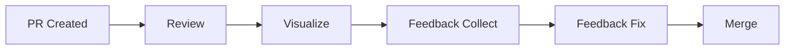
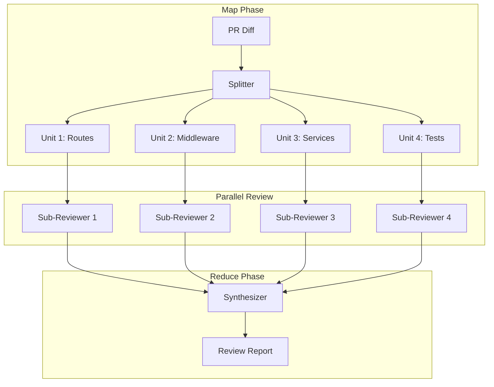
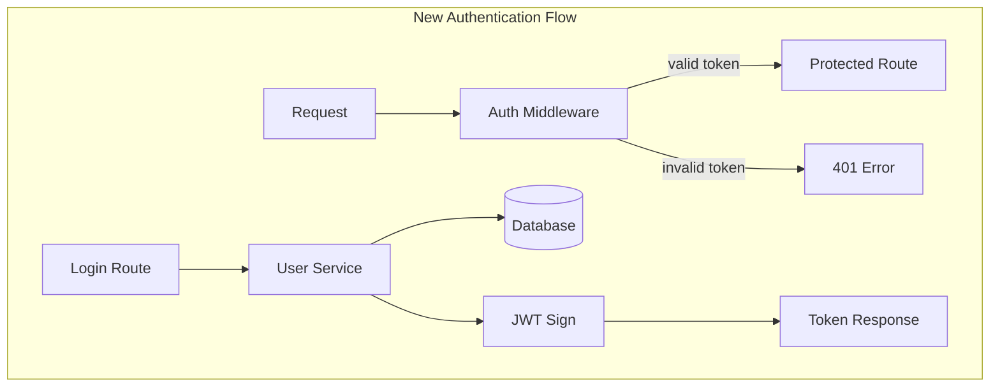
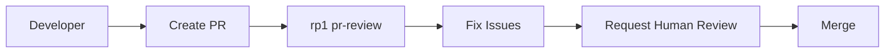
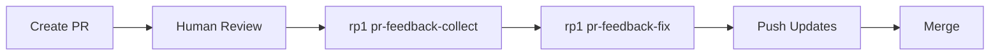
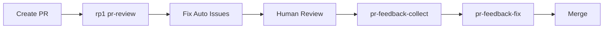

# PR Review Tutorial

Perform thorough code reviews using rp1's map-reduce PR analysis. This tutorial walks you through automated review, visual understanding, and feedback handling.

**Time to complete**: ~30-40 minutes

---

## What You'll Learn

- How rp1's map-reduce PR review architecture works
- Running automated PR analysis with confidence gating
- Visualizing PR changes with Mermaid diagrams
- Collecting and addressing reviewer feedback
- Integrating rp1 reviews into team workflows

## Prerequisites

!!! warning "Before You Begin"
    - rp1 installed ([Installation](../getting-started/installation.md))
    - Knowledge base generated (`/knowledge-build`)
    - A PR to review (local branch or GitHub PR)
    - For GitHub features: `gh` CLI authenticated

---

## The Scenario

We'll review a **feature PR** that adds user authentication to an API. This example was chosen because:

- Auth changes touch multiple layers (routes, middleware, database)
- Security implications require careful review
- Multiple files demonstrate the map-reduce approach

**PR**: Branch `feature/user-auth` with 8 files changed, adding JWT-based authentication.

---

## The PR Review Workflow



| Step | Command | Purpose |
|------|---------|---------|
| Review | `pr-review` | Automated analysis with confidence gating |
| Visualize | `pr-visual` | Diagram-based change understanding |
| Feedback Collect | `pr-feedback-collect` | Gather review comments from GitHub |
| Feedback Fix | `pr-feedback-fix` | Address reviewer comments systematically |

---

## Step 1: Run PR Review

Start the automated review analysis:

=== "Claude Code"

    ```bash
    /pr-review
    ```

    Or specify a target branch:

    ```bash
    /pr-review feature/user-auth main
    ```

=== "OpenCode"

    ```bash
    /rp1-dev/pr-review
    ```

    Or specify a target branch:

    ```bash
    /rp1-dev/pr-review feature/user-auth main
    ```

**What happens:**

rp1's map-reduce PR review:

1. **Splits** the diff into reviewable units (logical file groups)
2. **Maps** each unit to a sub-reviewer agent (parallel analysis)
3. **Reduces** findings through a synthesizer for holistic judgment



**What to expect:**

```
🔍 PR Review Started

Target: feature/user-auth → main
Files changed: 8
Additions: +342, Deletions: -28

Phase 1: Splitting diff into review units...
✓ Unit 1: Authentication routes (2 files)
✓ Unit 2: JWT middleware (2 files)
✓ Unit 3: User service (2 files)
✓ Unit 4: Test coverage (2 files)

Phase 2: Parallel sub-reviews...
[████████████████████] 4/4 units analyzed

Phase 3: Synthesizing findings...
```

!!! tip "Checkpoint"
    The splitter organizes files into logical units. If your files are grouped oddly, it may be because they share functionality the splitter detected.

---

## Step 2: Understand Confidence Gating

Each finding has a confidence score that determines how it's reported:

**What to expect:**

```
📊 Findings Summary

Critical Findings (≥65% confidence):
┌────────────────────────────────────────────────────────────────┐
│ 🔴 SECURITY: JWT secret hardcoded in source file              │
│    Location: src/middleware/auth.ts:12                        │
│    Confidence: 92%                                            │
│    "Secret should be loaded from environment variable"        │
└────────────────────────────────────────────────────────────────┘

High Priority (≥65% confidence):
┌────────────────────────────────────────────────────────────────┐
│ 🟠 Missing token expiration check                             │
│    Location: src/middleware/auth.ts:45                        │
│    Confidence: 78%                                            │
│    "Token validation doesn't check exp claim"                 │
└────────────────────────────────────────────────────────────────┘

Medium Priority (≥65% confidence):
┌────────────────────────────────────────────────────────────────┐
│ 🟡 No rate limiting on login endpoint                         │
│    Location: src/routes/auth.ts:28                            │
│    Confidence: 71%                                            │
│    "Login should have rate limiting to prevent brute force"   │
└────────────────────────────────────────────────────────────────┘

Filtered (40-64%, critical/high only investigated):
- Possible SQL injection (45% → investigated → FALSE POSITIVE)
- Missing input validation (52% → investigated → documented)
```

**Confidence thresholds:**

| Confidence | Action |
|------------|--------|
| ≥65% | Included in report |
| 40-64% (critical/high) | Investigation protocol triggered |
| <40% | Excluded from report |

---

## Step 3: Review Fitness Judgment

The synthesizer produces a holistic judgment:

**What to expect:**

```
📋 Fitness Judgment

Verdict: REQUEST_CHANGES

Rationale:
The PR introduces functional authentication but has security
issues that must be addressed before merge:

1. Hardcoded JWT secret (critical, blocking)
2. Missing token expiration check (high, blocking)
3. No rate limiting (medium, recommended)

Positive Observations:
- Good test coverage for happy path
- Clean separation of concerns
- Proper error handling in middleware

Recommended Actions:
1. Move JWT_SECRET to environment variable
2. Add expiration check in validateToken()
3. Consider adding rate limiting to login route

Report: .rp1/work/pr-reviews/feature-user-auth/review.md
```

**Verdict types:**

| Verdict | Meaning |
|---------|---------|
| `APPROVE` | No blocking issues, safe to merge |
| `REQUEST_CHANGES` | Issues must be addressed |
| `BLOCK` | Critical problems, needs rework |

!!! tip "Checkpoint"
    The review report is saved to `.rp1/work/pr-reviews/`. Review it before taking action.

---

## Step 4: Visualize Changes (Optional)

For complex PRs, generate visual diagrams:

=== "Claude Code"

    ```bash
    /pr-visual
    ```

=== "OpenCode"

    ```bash
    /rp1-dev/pr-visual
    ```

**What happens:**

rp1 generates Mermaid diagrams showing:

- File change relationships
- New dependencies introduced
- Data flow modifications
- Component interactions

**What to expect:**

```
📊 PR Visualization

Generating diagrams for: feature/user-auth → main

Diagrams created:
1. File Change Map - shows which files changed and how they relate
2. New Dependencies - shows new imports/dependencies added
3. Auth Flow - shows the authentication data flow

Output: .rp1/work/pr-reviews/feature-user-auth/diagrams.md
```

Example generated diagram:



!!! info "When to Visualize"
    Use `pr-visual` for PRs with many file changes, new architectural patterns, or when you need to explain changes to stakeholders.

---

## Step 5: Collect Feedback (After GitHub Review)

If the PR has been reviewed on GitHub, collect the feedback:

=== "Claude Code"

    ```bash
    /pr-feedback-collect
    ```

=== "OpenCode"

    ```bash
    /rp1-dev/pr-feedback-collect
    ```

**What happens:**

rp1 uses the `gh` CLI to:

1. Fetch PR review comments
2. Classify by priority and type
3. Extract actionable tasks
4. Generate a structured feedback document

**What to expect:**

```
📥 Collecting PR Feedback

PR: #42 - Add user authentication
Reviewers: @alice, @bob

Fetching comments...
✓ 6 review comments found
✓ 2 general comments found

Classifying feedback...
✓ Critical: 1
✓ High: 2
✓ Medium: 3
✓ Low: 2

Output: .rp1/work/features/{feature-id}/pr_feedback.md
```

The generated feedback document:

```markdown
# PR Feedback: #42 - Add user authentication

## Critical Priority
- [ ] **@alice**: "JWT secret cannot be in source code" (auth.ts:12)

## High Priority
- [ ] **@bob**: "Add token expiration validation" (auth.ts:45)
- [ ] **@alice**: "Need tests for invalid token scenarios" (auth.test.ts)

## Medium Priority
- [ ] **@bob**: "Consider using httpOnly cookies" (auth.ts:67)
...
```

!!! tip "Checkpoint"
    The feedback document organizes comments by priority. Critical items should be addressed first.

---

## Step 6: Fix Feedback

Address reviewer comments systematically:

=== "Claude Code"

    ```bash
    /pr-feedback-fix
    ```

    Or with a feature context:

    ```bash
    /pr-feedback-fix user-auth
    ```

=== "OpenCode"

    ```bash
    /rp1-dev/pr-feedback-fix
    ```

    Or with a feature context:

    ```bash
    /rp1-dev/pr-feedback-fix user-auth
    ```

**What happens:**

rp1 reads the feedback document and:

1. Prioritizes issues by severity
2. Implements fixes for each item
3. Updates the feedback document with completion status
4. Runs tests to verify fixes

**What to expect:**

```
🔧 Addressing PR Feedback

Loading: .rp1/work/features/user-auth/pr_feedback.md
Found: 8 feedback items (1 critical, 2 high, 3 medium, 2 low)

Fixing Critical Issues...
[1/1] Moving JWT secret to environment variable
  ✓ Updated src/middleware/auth.ts
  ✓ Added JWT_SECRET to .env.example
  ✓ Updated documentation

Fixing High Priority Issues...
[1/2] Adding token expiration validation
  ✓ Updated validateToken() in auth.ts
  ✓ Added test cases

[2/2] Adding invalid token test scenarios
  ✓ Added 4 test cases to auth.test.ts
  ✓ All tests passing

Fixing Medium Priority Issues...
...

Summary:
- Critical: 1/1 fixed
- High: 2/2 fixed
- Medium: 3/3 fixed
- Low: 2/2 fixed

Ready to commit and push.
```

!!! tip "Checkpoint"
    After fixing feedback, run the PR review again to verify all issues are resolved.

---

## Team Workflow Integration

### Pattern A: Pre-Review with rp1

Run `pr-review` before requesting human review:



**Benefits**: Catch obvious issues before human reviewers spend time.

### Pattern B: Post-Review Feedback Loop

Use rp1 to process and fix human feedback:



**Benefits**: Systematic processing of reviewer comments, nothing missed.

### Pattern C: Full rp1 Loop

Combine automated and human review:



**Benefits**: Most thorough review process, combines AI and human insight.

---

## Summary

You've learned the complete PR review workflow:

| Step | Command | Output |
|------|---------|--------|
| 1. Review | `pr-review` | Findings with confidence scores |
| 2. Judgment | (automatic) | APPROVE / REQUEST_CHANGES / BLOCK |
| 3. Visualize | `pr-visual` | Mermaid diagrams |
| 4. Collect | `pr-feedback-collect` | Structured feedback document |
| 5. Fix | `pr-feedback-fix` | Addressed issues |

### Key Concepts

- **Map-Reduce**: Parallel analysis of diff units, synthesized judgment
- **Confidence Gating**: Only high-confidence findings reported
- **Fitness Judgment**: Holistic assessment, not just issue list
- **Feedback Loop**: Systematic processing of reviewer comments

---

## Next Steps

- **Reference docs**: See [pr-review](../reference/dev/pr-review.md), [pr-visual](../reference/dev/pr-visual.md), [pr-feedback-collect](../reference/dev/pr-feedback-collect.md), [pr-feedback-fix](../reference/dev/pr-feedback-fix.md)
- **Understand the architecture**: Learn about [Map-Reduce Workflows](../concepts/map-reduce-workflows.md)
- **Investigate issues**: Use [Bug Investigation](bug-investigation.md) for complex problems
- **Build features**: Follow the [Feature Development](feature-development.md) workflow

---

## Troubleshooting

??? question "PR review is taking too long"

    Large PRs with many files take longer due to parallel sub-reviews. Consider:

    - Breaking large PRs into smaller chunks
    - Excluding generated files (they're filtered automatically, but patterns may need adjustment)

??? question "Confidence scores seem too low"

    Confidence depends on evidence found in your codebase. Ensure your knowledge base is current:
    ```bash
    /knowledge-build
    ```

??? question "pr-feedback-collect can't find comments"

    Ensure:

    1. You're in a git repository with a remote
    2. The `gh` CLI is authenticated (`gh auth status`)
    3. The PR exists and has comments

??? question "Diagrams aren't rendering"

    Mermaid diagrams require a compatible viewer. The generated markdown works in:

    - GitHub (native support)
    - VS Code with Mermaid extension
    - MkDocs with pymdownx.superfences

??? question "Can I review without GitHub?"

    Yes. `pr-review` and `pr-visual` work with local branches:
    ```bash
    /pr-review feature-branch main
    ```

    Only `pr-feedback-collect` requires GitHub integration.
