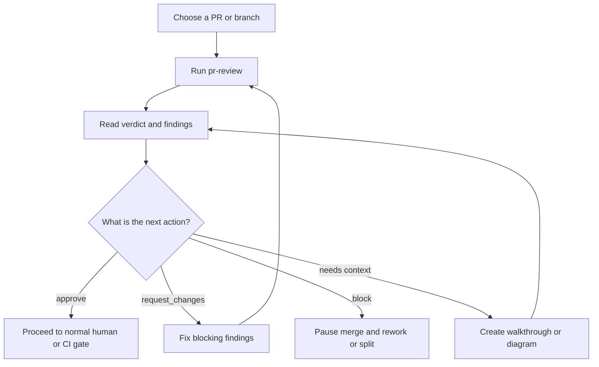
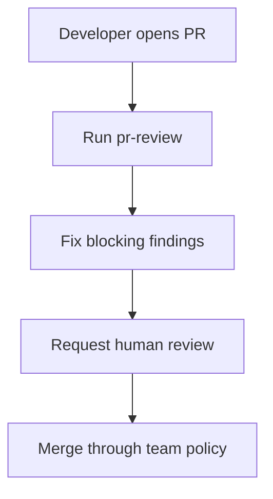
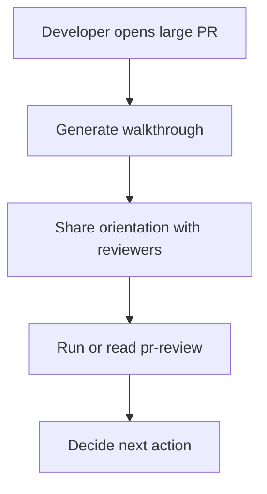
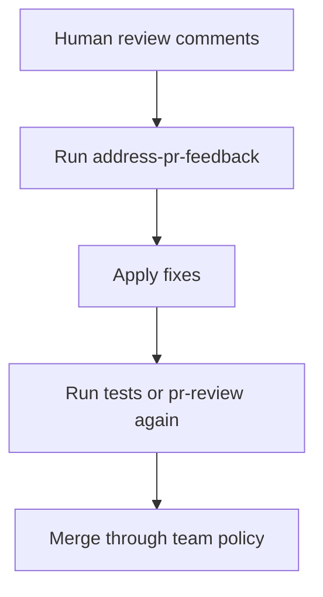

# PR Review Guide

Use rp1 to review a pull request, decide what should happen next, and turn
findings or human comments into follow-up work.

**Time to complete**: 15-25 minutes

---

## What You'll Do

- Run a review against a pull request, branch, or local diff.
- Read the verdict and separate blocking issues from useful observations.
- Decide whether to proceed, fix, split, or ask for human review.
- Use walkthroughs and diagrams when reviewers need more context.
- Address follow-up comments without losing track of decisions.

## Prerequisites

!!! warning "Before You Begin"
    - rp1 installed ([Installation](../getting-started/installation.md))
    - Project context generated with `knowledge-build`
    - A pull request, branch, or local diff to review
    - For GitHub pull requests: [`gh` CLI](https://cli.github.com/) installed and authenticated

---

## Review Decision Flow


```mermaid
flowchart TB
    START[Choose a PR or branch] --> REVIEW[Run pr-review]
    REVIEW --> READ[Read verdict and findings]
    READ --> DECIDE{What is the next action?}
    DECIDE -->|approve| PROCEED[Proceed to normal human or CI gate]
    DECIDE -->|request_changes| FIX[Fix blocking findings]
    DECIDE -->|block| PAUSE[Pause merge and rework or split]
    DECIDE -->|needs context| ORIENT[Create walkthrough or diagram]
    FIX --> REVIEW
    ORIENT --> READ
```

rp1's verdict is review input. It does not replace your team's merge policy,
required CI checks, security rules, or human approval requirements.

## Step 1: Run The Review

Start with the current branch when it already has an associated pull request.

=== "Claude Code"

    ```bash
    /pr-review
    ```

=== "OpenCode"

    ```bash
    /rp1-dev-pr-review
    ```

=== "Codex"

    ```bash
    $rp1-dev-pr-review
    ```

You can also point the review at a specific target.

=== "Claude Code"

    ```bash
    /pr-review 42
    /pr-review https://github.com/owner/repo/pull/42
    /pr-review feature/user-auth main
    ```

=== "OpenCode"

    ```bash
    /rp1-dev-pr-review 42
    /rp1-dev-pr-review https://github.com/owner/repo/pull/42
    /rp1-dev-pr-review feature/user-auth main
    ```

=== "Codex"

    ```bash
    $rp1-dev-pr-review 42
    $rp1-dev-pr-review https://github.com/owner/repo/pull/42
    $rp1-dev-pr-review feature/user-auth main
    ```

The review resolves the target, reads the PR description or local diff, checks
the implementation against that intent, and writes a report under
`.rp1/work/pr-reviews/`.

## Step 2: Read The Verdict

The final output and markdown report should answer four questions:

| Question | Where to look |
|----------|---------------|
| What was this PR trying to do? | Intent or summary section |
| Is it safe to proceed? | Verdict and rationale |
| What must change before merge? | Critical and high findings |
| What should be tracked after review? | Recommendations and follow-ups |

Typical verdicts:

| Verdict | What it means | Next action |
|---------|---------------|-------------|
| `approve` | No blocking issues were found. | Continue to human review, CI, or merge policy. |
| `request_changes` | One or more findings should be fixed before merge. | Fix the blocking items, push updates, and rerun review if the change is material. |
| `block` | The PR has critical risk or the review cannot support the current direction. | Pause merge, rework the approach, split the PR, or ask a domain owner. |

When the reviewed PR URL is known, the report and Arcade run show a reviewed PR
link so you can jump back to the source review target.

## Step 3: Decide What Happens Next

Use the verdict with your own context:

| Situation | Action |
|-----------|--------|
| Verdict is `approve`, CI is green, and no required reviewer is missing. | Proceed through your normal merge process. |
| Verdict is `request_changes` with concrete code findings. | Fix those items, add or update tests when needed, then rerun review. |
| Verdict is `block`. | Stop the merge path until the design, security, or correctness issue is resolved. |
| The PR is large and reviewers need orientation. | Generate a walkthrough before asking for review. |
| The change is cross-file or hard to explain in prose. | Generate a visual diagram and attach or link it in the PR discussion. |
| Human reviewers already left comments. | Use the feedback workflow to collect and address comments systematically. |

!!! tip "Keep findings actionable"
    A useful review decision identifies the exact blocking item, the expected
    fix, and whether another review pass is required.

## Step 4: Use Walkthroughs And Visual Aids

Use these when the review needs context, not as a substitute for fixing
findings.

| Need | Command | Best use |
|------|---------|----------|
| Review verdict and actionable findings | `pr-review` | Decide whether to approve, request changes, or block. |
| Reviewer orientation | `pr-walkthrough` | Explain what changed, where to look, and what questions remain. |
| Cross-file diagram | `pr-visual` | Show flows, dependencies, or file relationships that are hard to scan from a diff. |

Generate a walkthrough:

=== "Claude Code"

    ```bash
    /pr-walkthrough 42
    ```

=== "OpenCode"

    ```bash
    /rp1-dev-pr-walkthrough 42
    ```

=== "Codex"

    ```bash
    $rp1-dev-pr-walkthrough 42
    ```

Generate diagrams:

=== "Claude Code"

    ```bash
    /pr-visual 42
    ```

=== "OpenCode"

    ```bash
    /rp1-dev-pr-visual 42
    ```

=== "Codex"

    ```bash
    $rp1-dev-pr-visual 42
    ```

Open generated reports, walkthroughs, and diagrams from the command output or
from the run in [Arcade](../arcade/index.md). Walkthroughs are easiest to share
when reviewers need a quick map before reading the diff.

## Step 5: Address Feedback

After human reviewers comment on the pull request, use the feedback workflow to
collect unresolved comments, decide which ones need code changes, and apply the
fixes in one pass.

[Go to Addressing PR Feedback :material-arrow-right:](pr-feedback.md){ .md-button .md-button--primary }

## Team Review Patterns

### Pre-Review Before Requesting Humans


```mermaid
flowchart TB
    DEV[Developer opens PR] --> AUTO[Run pr-review]
    AUTO --> FIX[Fix blocking findings]
    FIX --> HUMAN[Request human review]
    HUMAN --> MERGE[Merge through team policy]
```

Use this when you want to catch obvious issues before reviewers spend time.

### Orientation For Larger PRs


```mermaid
flowchart TB
    DEV[Developer opens large PR] --> WALK[Generate walkthrough]
    WALK --> REVIEWERS[Share orientation with reviewers]
    REVIEWERS --> AUTO[Run or read pr-review]
    AUTO --> DECISION[Decide next action]
```

Use this when the PR is correct but hard to scan without a change map.

### Post-Review Feedback Loop


```mermaid
flowchart TB
    HUMAN[Human review comments] --> FEEDBACK[Run address-pr-feedback]
    FEEDBACK --> UPDATE[Apply fixes]
    UPDATE --> CHECK[Run tests or pr-review again]
    CHECK --> MERGE[Merge through team policy]
```

Use this when comments already exist and you need to avoid missing one.

---

## Troubleshooting

??? question "The review target is wrong"

    Pass the PR number or URL explicitly:

    ```bash
    /pr-review 42
    ```

    For local branches, include the base branch:

    ```bash
    /pr-review feature-branch main
    ```

??? question "The report does not understand the intent"

    Make sure the PR description explains the goal, user impact, and known
    tradeoffs. If the PR is local-only, include a clear branch name and commit
    history, or add context when the workflow asks.

??? question "The PR is too large to review usefully"

    Generate a walkthrough for orientation, then split the PR if the findings
    are too broad to act on. Reviews are most useful when each finding maps to
    a specific owner and fix.

??? question "I need automated GitHub review comments"

    Use [Remote PR Review](remote-pr-review.md) and the
    [PR Review Config Reference](../reference/pr-review-config.md) for CI
    setup and posting behavior.

## Next Steps

- **Command details**: [`pr-review`](../reference/dev/pr-review.md)
- **Walkthrough reference**: [`pr-walkthrough`](../reference/dev/pr-walkthrough.md)
- **Visual reference**: [`pr-visual`](../reference/dev/pr-visual.md)
- **Human comments**: [Addressing PR Feedback](pr-feedback.md)
