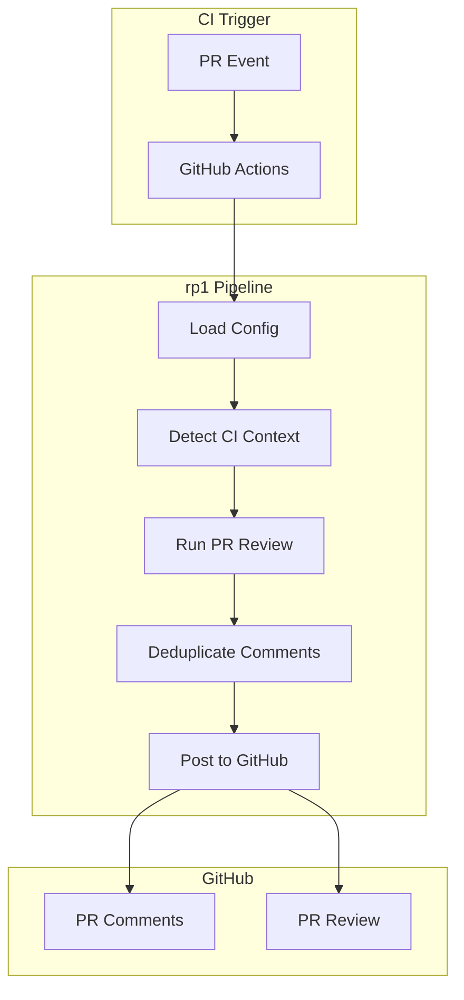
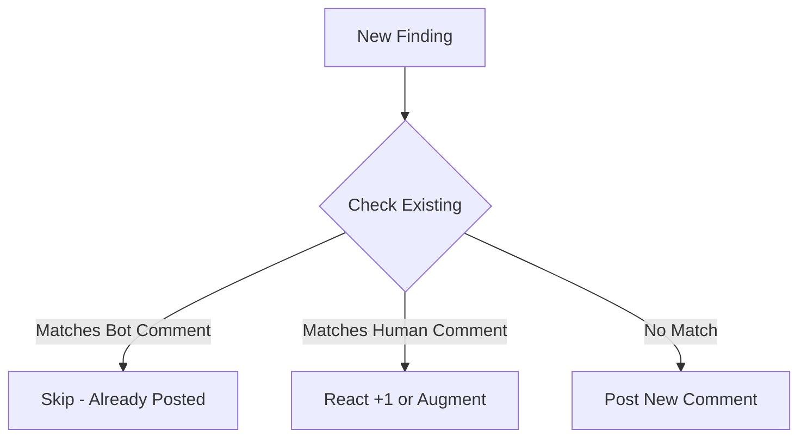

# Remote PR Review (CI/CD)

Run automated PR reviews in CI/CD environments. This guide covers setting up rp1 PR reviews in GitHub Actions with intelligent comment management and deduplication.

**Time to complete**: ~20-30 minutes

---

## What You'll Learn

- Setting up rp1 PR review in GitHub Actions
- Configuring review behavior per repository
- Understanding comment deduplication
- Troubleshooting common CI issues

## Prerequisites

!!! warning "Before You Begin"
    - rp1 installed locally and working ([Installation](../getting-started/installation.md))
    - Repository with existing `.rp1/` configuration
    - GitHub repository with Actions enabled
    - Anthropic API key

---

## Overview

rp1's remote PR review extends the local `/pr-review` command to run automatically in CI/CD pipelines. When configured, it:

1. **Triggers automatically** on PR events (opened, synchronized, reopened)
2. **Posts inline comments** on specific code locations
3. **Deduplicates comments** to avoid noise across multiple runs
4. **Respects human reviewers** by acknowledging their comments



---

## Step 1: Create Configuration File

Create `.rp1/config/pr-review.yaml` in your repository:

```yaml
# Enable automated PR review
enabled: true

# Review draft PRs (default: true)
review_drafts: true

# AI harness to use: "claude-code" | "opencode"
ai_harness: claude-code

# Post inline comments on specific code locations
add_comments: true

# Collapse summary in <details> tag (useful for long summaries)
collapse_summary: false

# Verdict mode: "approve" | "request_changes" | "comment" | "auto"
# - auto: Determines verdict based on finding severity
verdict: auto

# Maximum inline comments per review (prevents overwhelming PRs)
max_comments: 25

# Generate mermaid diagrams in summary
visualize: false
```

### Verdict Modes

| Mode | Behavior |
|------|----------|
| `auto` | Critical/high findings = REQUEST_CHANGES, medium/low = COMMENT, none = APPROVE |
| `approve` | Always APPROVE (advisory-only reviews) |
| `request_changes` | Always REQUEST_CHANGES (strict enforcement) |
| `comment` | Always COMMENT (neutral) |

!!! tip "Start with auto"
    The `auto` verdict mode is recommended for most teams. It blocks PRs with serious issues while allowing minor findings to pass.

---

## Step 2: Set Up GitHub Actions Workflow

Create `.github/workflows/rp1-pr-review.yml`:

```yaml
name: rp1 PR Review

on:
  pull_request:
    types: [opened, synchronize, reopened]

permissions:
  contents: read
  pull-requests: write

jobs:
  review:
    runs-on: ubuntu-latest
    steps:
      - uses: actions/checkout@v4
        with:
          fetch-depth: 0

      - name: Install rp1
        run: curl -fsSL https://rp1.run/install.sh | bash

      - name: Install Claude Code
        run: npm install -g @anthropic-ai/claude-code

      - name: Run PR Review
        env:
          ANTHROPIC_API_KEY: ${{ secrets.ANTHROPIC_API_KEY }}
          GITHUB_TOKEN: ${{ secrets.GITHUB_TOKEN }}
        run: claude /rp1-dev:pr-review
```

### Required Secrets

| Secret | Description | How to Get |
|--------|-------------|------------|
| `ANTHROPIC_API_KEY` | API key for Claude | [Anthropic Console](https://console.anthropic.com/) |
| `GITHUB_TOKEN` | Automatically provided | Built-in GitHub Actions token |

!!! warning "Security"
    Never commit your `ANTHROPIC_API_KEY` to the repository. Always use GitHub Secrets.

---

## Step 3: Configure Permissions

Ensure your workflow has the correct permissions:

```yaml
permissions:
  contents: read        # Read repository contents
  pull-requests: write  # Post comments and reviews
```

If you're using a custom `GITHUB_TOKEN` (not the built-in one), ensure it has `repo` scope.

---

## How Comment Deduplication Works

The remote PR review intelligently manages comments across multiple runs:

### Bot Comment Deduplication

When the same bot runs multiple times on a PR:

1. New comments are compared against existing bot comments
2. If a comment matches (same file, overlapping lines, similar content), it's skipped
3. Only new findings result in new comments

### Human Comment Acknowledgment

When human reviewers have already commented:

1. If a human identified the same issue, the bot reacts with :+1: instead of posting
2. If the human's comment lacks detail, the bot may reply with additional context
3. The bot never duplicates what humans have already said



---

## Environment Variable Overrides

Override configuration values via environment variables for CI flexibility:

| Environment Variable | Overrides |
|---------------------|-----------|
| `RP1_PR_REVIEW_ENABLED` | `enabled` |
| `RP1_PR_REVIEW_VERDICT` | `verdict` |
| `RP1_PR_REVIEW_ADD_COMMENTS` | `add_comments` |
| `RP1_PR_REVIEW_VISUALIZE` | `visualize` |

Example usage in workflow:

```yaml
- name: Run PR Review (Strict Mode)
  env:
    ANTHROPIC_API_KEY: ${{ secrets.ANTHROPIC_API_KEY }}
    GITHUB_TOKEN: ${{ secrets.GITHUB_TOKEN }}
    RP1_PR_REVIEW_VERDICT: request_changes  # Override config
  run: claude /rp1-dev:pr-review
```

---

## Draft PR Handling

Control whether draft PRs are reviewed:

```yaml
# In pr-review.yaml
review_drafts: false  # Skip draft PRs entirely
```

When `review_drafts: false`:

- Draft PRs trigger the workflow but exit early
- No review is posted
- Once the PR is marked ready for review, the next push triggers a full review

---

## Visual Diagrams in CI

Enable mermaid diagram generation in review summaries:

```yaml
# In pr-review.yaml
visualize: true
```

When enabled:

- Diagrams are generated in markdown format (not HTML)
- Embedded directly in the review summary
- GitHub renders mermaid blocks natively in PR comments

!!! note "Performance"
    Visualization adds processing time. Enable only when visual understanding of changes is valuable.

---

## Advanced Configuration

### Limit Comment Volume

Prevent overwhelming PR authors:

```yaml
max_comments: 15  # Maximum inline comments
add_comments: true
collapse_summary: true  # Collapse summary to reduce noise
```

### Custom Bot Marker

Identify bot comments for tracking:

```yaml
bot_marker: "<!-- my-team-rp1-review -->"
```

The marker is invisible in rendered comments but helps with deduplication and tracking.

---

## Troubleshooting

??? question "Review not posting comments"

    1. Check `pull-requests: write` permission is set
    2. Verify `GITHUB_TOKEN` has access to the repository
    3. Check Actions logs for API errors

    ```yaml
    permissions:
      pull-requests: write
    ```

??? question "Duplicate comments appearing"

    1. Ensure `bot_marker` is consistent across runs
    2. Check that the same config file is used
    3. Verify the deduplication logic is matching correctly (check similarity threshold)

??? question "Review takes too long"

    Large PRs take longer. Consider:

    1. Breaking PRs into smaller chunks
    2. Setting `visualize: false` to skip diagram generation
    3. Reducing `max_comments` to limit analysis scope

??? question "API rate limits"

    1. Check Anthropic API quota in [console](https://console.anthropic.com/)
    2. Consider running reviews only on significant PRs (use path filters)

    ```yaml
    on:
      pull_request:
        paths:
          - 'src/**'
          - '!**/*.md'
    ```

??? question "Config not being loaded"

    1. Verify file is at `.rp1/config/pr-review.yaml` (exact path)
    2. Check YAML syntax is valid
    3. Ensure `enabled: true` is set
    4. Check Actions logs for config loading messages

---

## Summary

You've learned how to set up remote PR review:

| Topic | Key Points |
|-------|------------|
| Configuration | `.rp1/config/pr-review.yaml` with schema validation |
| GitHub Actions | Workflow with correct permissions and secrets |
| Deduplication | Bot and human comment awareness |
| Customization | Verdict modes, comment limits, visual diagrams |

---

## Next Steps

- [PR Review Config Reference](../reference/pr-review-config.md) - All configuration options
- [PR Review Command Reference](../reference/dev/pr-review.md) - Command details
- [CI/CD Integration Guide](ci-cd-integration.md) - Broader CI/CD patterns
- [Agent Tools Reference](../reference/agent-tools.md) - GitHub PR tools documentation
