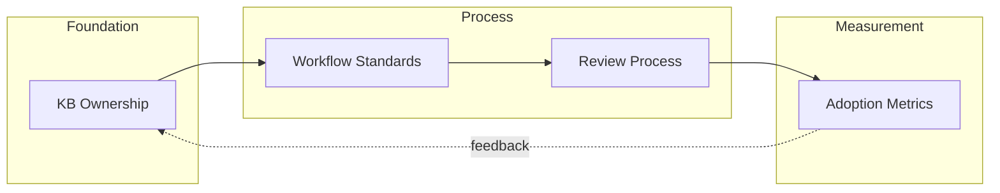
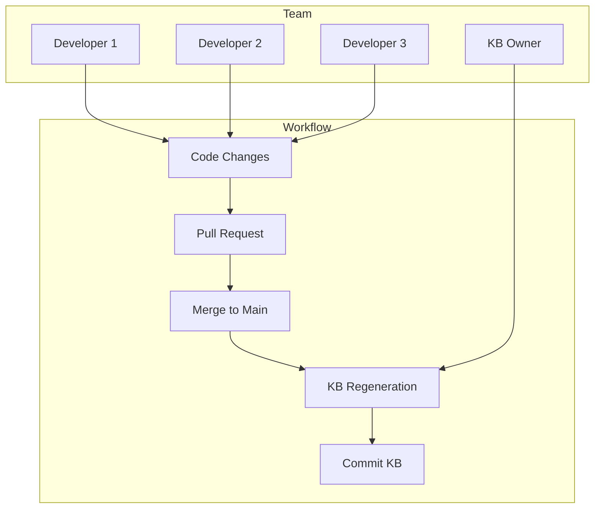
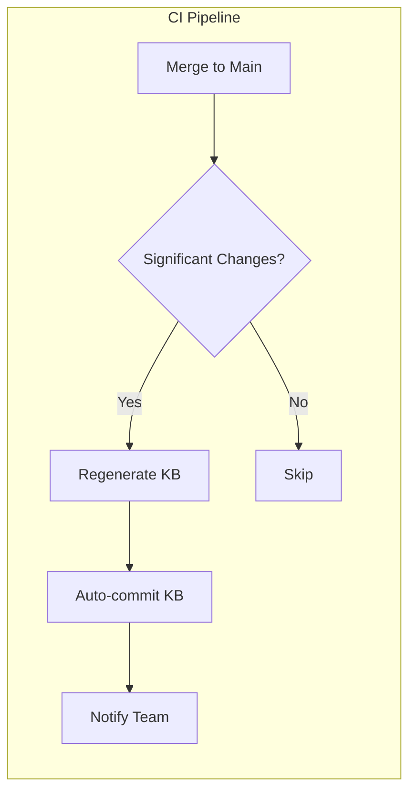
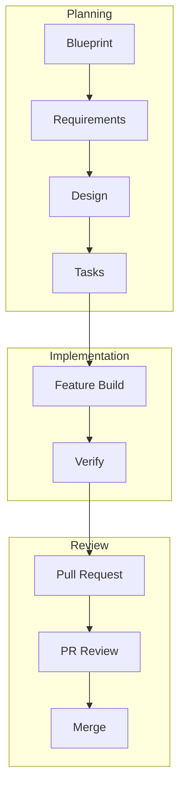
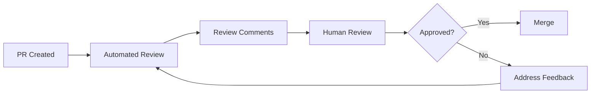
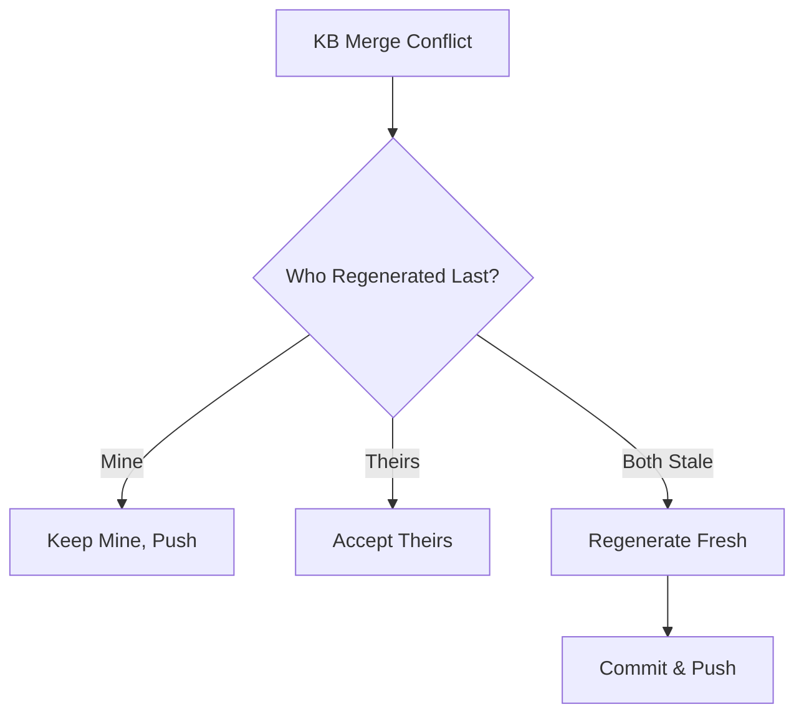
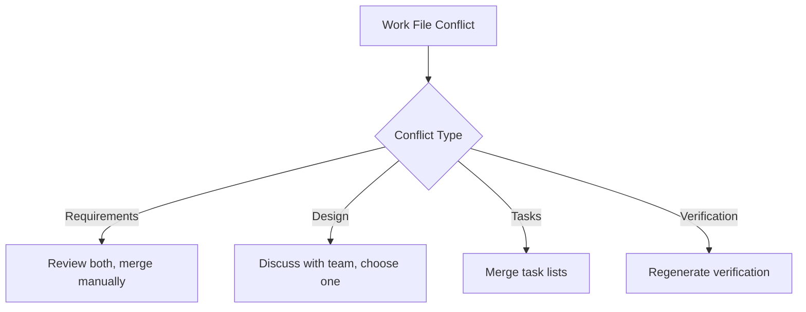

# Scaling rp1 with Teams

Take rp1 from individual productivity tool to team-wide development standard. This guide covers ownership models, workflow standardization, and adoption measurement.

**Time to complete**: ~30 minutes (reading)

---

## What You'll Learn

- KB ownership models for different team sizes
- Standardizing workflows across team members
- Review processes using rp1
- Handling merge conflicts in KB and work files
- Measuring and tracking team adoption

## Prerequisites

!!! warning "Before You Begin"
    - rp1 installed and working for individual use ([Installation](../getting-started/installation.md))
    - Completed [First Workflow](../getting-started/first-workflow.md) tutorial
    - Understanding of [Knowledge-Aware Agents](../concepts/knowledge-aware-agents.md)

---

## Overview

Scaling rp1 to a team involves three key areas:



| Area | Key Question |
|------|--------------|
| **KB Ownership** | Who regenerates the knowledge base? |
| **Workflow Standards** | How do we ensure consistent rp1 usage? |
| **Review Process** | How do we integrate rp1 into code review? |
| **Adoption Metrics** | How do we measure success? |

---

## KB Ownership Models

The knowledge base needs regular updates as your codebase evolves. Choose an ownership model that fits your team structure.

### Model Comparison

| Model | Best For | Pros | Cons |
|-------|----------|------|------|
| **Single Maintainer** | Small teams (2-5) | Simple, consistent | Single point of failure |
| **Rotating Ownership** | Medium teams (5-15) | Shared knowledge, no bottleneck | Coordination overhead |
| **CI-Managed** | Large teams (15+) | Fully automated, always current | Setup complexity |

### Single Maintainer Model

One team member owns KB regeneration. Best for small teams or initial adoption.



**Setup**:

1. Designate one team member as KB owner
2. KB owner regenerates weekly or after significant changes
3. All team members pull latest KB before starting work

**Best practices**:

!!! tip "Single Maintainer Tips"
    - Schedule KB regeneration (e.g., Monday morning)
    - Document the regeneration process
    - Have a backup owner identified
    - Regenerate after major refactors or new feature merges

**Example workflow**:

```bash
# KB Owner's weekly routine
git pull origin main
/knowledge-build
git add .rp1/context/
git commit -m "chore: weekly KB regeneration"
git push
```

### Rotating Ownership Model

Team members take turns owning KB updates. Spreads knowledge and prevents bottlenecks.

**Setup**:

1. Create a rotation schedule (weekly or bi-weekly)
2. Document the handoff process
3. Use a shared calendar or Slack reminder

**Rotation checklist**:

```markdown
## KB Owner Handoff Checklist

- [ ] Pull latest main branch
- [ ] Run `/knowledge-build`
- [ ] Commit and push KB changes
- [ ] Note any issues in #rp1-team channel
- [ ] Update rotation tracker
```

!!! info "Rotation Length"
    Weekly rotations work well for active codebases. For stable codebases, bi-weekly or monthly rotations reduce overhead.

### CI-Managed Model

Automate KB regeneration in your CI/CD pipeline. Best for large teams or active codebases.



**Setup**:

See [CI/CD Integration](ci-cd-integration.md) for detailed setup. Key workflow:

```yaml
# .github/workflows/kb-rebuild.yml
name: Rebuild Knowledge Base

on:
  push:
    branches: [main]
    paths:
      - 'src/**'
      - 'lib/**'
      - '!**/*.md'
      - '!.rp1/**'

jobs:
  rebuild-kb:
    runs-on: ubuntu-latest
    steps:
      - uses: actions/checkout@v4
      - name: Install rp1
        run: curl -fsSL https://rp1.run/install.sh | sh
      - name: Rebuild KB
        run: |
          rp1 init --yes
          claude --print "/knowledge-build"
      - name: Commit KB
        run: |
          git config user.name "github-actions[bot]"
          git config user.email "github-actions[bot]@users.noreply.github.com"
          git add .rp1/context/
          git diff --staged --quiet || git commit -m "chore: rebuild KB [skip ci]"
          git push
```

**Benefits**:

- KB always current with main branch
- No manual coordination needed
- Audit trail of KB changes
- Team members always have fresh context

!!! warning "CI Costs"
    KB regeneration uses AI API calls. Consider scheduled regeneration (nightly) instead of per-merge for high-volume repositories.

---

## Workflow Standardization

Consistent rp1 usage across the team maximizes value. Standardize on workflows, not just tool usage.

### Feature Development Standard

Define a standard feature workflow for your team:



**Standard workflow document**:

```markdown
## Team Feature Workflow

### Required Steps

1. **Blueprint** (`/blueprint feature-name`)
   - Create charter with stakeholder input
   - All features need a charter

2. **Requirements** (`/feature-requirements feature-name`)
   - Document acceptance criteria
   - Review with product owner

3. **Design** (`/feature-design feature-name`)
   - Technical design before coding
   - Peer review for medium+ complexity

4. **Tasks** (`/feature-tasks feature-name`)
   - Break into implementable chunks
   - Estimate complexity

5. **Build** (`/feature-build feature-name`)
   - Implement with rp1 assistance
   - Commit frequently

6. **Verify** (`/feature-verify feature-name`)
   - Run before PR creation
   - Address all issues

### Optional Steps

- Skip blueprint for bugs and small fixes
- Skip design for simple changes
- Use `/code-quick-build` for urgent hotfixes
```

### Branch Naming Conventions

Standardize branch naming to integrate with rp1:

| Type | Pattern | Example |
|------|---------|---------|
| Feature | `feature/<feature-id>` | `feature/user-auth` |
| Bug fix | `fix/<issue-id>` | `fix/login-timeout` |
| Hotfix | `hotfix/<description>` | `hotfix/security-patch` |

!!! tip "Feature ID Consistency"
    Use the same feature ID in branch names and rp1 commands:
    ```bash
    git checkout -b feature/user-auth
    /blueprint user-auth
    /feature-requirements user-auth
    ```

### PR Template Integration

Add rp1-specific sections to your PR template:

```markdown
## Pull Request

### Description
<!-- What does this PR do? -->

### rp1 Artifacts

- [ ] Feature charter: `.rp1/work/features/<feature-id>/charter.md`
- [ ] Requirements: `.rp1/work/features/<feature-id>/requirements.md`
- [ ] Design: `.rp1/work/features/<feature-id>/design.md`
- [ ] Verification: `.rp1/work/features/<feature-id>/verification-report.md`

### Checklist

- [ ] Ran `/feature-verify` before creating PR
- [ ] All acceptance criteria met
- [ ] Tests passing
- [ ] Documentation updated (if applicable)
```

---

## Review Processes

Integrate rp1 into your code review workflow for consistent, thorough reviews.

### Automated PR Review

Set up automated PR review for every pull request:



**GitHub Actions setup**:

```yaml
name: PR Review

on:
  pull_request:
    types: [opened, synchronize]

jobs:
  review:
    runs-on: ubuntu-latest
    permissions:
      pull-requests: write
    steps:
      - uses: actions/checkout@v4
        with:
          fetch-depth: 0
      - name: Install rp1
        run: curl -fsSL https://rp1.run/install.sh | sh
      - name: Run PR Review
        env:
          ANTHROPIC_API_KEY: ${{ secrets.ANTHROPIC_API_KEY }}
          GH_TOKEN: ${{ secrets.GITHUB_TOKEN }}
        run: |
          rp1 init --yes
          claude --print "/pr-review ${{ github.event.pull_request.number }}"
```

### Review Responsibilities Matrix

Define what rp1 reviews vs. what humans review:

| Aspect | rp1 Reviews | Human Reviews |
|--------|-------------|---------------|
| **Code quality** | Patterns, naming, structure | Business logic correctness |
| **Test coverage** | Coverage gaps, test quality | Test scenarios completeness |
| **Security** | Common vulnerabilities | Domain-specific security |
| **Architecture** | Pattern adherence | Strategic fit |
| **Documentation** | Completeness, accuracy | Clarity, audience fit |

!!! info "rp1 as First Reviewer"
    Use rp1 as the first reviewer to catch common issues before human review. This frees human reviewers to focus on business logic and strategic concerns.

### Review Feedback Loop

When rp1 identifies issues, use the feedback commands:

```bash
# Collect feedback from PR comments
/pr-feedback-collect PR_NUMBER

# Apply fixes based on feedback
/pr-feedback-fix FEATURE_ID
```

---

## Merge Conflict Resolution

KB and work files can conflict when multiple team members work simultaneously. Here's how to resolve them.

### KB File Conflicts

KB files are regenerated, not manually edited. Resolution is straightforward:



**Resolution steps**:

```bash
# Option 1: Accept theirs (most common)
git checkout --theirs .rp1/context/
git add .rp1/context/
git commit -m "resolve: accept upstream KB"

# Option 2: Regenerate fresh (recommended for large conflicts)
git checkout --theirs .rp1/context/
/knowledge-build
git add .rp1/context/
git commit -m "resolve: regenerate KB after conflict"
```

!!! tip "Avoid KB Conflicts"
    - Pull latest before regenerating KB
    - Use CI-managed KB for active teams
    - Coordinate KB regeneration during active development

### Work Artifact Conflicts

Feature work files (requirements, design, tasks) may have meaningful conflicts:



**Resolution by file type**:

| File | Resolution Strategy |
|------|---------------------|
| `charter.md` | Merge manually, preserve stakeholder input |
| `requirements.md` | Merge acceptance criteria, deduplicate |
| `design.md` | Team discussion, choose authoritative version |
| `tasks.md` | Merge task lists, update status |
| `verification-report.md` | Regenerate with `/feature-verify` |

**Example: Merging requirements**:

```bash
# See both versions
git diff HEAD...MERGE_HEAD -- .rp1/work/features/my-feature/requirements.md

# Edit to merge manually
vim .rp1/work/features/my-feature/requirements.md

# Mark resolved
git add .rp1/work/features/my-feature/requirements.md
git commit -m "resolve: merge requirements for my-feature"
```

---

## Measuring Adoption

Track team adoption to identify what's working and where to improve.

### Key Metrics

| Metric | What It Measures | How to Track |
|--------|------------------|--------------|
| **Usage rate** | % of PRs using rp1 workflow | Count commits with rp1 signature |
| **PR review coverage** | % of PRs with rp1 review | CI job success rate |
| **Time to first PR** | New developer onboarding speed | Track first PR date |

### Adoption Milestones

Set team adoption milestones:

| Milestone | Target | Indicator |
|-----------|--------|-----------|
| **Pilot** | 1 feature | First complete workflow |
| **Early Adoption** | 25% features | Team using for new features |
| **Mainstream** | 75% features | Default workflow for all features |
| **Mature** | 90%+ features | CI-managed KB, automated reviews |

---

## Summary

You've learned how to scale rp1 to your team:

| Topic | Key Points |
|-------|------------|
| **KB Ownership** | Single maintainer, rotating, or CI-managed |
| **Workflow Standards** | Define required steps, branch naming, PR templates |
| **Review Process** | Automated first review, human review for business logic |
| **Conflict Resolution** | Regenerate KB, merge work files manually |
| **Adoption Metrics** | Track usage rate, completion rate, onboarding time |

---

## Next Steps

- [CI/CD Integration](ci-cd-integration.md) - Automate rp1 in your pipeline
- [Feature Development](feature-development.md) - Standard feature workflow
- [Team Onboarding](team-onboarding.md) - Onboard new team members
- [PR Review](pr-review.md) - Detailed PR review process

---

## Troubleshooting

??? question "Team members not using rp1 consistently"

    Common causes and solutions:

    1. **Workflow too complex**: Simplify required steps for small changes
    2. **No enforcement**: Add PR template checklist, CI checks
    3. **Training gaps**: Run team workshop, pair on first features
    4. **Unclear value**: Share metrics showing time savings

??? question "KB conflicts happening frequently"

    1. **Pull before regenerating**: Always `git pull` first
    2. **Coordinate regeneration**: Use Slack channel for coordination
    3. **Move to CI-managed**: Automate KB regeneration
    4. **Reduce frequency**: Weekly regeneration instead of per-feature

??? question "Adoption stalled at pilot stage"

    1. **Identify blockers**: Survey team for friction points
    2. **Executive support**: Get leadership to endorse workflow
    3. **Quick wins**: Start with bug investigation, not full features
    4. **Celebrate success**: Share time savings publicly

??? question "Different teams want different workflows"

    1. **Core + optional**: Define required steps, make others optional
    2. **Team-specific configs**: Allow workflow customization per team
    3. **Gradual alignment**: Start with common ground, expand over time

??? question "How do we handle contractors or external contributors?"

    1. **Read-only KB**: Share KB files, don't require regeneration
    2. **Simplified workflow**: `/code-quick-build` for small contributions
    3. **Mentored onboarding**: Pair with team member on first PR
    4. **Documentation**: Point to [First Workflow](../getting-started/first-workflow.md)
