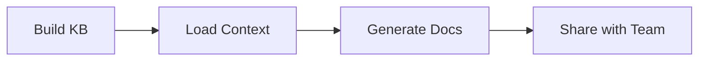
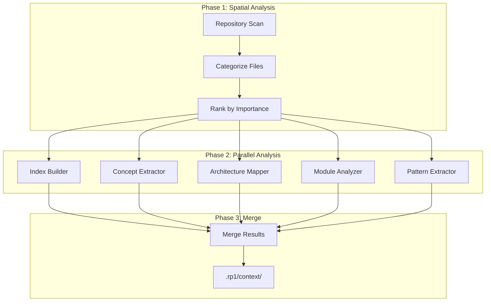
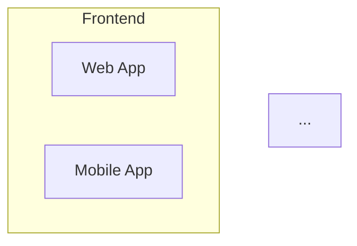

# Team Onboarding Tutorial

Help new team members get productive quickly using rp1's knowledge base capabilities. This tutorial walks you through generating codebase documentation and creating onboarding materials.

**Time to complete**: ~25-35 minutes

---

## What You'll Learn

- How rp1's knowledge base captures codebase understanding
- Generating a knowledge base for your project
- Understanding the KB output files
- Creating orientation documentation for new developers
- Sharing knowledge base artifacts with your team

## Prerequisites

!!! warning "Before You Begin"
    - rp1 installed ([Installation](../getting-started/installation.md))
    - A codebase you want to document
    - Git repository (KB tracks commits for incremental updates)

---

## The Scenario

A **new developer is joining your team** and needs to understand an unfamiliar codebase. This example was chosen because:

- Onboarding is time-consuming (often 2-4 weeks to productivity)
- Tribal knowledge is often undocumented
- New developers ask the same questions repeatedly
- Documentation gets stale quickly

**Goal**: Generate living documentation that helps new developers understand architecture, patterns, and conventions.

---

## The Onboarding Workflow



| Step | Command | Purpose |
|------|---------|---------|
| Build KB | `knowledge-build` | Analyze codebase, generate KB files |
| Load Context | `knowledge-load` | Prepare KB for agent use |
| Generate Docs | `project-birds-eye-view` | Create orientation documentation |
| Share | Git commit | Make KB available to team |

---

## Step 1: Generate Knowledge Base

Build the knowledge base for your project:

=== "Claude Code"

    ```bash
    /knowledge-build
    ```

=== "OpenCode"

    ```bash
    /rp1-base/knowledge-build
    ```

**What happens:**

rp1's KB generation uses a map-reduce architecture:

1. **Spatial Analysis**: Scans repository, categorizes files by KB section
2. **Parallel Analysis**: 5 specialized agents analyze files concurrently
3. **Merge Phase**: Combines agent outputs into KB files



**What to expect:**

```
🔍 Knowledge Base Generation Started

Repository: /path/to/your-project
Type: Single Project (detected)

Phase 1: Spatial Analysis
Scanning repository...
✓ 847 files found
✓ 312 files relevant to KB
✓ Files categorized by section

Phase 2: Parallel KB Generation
[████████████████████] 5/5 agents complete

Phase 3: Merging Results
✓ index.md generated
✓ concept_map.md generated
✓ architecture.md generated
✓ modules.md generated
✓ patterns.md generated

✅ Knowledge Base Complete

Location: .rp1/context/
Files: 5 markdown files + state.json + meta.json
Time: 8 minutes 32 seconds

Note: meta.json contains local paths - add to .gitignore
Next: Knowledge base is ready for use with rp1 commands
```

!!! info "First-time vs Incremental"
    - **First-time**: 10-15 minutes (full analysis)
    - **Incremental**: 2-5 minutes (only changed files)
    - **No changes**: Instant skip (git commit unchanged)

!!! tip "Checkpoint"
    Run `ls .rp1/context/` to verify all KB files were created.

---

## Step 2: Understand KB Output

The knowledge base consists of 5 core files:

### index.md - Project Overview

Quick start guide with:

- Repository structure
- Project summary
- Entry points
- Development setup

```markdown
# Project Knowledge Base

**Repository Type**: Single Project
**Primary Languages**: TypeScript, Python
**Last Updated**: 2024-01-15

## Quick Start
...

## Repository Structure
```

### concept_map.md - Domain Concepts

Business and technical concepts:

- Domain terminology
- Key entities
- Relationships
- Business rules

```markdown
# Domain Concepts

## Core Business Concepts

### Order
**Definition**: A customer's request to purchase items
**Implementation**: src/models/order.ts
**Relationships**: Customer (1:N), OrderItem (1:N), Payment (1:1)
```

### architecture.md - System Architecture

High-level system design:

- Component diagrams
- Integration points
- Data flow
- Deployment architecture

```markdown
# System Architecture

## High-Level Architecture



### modules.md - Module Breakdown

Component structure:

- Module purposes
- Dependencies
- Key files
- APIs

```markdown
# Module Breakdown

## src/api
**Purpose**: REST API endpoints
**Dependencies**: services, models, middleware
**Key Files**: routes.ts, handlers.ts
```

### patterns.md - Implementation Patterns

Coding conventions:

- Naming conventions
- Error handling patterns
- Testing idioms
- Common utilities

```markdown
# Implementation Patterns

## Error Handling
**Pattern**: Custom error classes with error codes
**Example**: throw new AppError('NOT_FOUND', 'User not found')
```

---

## Step 3: Load KB Context

The KB is automatically loaded when you run rp1 commands. You can also explicitly load it:

=== "Claude Code"

    ```bash
    /knowledge-load
    ```

=== "OpenCode"

    ```bash
    /rp1-base/knowledge-load
    ```

**What happens:**

rp1 reads the KB files and builds an internal knowledge graph. This context is then available to all KB-aware commands.

**What to expect:**

```
📚 Knowledge Base Loading

Location: .rp1/context/
Files found: 5

Loading context...
✓ index.md (project overview)
✓ concept_map.md (domain concepts)
✓ architecture.md (system architecture)
✓ modules.md (component breakdown)
✓ patterns.md (implementation patterns)

READY

Knowledge base loaded and ready for use.
```

!!! info "When is KB Loaded?"
    KB-aware agents (like bug-investigator, code-auditor, feature-verifier) load the KB automatically. You typically don't need to call `knowledge-load` explicitly.

---

## Step 4: Generate Orientation Documentation

Create a comprehensive overview document for new developers:

=== "Claude Code"

    ```bash
    /project-birds-eye-view
    ```

=== "OpenCode"

    ```bash
    /rp1-base/project-birds-eye-view
    ```

**What happens:**

rp1 uses the KB to generate a single, comprehensive orientation document with:

- Project overview and purpose
- Architecture diagrams
- Key concepts explained
- Getting started guide
- Common tasks and workflows

**What to expect:**

```
📄 Generating Project Overview

Using knowledge base from: .rp1/context/

Creating orientation document...
✓ Project summary
✓ Architecture overview
✓ Key concepts
✓ Getting started guide
✓ Development workflows
✓ Common tasks

Output: .rp1/docs/project-overview.md

✅ Orientation document complete

The document includes:
- Executive summary (1 page)
- Architecture diagrams (2 diagrams)
- Concept glossary (15 terms)
- Step-by-step setup guide
- Common workflows (5 scenarios)
```

The generated document is designed for new developers to read on their first day.

!!! tip "Checkpoint"
    Open `.rp1/docs/project-overview.md` and review it. Does it capture the key things a new developer needs to know?

---

## Step 5: Share with Team

Commit the KB to your repository:

```bash
git add .rp1/context/
git add .rp1/docs/
git commit -m "docs: add knowledge base and orientation docs"
git push
```

**Why commit the KB?**

- Team members get KB without regenerating
- Orientation docs are immediately available
- Changes are tracked over time
- CI/CD can regenerate KB on significant changes

---

## New Developer Onboarding Checklist

Use this checklist when onboarding a new team member:

### Day 1: Environment Setup

- [ ] Clone repository
- [ ] Install rp1 ([Installation](../getting-started/installation.md))
- [ ] Read `.rp1/docs/project-overview.md`
- [ ] Run through setup instructions
- [ ] Verify development environment works

### Day 1-2: Codebase Orientation

- [ ] Read `.rp1/context/index.md` for project structure
- [ ] Review `.rp1/context/architecture.md` for system design
- [ ] Scan `.rp1/context/concept_map.md` for domain terminology
- [ ] Explore key modules identified in overview

### Day 3-5: Guided Exploration

- [ ] Use rp1 to investigate specific areas:
    ```bash
    /code-investigate "How does authentication work in this codebase?"
    ```
- [ ] Ask questions about patterns:
    ```bash
    /code-investigate "What patterns are used for database access?"
    ```

### Week 1: First Contribution

- [ ] Pick a small bug or feature
- [ ] Use [Feature Development](feature-development.md) workflow
- [ ] Get PR reviewed with [PR Review](pr-review.md)
- [ ] Merge first contribution

---

## Monorepo Considerations

If your project is a monorepo, KB generation adapts:

### Monorepo Root KB

When generated from the root:

```bash
cd /path/to/monorepo
/knowledge-build
```

Creates:

- System-wide architecture
- Cross-project dependencies
- Shared patterns
- Per-project summaries

### Project-Specific KB

For focused analysis, generate from a specific project:

```bash
cd /path/to/monorepo/packages/api
/knowledge-build
```

Creates:

- Project-specific architecture
- Local dependencies
- Project patterns
- Integration points with other projects

!!! info "Which to Use?"
    - **System-wide onboarding**: Generate from monorepo root
    - **Team-specific onboarding**: Generate from their project directory

---

## Summary

You've learned the team onboarding workflow:

| Step | Command | Output |
|------|---------|--------|
| 1. Build KB | `knowledge-build` | 5 KB files in .rp1/context/ |
| 2. Load | `knowledge-load` | KB ready for agents |
| 3. Generate Docs | `project-birds-eye-view` | Orientation document |
| 4. Share | Git commit | Team access |

### Key Benefits

- **Automated documentation**: No manual writing required
- **Living docs**: Regenerate when code changes significantly
- **Context for AI**: All rp1 commands understand your codebase
- **Faster onboarding**: New developers productive in days, not weeks

---

## Next Steps

- **Explore the KB**: Read through each file in `.rp1/context/`
- **Investigate code**: Use [Bug Investigation](bug-investigation.md) to explore specific areas
- **Build features**: Follow the [Feature Development](feature-development.md) workflow
- **Reference docs**: See [knowledge-build](../reference/base/knowledge-build.md), [knowledge-load](../reference/base/knowledge-load.md), [project-birds-eye-view](../reference/base/project-birds-eye-view.md)

---

## Troubleshooting

??? question "KB generation is taking too long"

    Large repositories take longer. Consider:

    - First-time generation is 10-15 minutes
    - Subsequent runs are incremental (2-5 minutes)
    - Very large repos (10k+ files) may take 20+ minutes

??? question "KB files are missing or empty"

    Ensure:

    1. You're in a git repository
    2. The repository has source code (not just config)
    3. Run from project root, not a subdirectory

??? question "KB doesn't capture important concepts"

    The KB is generated from code analysis. If concepts are missing:

    - They may be implicit in the code (add comments/docs)
    - Regenerate after adding documentation
    - Consider adding a CONCEPTS.md file that rp1 can reference

??? question "Multiple team members generating KB"

    Coordinate KB generation to avoid conflicts:

    - Designate one person to regenerate KB
    - Or regenerate in CI/CD on main branch changes
    - Commit after regeneration to share results

??? question "Monorepo KB is too broad"

    For focused analysis:

    ```bash
    cd packages/your-project
    /knowledge-build
    ```

    This creates a project-specific KB in that directory.
