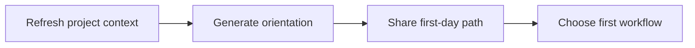

# Team Onboarding

Help a teammate get from a fresh checkout to a useful first workflow without
making them read raw project context first.

**Time to complete**: ~20-30 minutes

---

## What You'll Set Up

- A current project context for the repository
- A generated orientation document that explains the project at a high level
- A first-day checklist for new teammates
- Clear first workflow options for feature work, PR review, Arcade monitoring,
  and project exploration

## Prerequisites

!!! warning "Before You Begin"
    - rp1 installed ([Installation and Host Setup](../getting-started/installation.md))
    - The repository initialized with `rp1 init`
    - A supported host available for the teammate

---

## First-Day Checklist For A Teammate

| Step | Teammate outcome |
|------|------------------|
| 1. Install and verify rp1 | They can run `rp1 verify` and see their host integration. |
| 2. Open the generated orientation | They get the project shape before diving into files. |
| 3. Build or refresh project context | Their host has current project knowledge. |
| 4. Pick a first workflow | They know whether to ship a change, review a PR, or monitor Arcade. |
| 5. Open Arcade | They can inspect runs, artifacts, links, and waiting states. |
| 6. Learn the source docs | They know which `.rp1/context/` files are maintainer material. |

---

## Prepare The Project For Onboarding


```mermaid
flowchart LR
    Context[Refresh project context] --> Orientation[Generate orientation]
    Orientation --> FirstDay[Share first-day path]
    FirstDay --> Workflow[Choose first workflow]
```

### 1. Refresh Project Context

Run the context workflow from the project root.

=== "Claude Code"

    ```bash
    /knowledge-build
    ```

=== "OpenCode"

    ```bash
    /rp1-base-knowledge-build
    ```

=== "Codex"

    ```bash
    $rp1-base-knowledge-build
    ```

=== "GitHub Copilot CLI"

    ```bash
    /rp1-base-knowledge-build
    ```

This updates `.rp1/context/` so workflows can use the current repository
structure and conventions.

### 2. Generate An Orientation Document

Run the project overview workflow after context is current.

=== "Claude Code"

    ```bash
    /project-birds-eye-view
    ```

=== "OpenCode"

    ```bash
    /rp1-base-project-birds-eye-view
    ```

=== "Codex"

    ```bash
    $rp1-base-project-birds-eye-view
    ```

=== "GitHub Copilot CLI"

    ```bash
    /rp1-base-project-birds-eye-view
    ```

Share the generated orientation before asking a teammate to read lower-level
context files. The workflow prints and registers the output location.

### 3. Share The First Workflow Options

Give the teammate one of these next steps based on their first job.

| First job | Recommended path |
|-----------|------------------|
| Ship a small change | [Your First Workflow](../getting-started/first-workflow.md) |
| Start planned feature work | [Feature Development](feature-development.md) |
| Review an existing PR | [PR Review](pr-review.md) |
| Monitor agent work | [Arcade Overview](../arcade/index.md) |
| Understand team conventions | [Scaling with Teams](scaling-with-teams.md) |

---

## What To Share

For most teammates, share these in order:

1. The generated orientation document
2. [Installation and Host Setup](../getting-started/installation.md)
3. [Your First Workflow](../getting-started/first-workflow.md)
4. [Arcade Overview](../arcade/index.md)
5. A team-specific note with repository commands, review expectations, and
   owners

### Maintainer Source Files

The raw `.rp1/context/` files are useful when someone needs source-level project
context or wants to update onboarding material. They should not be the first
reading path for a new teammate.

| Source file | Best for |
|-------------|----------|
| `.rp1/context/index.md` | Quick project summary and loading map |
| `.rp1/context/architecture.md` | System shape and integrations |
| `.rp1/context/interaction-model.md` | User-visible states and surfaces |
| `.rp1/context/modules.md` | Components and responsibilities |
| `.rp1/context/patterns.md` | Coding and workflow conventions |

---

## Keeping Onboarding Current

Refresh onboarding material when:

- the architecture changed materially
- new modules or major user surfaces shipped
- conventions changed enough that old examples would mislead readers
- a new teammate struggled because an onboarding page was missing context

The maintenance loop is:

1. Re-run `knowledge-build`
2. Re-run `project-birds-eye-view`
3. Review the generated orientation
4. Update any team-specific notes
5. Share the refreshed path with the team

---

## Related

- [Project Context](../concepts/knowledge-aware-agents.md)
- [knowledge-build Reference](../reference/base/knowledge-build.md)
- [project-birds-eye-view Reference](../reference/base/project-birds-eye-view.md)
- [Troubleshooting](../troubleshooting/index.md)
