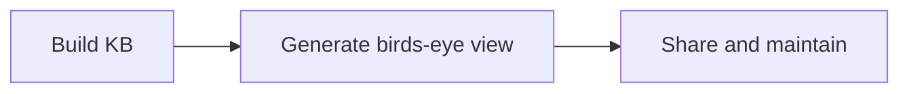

# Team Onboarding Tutorial

Help a teammate get productive faster by generating a current knowledge base and
an orientation document from it.

**Time to complete**: ~20-30 minutes

---

## What You'll Learn

- How to generate a shareable KB in `.rp1/context/`
- Which files are most useful for onboarding
- How to create a birds-eye-view document for a teammate
- How to keep onboarding material current as the codebase changes

## Prerequisites

!!! warning "Before You Begin"
    - rp1 installed ([Installation](../getting-started/installation.md))
    - A repository you want to document

---

## The Workflow


```mermaid
flowchart LR
    KB[Build KB] --> DOC[Generate birds-eye view]
    DOC --> SHARE[Share and maintain]
```

| Step | Workflow | Purpose |
|------|----------|---------|
| 1 | `knowledge-build` | Create or refresh `.rp1/context/` |
| 2 | `project-birds-eye-view` | Generate a high-level orientation document |
| 3 | Share | Commit or distribute the docs your team should use |

---

## Step 1: Generate the Knowledge Base

=== "Claude Code"

    ```bash
    /knowledge-build
    ```

=== "OpenCode"

    ```bash
    /rp1-base-knowledge-build
    ```

=== "Codex"

    ```bash
    $rp1-base-knowledge-build
    ```

This writes the current knowledge base under `.rp1/context/`.

### What new teammates should read first

| File | Why it helps |
|------|--------------|
| `index.md` | Quick project summary and where to load next |
| `architecture.md` | System shape, boundaries, and integrations |
| `interaction-model.md` | User-visible states, surfaces, and workflow behavior |
| `modules.md` | Major components and responsibilities |
| `patterns.md` | Coding and workflow conventions |

---

## Step 2: Generate a Birds-Eye View

=== "Claude Code"

    ```bash
    /project-birds-eye-view
    ```

=== "OpenCode"

    ```bash
    /rp1-base-project-birds-eye-view
    ```

=== "Codex"

    ```bash
    $rp1-base-project-birds-eye-view
    ```

This generates:

```text
.rp1/context/birds-eye-view.md
```

The birds-eye-view document is useful when someone needs a guided overview
instead of reading the raw KB files one by one.

---

## Step 3: Share the Right Artifacts

For most teams, the useful onboarding set is:

- `.rp1/context/index.md`
- `.rp1/context/architecture.md`
- `.rp1/context/modules.md`
- `.rp1/context/patterns.md`
- `.rp1/context/birds-eye-view.md`

If your team commits `.rp1/context/`, new developers can start from those files
immediately after cloning the repository.

---

## Keeping It Current

Onboarding docs only stay useful if they move with the codebase.

Rebuild the KB when:

- the architecture changed materially
- new modules or major surfaces shipped
- conventions changed enough that old examples mislead readers

The normal maintenance loop is:

1. Re-run `knowledge-build`
2. Re-run `project-birds-eye-view`
3. Review and share the refreshed output

---

## Related

- [Knowledge-Aware Agents](../concepts/knowledge-aware-agents.md)
- [knowledge-build Reference](../reference/base/knowledge-build.md)
- [project-birds-eye-view Reference](../reference/base/project-birds-eye-view.md)
