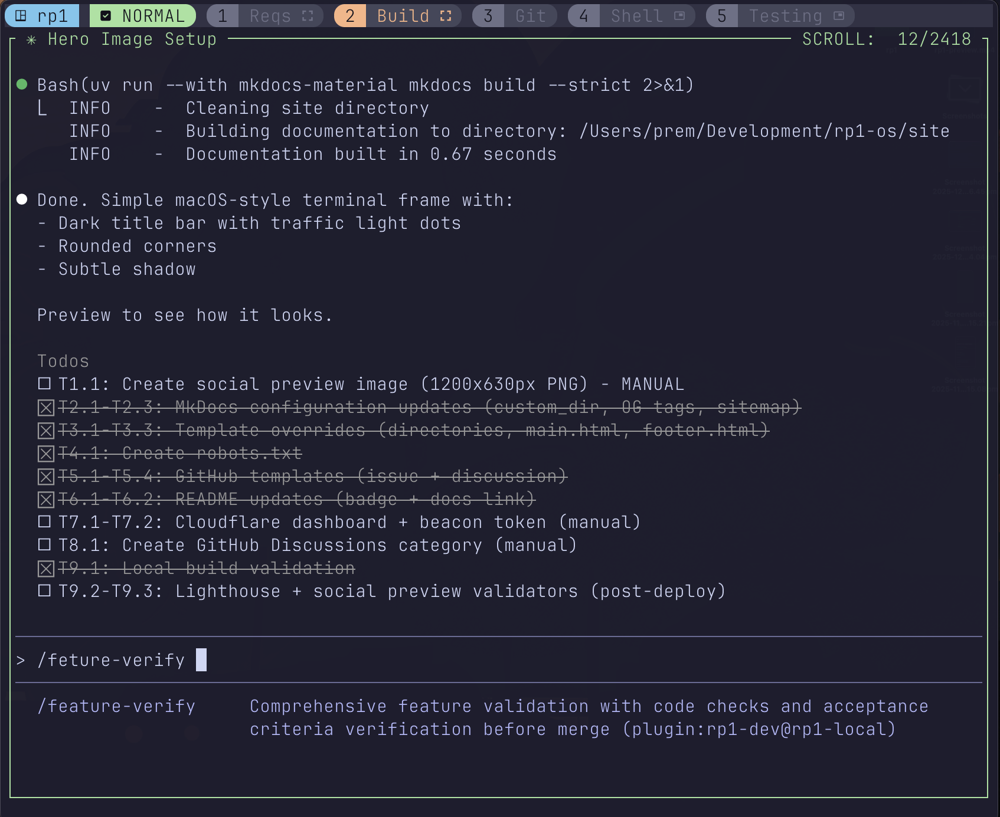

---
hide:
  - navigation
  - toc
---

# > stop prompting; **start shipping**<span class="cursor"></span>

Professional development workflows for AI coding assistants.
21 commands. 18 specialized agents. Single-pass execution.

[Get Started](getting-started/quickstart.md){ .md-button .md-button--primary }
[View on GitHub](https://github.com/rp1-run/rp1){ .md-button }

=== "Feature Workflow"
    <div class="terminal-window">
      <div class="terminal-header">
        <span class="terminal-dot red"></span>
        <span class="terminal-dot yellow"></span>
        <span class="terminal-dot green"></span>
      </div>
      
    </div>

=== "PR Visual"
    <div class="terminal-window">
      <div class="terminal-header">
        <span class="terminal-dot red"></span>
        <span class="terminal-dot yellow"></span>
        <span class="terminal-dot green"></span>
      </div>
      
    </div>

---

## Try it out

<div class="grid" markdown>

<div markdown>

**Ship a feature**

```bash
/rp1-dev:feature-requirements "user-auth"
/rp1-dev:feature-design "user-auth"
/rp1-dev:feature-build "user-auth"
```

**Review a PR**

```bash
/rp1-dev:pr-review "feature/auth"
```

**Investigate a bug**

```bash
/rp1-dev:code-investigate "bug-123" "Login fails"
```

</div>

<div markdown>

**Generate knowledge base**

```bash
/rp1-base:knowledge-build
```

**Quick code check**

```bash
/rp1-dev:code-check
```

**Strategic analysis**

```bash
/rp1-base:strategize
```

[See all 21 commands :material-arrow-right:](reference/index.md)

</div>

</div>

---

## Why rp1?

<div class="grid why" markdown>

<div markdown>

:fontawesome-solid-bolt: **Single-pass execution**

Constitutional prompts encode expert patterns with built-in rules. No iteration loops, no "let me revise that" — tasks complete in one shot.

[Learn about constitutional prompting :material-arrow-right:](concepts/constitutional-prompting.md)

</div>

<div markdown>

:fontawesome-solid-brain: **Codebase awareness**

Run `knowledge-build` once. Your architecture becomes context for every command. No generic advice — everything respects your patterns.

[Learn about knowledge-aware agents :material-arrow-right:](concepts/knowledge-aware-agents.md)

</div>

<div markdown>

:fontawesome-solid-layer-group: **Lean context architecture**

Progressive disclosure and subagent delegation keep your main thread focused. Complex work happens in specialized agents, results flow back clean.

[Explore the command-agent pattern :material-arrow-right:](concepts/command-agent-pattern.md)

</div>

<div markdown>

:fontawesome-solid-flask: **Validate before you build**

Hypothesis testing catches bad assumptions early. Design decisions get validated against your codebase before implementation begins.

[See hypothesis validation :material-arrow-right:](reference/dev/validate-hypothesis.md)

</div>

<div markdown>

:fontawesome-solid-door-open: **Start anywhere**

Full blueprints with charters and PRDs, or jump straight in with a vague idea. Structured when you need it, flexible when you don't.

[Try the blueprint wizard :material-arrow-right:](reference/dev/blueprint.md)

</div>

</div>

---

## Our Principles

<div class="grid principles" markdown>

<div markdown>

:fontawesome-solid-battery-full: **Batteries Included**

Skills, subagents, and finely-tuned prompts ship out of the box. No assembly required.

</div>

<div markdown>

:fontawesome-brands-osi: **Always Open Source**

Fully pluggable into existing agentic tools. Your workflows, your control.

</div>

<div markdown>

:fontawesome-solid-eye: **Visual-First**

Heavily leans on visual language — diagrams, charts, and structured outputs for clarity.

</div>

<div markdown>

:fontawesome-solid-rotate: **Continuous Evolution**

Keep improving and adapting as frontier models mature. Today's best, tomorrow's baseline.

</div>

<div markdown>

:fontawesome-solid-shuffle: **Model/Tool Agnostic**

No lock-in to any frontier lab or platform. Works with Claude Code, OpenCode, and more tools coming.

</div>

</div>

---

## Guides

<div class="grid" markdown>

<div markdown>

**Feature Development**

End-to-end workflow from requirements to verified implementation.

[Read guide :material-arrow-right:](guides/feature-development.md)

</div>

<div markdown>

**Bug Investigation**

Systematic root cause analysis with evidence-based hypothesis testing.

[Read guide :material-arrow-right:](guides/bug-investigation.md)

</div>

<div markdown>

**PR Review**

Thorough multi-pass analysis that catches what single-reviewer approaches miss. Visual diagrams show exactly what changed.

[Read guide :material-arrow-right:](guides/pr-review.md)

</div>

<div markdown>

**Team Onboarding**

Get new developers productive on your codebase fast. Knowledge base + guided exploration beats reading docs alone.

[Read guide :material-arrow-right:](guides/team-onboarding.md)

</div>

</div>

---

## Platform support

<div class="grid" markdown>

<div class="platform-card" markdown>


**Claude Code**

Native plugin via marketplace

[Setup guide :material-arrow-right:](getting-started/claude-code.md)

</div>

<div class="platform-card" markdown>


**OpenCode**

One-line install script

[Setup guide :material-arrow-right:](getting-started/opencode.md)

</div>

</div>

**Coming soon:** Cursor, Goose, Amp

---

<div align="center" markdown>

[Get Started](getting-started/quickstart.md){ .md-button .md-button--primary }

[](https://github.com/rp1-run/rp1)

</div>

<script>
document.addEventListener('DOMContentLoaded', function() {
  const tabSet = document.querySelector('.tabbed-set');
  if (!tabSet) return;

  const labels = tabSet.querySelectorAll('.tabbed-labels label');
  if (labels.length < 2) return;

  let currentTab = 0;
  let interval;

  function rotateTab() {
    currentTab = (currentTab + 1) % labels.length;
    labels[currentTab].click();
  }

  function startRotation() {
    interval = setInterval(rotateTab, 8000);
  }

  function stopRotation() {
    clearInterval(interval);
  }

  // Start auto-rotation
  startRotation();

  // Pause on hover/focus
  tabSet.addEventListener('mouseenter', stopRotation);
  tabSet.addEventListener('mouseleave', startRotation);
  tabSet.addEventListener('focusin', stopRotation);
  tabSet.addEventListener('focusout', startRotation);
});
</script>
