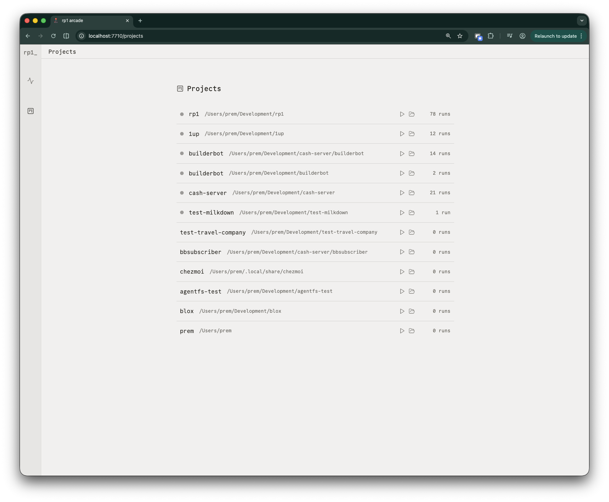
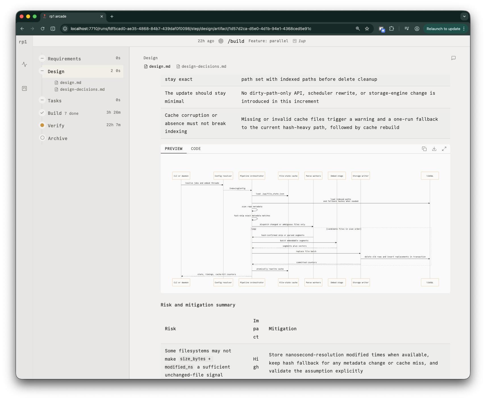
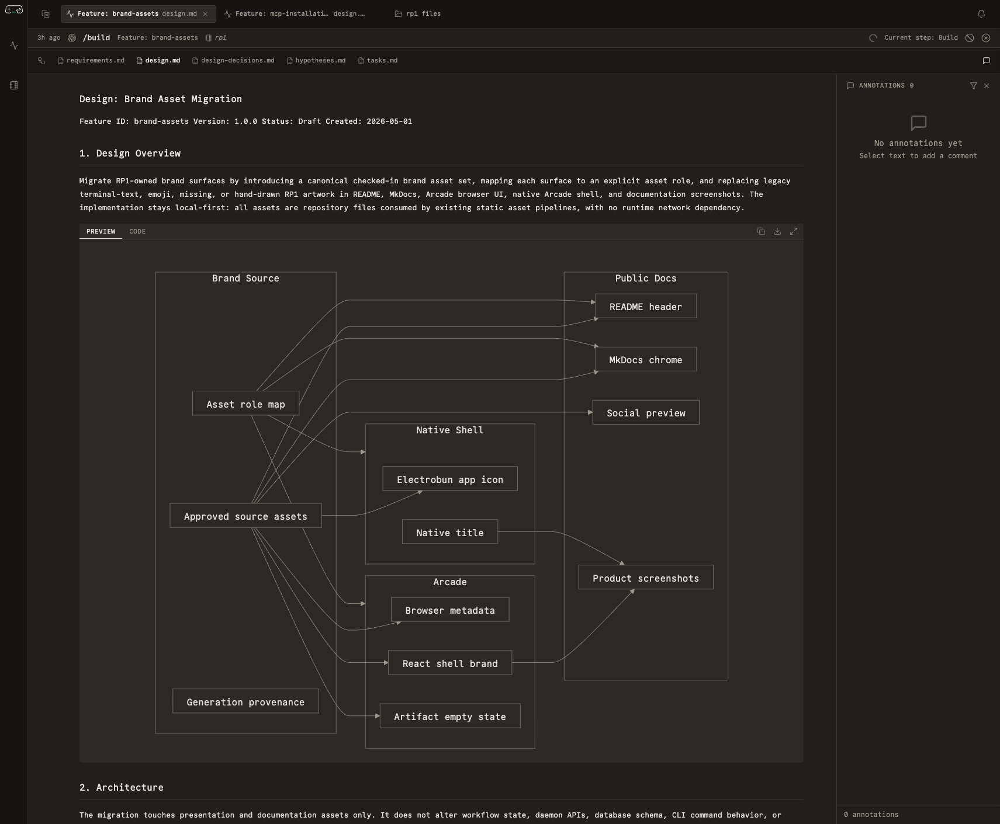
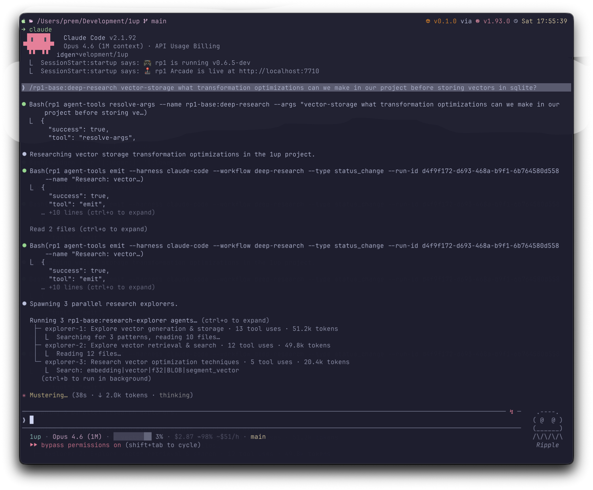

---
hide:
  - navigation
  - toc
---

# stop prompting; **start shipping**

Professional development workflows for AI coding assistants.
Skip the iteration loops. Keep work attached to projects, artifacts, and feedback instead of ephemeral sessions.
40 workflow skills. 51 specialized agents. Use the same workflows in **Claude Code**, **OpenCode**, and **Codex**, then review them in **Arcade**.

[:fontawesome-solid-terminal: Get Started](getting-started/installation.md){ .md-button .md-button--primary }
[:fontawesome-brands-github: View on GitHub](https://github.com/rp1-run/rp1){ .md-button .md-button--github }
[:fontawesome-brands-discord: Discord](https://discord.gg/cjmqWGb5q){ .md-button .md-button--discord }

  

    

      <ul class="splide__list">
        <li class="splide__slide">
          
Project overview

          
        </li>
        <li class="splide__slide">
          
Workflow detail

          
        </li>
        <li class="splide__slide">
          
Artifact feedback

          
        </li>
        <li class="splide__slide">
          
Claude Code workflow

          
        </li>
      </ul>
    

  

---

## Start with an outcome

Pick the workflow that matches the outcome you want. RP1 keeps the artifact trail and review loop intact across Claude Code, OpenCode, and Codex.

  

    
Ship a feature

    
Turn a feature idea into requirements, design, implementation, and verification with durable artifacts at every step.

    <pre><code class="language-bash">/build "user-auth"</code></pre>
  

  

    
Make a quick change

    
Push through a bounded change fast without giving up structure, reviewability, or resumability.

    <pre><code class="language-bash">/build-fast "Add dark mode toggle"</code></pre>
  

  

    
Power through small changes

    
Work through a queue of small requests with speed, but still grounded in the codebase, its patterns, and the knowledge base.

    <pre><code class="language-bash">/speedrun "Tighten the empty state copy"</code></pre>
  

  

    
Review a PR

    
Get structured findings, sharper confidence, and visual summaries instead of a shallow skim.

    <pre><code class="language-bash">/pr-review "feature/auth"</code></pre>
  

  

    
Investigate a bug

    
Move from a vague failure to an evidence-backed root cause instead of bouncing through ad hoc prompts.

    <pre><code class="language-bash">/code-investigate "bug-123" "Login fails"</code></pre>
  

  

    
Build project context

    
Generate a project-aware knowledge base so every workflow starts from your actual system, not generic assumptions.

    <pre><code class="language-bash">/knowledge-build</code></pre>
  

  

    
Deep research

    
Investigate a system, compare multiple projects, or pull together a technical brief with grounded findings.

    <pre><code class="language-bash">/deep-research "Compare backend and frontend error handling"</code></pre>
  

  
Same workflow, different harness

  

    

      <strong>Claude Code</strong> 
      <code>/build "user-auth"</code>
    

    

      <strong>OpenCode</strong> 
      <code>/rp1-dev-build "user-auth"</code>
    

    

      <strong>Codex</strong> 
      <code>$rp1-dev-build "user-auth"</code>
    

  

  

    <a href="reference/index.md">See the workflow reference</a>
    ·
    <a href="arcade/index.md">Explore Arcade</a>
  

---

## Why rp1?

:fontawesome-solid-bolt: **Ship features without iteration loops**

Constitutional prompts encode expert patterns with built-in rules. No "let me revise that" — tasks complete in one shot.

[Learn about constitutional prompting :material-arrow-right:](concepts/constitutional-prompting.md)

:fontawesome-solid-brain: **Project-aware from the first command**

Run `knowledge-build` once. Your architecture becomes context for every command. No generic advice — everything respects your patterns.

[Learn about knowledge-aware agents :material-arrow-right:](concepts/knowledge-aware-agents.md)

:fontawesome-solid-comment-dots: **Give feedback in context**

Open artifacts in Arcade and annotate the exact file or section you want changed. Agents can pick that feedback up without forcing you into copy-paste loops.

[Use Arcade annotations :material-arrow-right:](arcade/annotations.md)

:fontawesome-solid-flask: **Catch bad assumptions before coding**

Automatic hypothesis testing catches bad assumptions early. Design decisions get validated against your codebase before implementation begins.

[See hypothesis validation :material-arrow-right:](reference/dev/validate-hypothesis.md)

:fontawesome-solid-shuffle: **Switch harnesses without switching costs**

rp1 keeps the workflow layer stable across Claude Code, OpenCode, and Codex. The syntax adapts to each host, but the workflow, artifacts, and review loop stay the same.

[See the same workflows on every host :material-arrow-right:](reference/dev/index.md)

:fontawesome-solid-file-lines: **Durable artifacts, not disposable chats**

Requirements, design, tasks, verification, and reports stay attached to the project and remain resumable across sessions, reviews, and handoffs.

[See the feature workflow :material-arrow-right:](guides/feature-development.md)

---

## rp1 Principles

:fontawesome-solid-battery-full: **Batteries Included**

Workflows, subagents, KB generation, and structured artifacts ship together. No prompt assembly required.

:fontawesome-brands-osi: **Always Open Source**

Fully pluggable into existing agentic tools. Your workflows, your control.

:fontawesome-solid-eye: **Observable by Default**

Runs, gates, artifacts, and annotations stay visible in Arcade instead of disappearing into chat scrollback.

:fontawesome-solid-rotate: **Stable Workflows, Evolving Harnesses**

Keep the workflow layer stable while frontier models and host tools keep changing.

:fontawesome-solid-shuffle: **Same Workflows, Different Hosts**

Use rp1 from Claude Code, OpenCode, or Codex without rewriting how your team works.

---

## Guides

**Feature Development**

End-to-end workflow from requirements to verified implementation.

[Read guide :material-arrow-right:](guides/feature-development.md)

**Bug Investigation**

Systematic root cause analysis with evidence-based hypothesis testing.

[Read guide :material-arrow-right:](guides/bug-investigation.md)

**PR Review**

Thorough multi-pass analysis that catches what single-reviewer approaches miss. Visual diagrams show exactly what changed.

[Read guide :material-arrow-right:](guides/pr-review.md)

**Team Onboarding**

Get new developers productive on your codebase fast. Knowledge base + guided exploration beats reading docs alone.

[Read guide :material-arrow-right:](guides/team-onboarding.md)

---

## Platform support

**Claude**

[Setup guide :material-arrow-right:](getting-started/installation.md)

**opencode**

[Setup guide :material-arrow-right:](getting-started/installation.md)

**Codex**

[Setup guide :material-arrow-right:](getting-started/installation.md)

---

[Get Started](getting-started/index.md){ .md-button .md-button--primary }
[Why rp1?](comparison/vs-raw-prompting.md){ .md-button }

