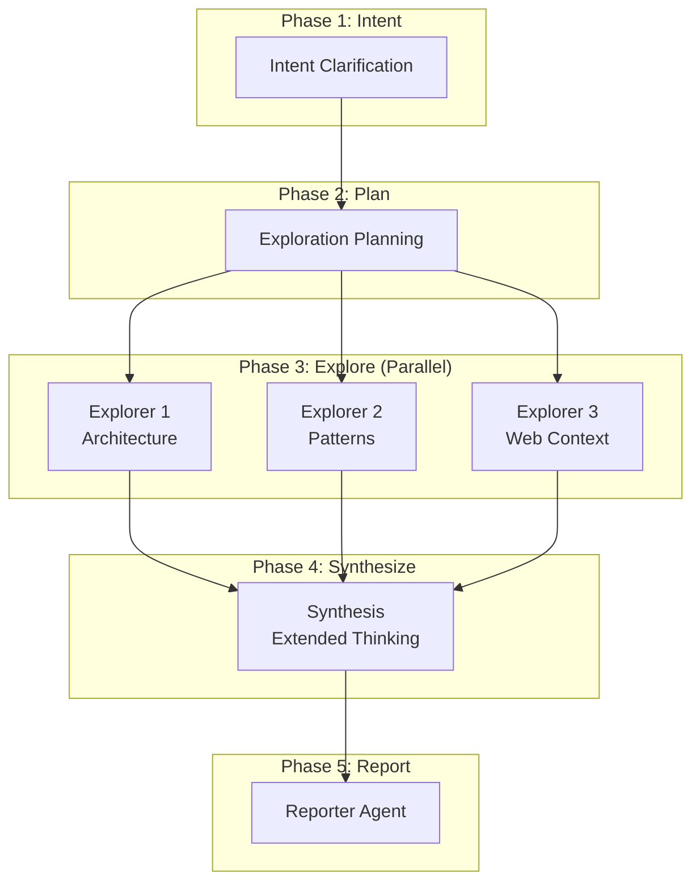

# deep-research

Autonomous deep research on codebases and technical topics using a map-reduce architecture with parallel exploration and structured report output.

---

## Synopsis

=== "Claude Code"

    ```bash
    /deep-research [research-topic]
    ```

=== "OpenCode"

    ```bash
    /rp1-base/deep-research [research-topic]
    ```

## Description

The `deep-research` command performs comprehensive research on your codebase, multiple projects, or technical topics. It uses a map-reduce architecture to parallelize exploration and produce a synthesized research report.

The workflow:

1. **Intent Clarification**: Parses your research topic to understand scope and questions
2. **Exploration Planning**: Determines explorer strategy based on research mode
3. **Parallel Exploration**: Spawns multiple explorer agents to investigate in parallel
4. **Synthesis**: Merges findings, identifies patterns, generates recommendations
5. **Report Generation**: Produces a structured markdown report with diagrams

## Parameters

| Parameter | Position | Default | Description |
|-----------|----------|---------|-------------|
| `research-topic` | `$ARGUMENTS` | (required) | Your research question or topic |
| `RP1_ROOT` | Environment | `.rp1/` | Root directory for output artifacts |

## Exploration Modes

The command automatically selects the appropriate exploration mode based on your research topic:

| Mode | Use Case | Explorers Spawned |
|------|----------|-------------------|
| **Single-project** | Understand one codebase | 2-3 per project (architecture, patterns, web context) |
| **Multi-project** | Compare multiple codebases | 1 per project + optional web explorer |
| **Technical investigation** | Research external topics | 1-2 codebase + 1-2 web explorers |

### Explorer Types

Each explorer specializes in a different research approach:

| Type | Purpose | Sources |
|------|---------|---------|
| **Codebase** | Analyze source code structure and patterns | Local files, KB context |
| **Web** | Research external documentation and best practices | Web search, documentation sites |
| **Hybrid** | Combined local and external research | Both sources |

## Output

Reports are saved to `{RP1_ROOT}/work/research/` with auto-generated filenames:

| Output | Description |
|--------|-------------|
| `{slug}-research.md` | Main research report |
| Mermaid diagrams | Architecture and flow diagrams embedded in report |

### Report Structure

| Section | Contents |
|---------|----------|
| Executive Summary | Key findings and scope overview |
| Research Questions | Original questions with answers |
| Findings | Categorized discoveries with evidence |
| Comparative Analysis | Cross-project comparison (multi-project mode) |
| Recommendations | Prioritized actionable items |
| Diagrams | Architecture, sequence, and flow visualizations |
| Sources | Codebase references and external links |

## Examples

### Single-Project Analysis

Understand the architecture of a specific feature:

=== "Claude Code"

    ```bash
    /deep-research Understand the authentication flow in this project
    ```

=== "OpenCode"

    ```bash
    /rp1-base/deep-research Understand the authentication flow in this project
    ```

**Expected output:**
```
## Research Complete

**Topic**: Authentication flow analysis
**Scope**: single-project
**Projects Analyzed**: ./

### Key Findings

The authentication system uses JWT tokens with refresh token rotation.
Login flow validates credentials against PostgreSQL, issues tokens,
and stores refresh tokens in Redis for fast invalidation.

### Recommendations

- Add rate limiting to login endpoint
- Implement token revocation on password change

### Report

Full report saved to: `.rp1/work/research/authentication-flow-research.md`

**Methodology**:
- Explorers spawned: 3
- KB files loaded: architecture.md, modules.md
- Files explored: 24
- Web searches: 2
- Diagrams generated: 2
```

### Multi-Project Comparison

Compare approaches across multiple codebases:

=== "Claude Code"

    ```bash
    /deep-research Compare error handling between ./backend and ./frontend
    ```

=== "OpenCode"

    ```bash
    /rp1-base/deep-research Compare error handling between ./backend and ./frontend
    ```

**Expected output:**
```
## Research Complete

**Topic**: Error handling comparison
**Scope**: multi-project
**Projects Analyzed**: ./backend, ./frontend

### Key Findings

Backend uses Result types with centralized error mapping.
Frontend uses try-catch with error boundaries and toast notifications.
Inconsistent error codes between services cause user-facing issues.

### Recommendations

- Standardize error codes across services
- Add error code documentation to API specs

### Report

Full report saved to: `.rp1/work/research/error-handling-comparison-research.md`
```

### Technical Investigation

Research best practices and external knowledge:

=== "Claude Code"

    ```bash
    /deep-research Best practices for Redis caching with Node.js
    ```

=== "OpenCode"

    ```bash
    /rp1-base/deep-research Best practices for Redis caching with Node.js
    ```

**Expected output:**
```
## Research Complete

**Topic**: Redis caching best practices for Node.js
**Scope**: technical-investigation
**Projects Analyzed**: ./

### Key Findings

Current project uses basic get/set without TTL management.
Industry best practices recommend cache-aside pattern with
connection pooling and circuit breakers for resilience.

### Recommendations

- Implement cache-aside pattern
- Add TTL configuration per cache type
- Add circuit breaker for Redis failures

### Report

Full report saved to: `.rp1/work/research/redis-caching-best-practices-research.md`
```

## Architecture



## Clarification Behavior

The command asks clarifying questions only when the research topic is ambiguous:

| Request Type | Behavior |
|--------------|----------|
| Clear request | Proceeds immediately |
| Ambiguous request | Asks ONE clarifying question |

**Clear requests** (no clarification needed):
- "Understand the authentication flow in this project"
- "Compare error handling between ./project-a and ./project-b"
- "Research best practices for Redis caching"

**Ambiguous requests** (will ask clarification):
- "Research this code" (which code? what aspects?)
- "Compare projects" (which projects?)
- "Help me understand" (understand what specifically?)

## Error Handling

| Condition | Behavior |
|-----------|----------|
| Ambiguous topic | Asks one clarifying question |
| No target projects | Defaults to current directory |
| Explorer fails | Continues if >50% succeed |
| >50% explorers fail | Aborts with error message |
| Reporter fails | Outputs synthesis summary directly |

## Related Commands

- [`knowledge-build`](knowledge-build.md) - Generate KB for enhanced exploration
- [`strategize`](strategize.md) - Strategic analysis with recommendations

## See Also

- [Map-Reduce Workflows](../../concepts/map-reduce-workflows.md) - The parallel architecture pattern
- [Knowledge-Aware Agents](../../concepts/knowledge-aware-agents.md) - How KB improves research quality
