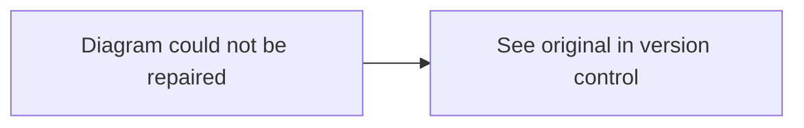

# fix-mermaid

Validates and repairs Mermaid diagrams in markdown files using mermaid-cli for syntax checking.

---

## Synopsis

=== "Claude Code"

    ```bash
    /fix-mermaid path/to/file.md    # Process markdown file in-place
    /fix-mermaid -                   # Process diagram from stdin
    ```

=== "OpenCode"

    ```bash
    /rp1-base/fix-mermaid path/to/file.md
    /rp1-base/fix-mermaid -
    ```

## Description

The `fix-mermaid` command scans markdown files for Mermaid diagram code blocks, validates each diagram using mermaid-cli, and automatically repairs common syntax errors. This helps maintain diagram quality in documentation without manual debugging.

The repair process:

1. **Scan**: Identifies all mermaid code blocks in the file
2. **Validate**: Tests each diagram using mermaid-cli
3. **Repair**: Attempts to fix invalid diagrams (up to 3 iterations per diagram)
4. **Fallback**: Inserts placeholder for diagrams that cannot be repaired

## Parameters

| Parameter | Position | Description |
|-----------|----------|-------------|
| `file-path` | `$1` | Path to markdown file, or `-` for stdin |

## Requirements

This command requires Node.js to be installed:

| Dependency | Description |
|------------|-------------|
| Node.js | Required for npx |
| @mermaid-js/mermaid-cli | Fetched automatically via npx |

!!! note "Automatic Installation"
    The mermaid-cli package is fetched via `npx` on first use. No manual installation is required if you have Node.js installed.

## Input Modes

### File Mode

Process a markdown file in-place:

=== "Claude Code"

    ```bash
    /fix-mermaid docs/architecture.md
    ```

=== "OpenCode"

    ```bash
    /rp1-base/fix-mermaid docs/architecture.md
    ```

The file is updated in-place with repaired diagrams.

### Stdin Mode

Process a single diagram from stdin (outputs to stdout):

=== "Claude Code"

    ```bash
    /fix-mermaid -
    ```

=== "OpenCode"

    ```bash
    /rp1-base/fix-mermaid -
    ```

When using stdin mode, provide a single Mermaid diagram (without code fences). The repaired diagram is output to stdout.

## Repair Process

The command attempts to repair each invalid diagram through iterative fixes:

| Iteration | Action |
|-----------|--------|
| 1 | Parse error message, apply targeted fix |
| 2 | Try alternative syntax corrections |
| 3 | Apply broader structural fixes |
| Fallback | Insert placeholder if all iterations fail |

### Common Repairs

The repair process handles these common issues:

- Missing or malformed node definitions
- Invalid arrow syntax
- Unescaped special characters in labels
- Missing subgraph closures
- Invalid direction declarations

### Placeholder Behavior

When a diagram cannot be repaired after 3 iterations, a placeholder is inserted:

```markdown

```

This ensures the document remains valid while preserving the location for manual review.

## Output

The command produces a JSON summary of repairs:

```json
{
  "file": "docs/architecture.md",
  "diagrams_found": 5,
  "diagrams_valid": 3,
  "diagrams_repaired": 1,
  "diagrams_failed": 1,
  "repairs": [
    {
      "index": 2,
      "iterations": 2,
      "status": "repaired"
    },
    {
      "index": 4,
      "iterations": 3,
      "status": "placeholder"
    }
  ]
}
```

## Examples

### Fix Diagrams in Documentation

=== "Claude Code"

    ```bash
    /fix-mermaid docs/guides/architecture.md
    ```

=== "OpenCode"

    ```bash
    /rp1-base/fix-mermaid docs/guides/architecture.md
    ```

**Expected output:**
```
Scanning docs/guides/architecture.md...
Found 4 mermaid diagrams

Diagram 1: Valid
Diagram 2: Invalid - attempting repair...
  Iteration 1: Fixed missing arrow syntax
  Repaired successfully
Diagram 3: Valid
Diagram 4: Valid

Summary:
- Valid: 3
- Repaired: 1
- Failed: 0
```

### Fix All Documentation

Process multiple files:

```bash
find docs -name "*.md" -exec /fix-mermaid {} \;
```

## Error Handling

| Condition | Behavior |
|-----------|----------|
| File not found | Returns error message |
| No mermaid blocks | Reports "No diagrams found" |
| Node.js not installed | Returns error with installation instructions |
| All diagrams valid | Reports success, no changes made |
| Some diagrams unfixable | Inserts placeholders, continues processing |

## Related Commands

- [`write-content`](write-content.md) - Create technical documentation with diagrams
- [`project-birds-eye-view`](project-birds-eye-view.md) - Generate project overview with diagrams

## See Also

- [Mermaid.js Documentation](https://mermaid.js.org/) - Official Mermaid syntax reference
