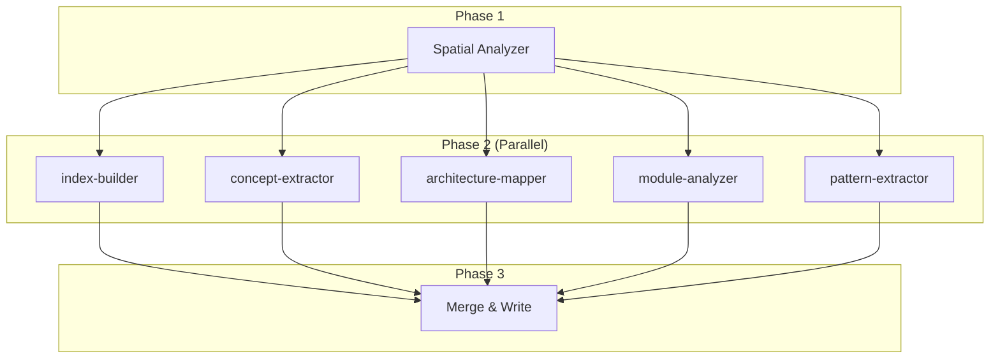

# knowledge-build

Orchestrates parallel knowledge base generation using spatial analysis and a map-reduce architecture.

---

## Synopsis

=== "Claude Code"

    ```bash
    /knowledge-build
    ```

=== "OpenCode"

    ```bash
    /rp1-base/knowledge-build
    ```

## Description

The `knowledge-build` command analyzes your codebase and generates a structured knowledge base in `.rp1/context/`. This KB powers all knowledge-aware agents, enabling them to understand your architecture, patterns, and conventions.

The command uses a parallel map-reduce architecture:

1. **Spatial Analysis**: Categorizes files by KB section
2. **Parallel Processing**: 5 agents analyze files simultaneously
3. **Merge**: Combines results into final KB files

## Parameters

| Parameter | Default | Description |
|-----------|---------|-------------|
| `RP1_ROOT` | `.rp1/` | Root directory for KB artifacts |
| `CODEBASE_ROOT` | `.` | Repository root to analyze |
| `EXCLUDE_PATTERNS` | `node_modules/,.git/,build/,dist/` | Patterns to exclude |

## Build Modes

The command automatically detects the appropriate build mode:

| Mode | Condition | Duration |
|------|-----------|----------|
| **Skip** | KB exists, no git changes | Instant |
| **Full** | First build or >50 files changed | 10-15 min |
| **Incremental** | <50 files changed since last build | 2-5 min |

## Output

The command generates these files in `.rp1/context/`:

| File | Contents |
|------|----------|
| `index.md` | Project overview, structure, entry points |
| `architecture.md` | System architecture, patterns, integrations |
| `modules.md` | Component breakdown, dependencies |
| `concept_map.md` | Domain concepts, terminology |
| `patterns.md` | Implementation patterns, idioms |
| `state.json` | Build metadata, git commit reference |

## Examples

### First-Time Build

=== "Claude Code"

    ```bash
    /knowledge-build
    ```

=== "OpenCode"

    ```bash
    /rp1-base/knowledge-build
    ```

**Expected output:**
```
First-time KB generation with parallel analysis (10-15 min)
Analyzing... (Phase 2/5)
✅ Knowledge Base Generated Successfully

Strategy: Parallel map-reduce
Repository: single-project
Files Analyzed: 142

KB Files Written:
- .rp1/context/index.md
- .rp1/context/concept_map.md
- .rp1/context/architecture.md
- .rp1/context/modules.md
- .rp1/context/patterns.md
- .rp1/context/state.json
```

### Incremental Build

When you've made changes since the last build:

**Expected output:**
```
Changes detected since last build (a1b2c3d → e4f5g6h). Analyzing 12 changed files (2-5 min)
✅ Knowledge Base Generated Successfully
```

### No Changes

When the codebase hasn't changed:

**Expected output:**
```
✓ KB is up-to-date (commit a1b2c3d). No regeneration needed.
```

## Architecture



## Related Commands

- [`knowledge-load`](knowledge-load.md) - Load KB context for agents

## See Also

- [Knowledge-Aware Agents](../../concepts/knowledge-aware-agents.md) - How agents use the KB
- [Map-Reduce Workflows](../../concepts/map-reduce-workflows.md) - The parallel architecture
