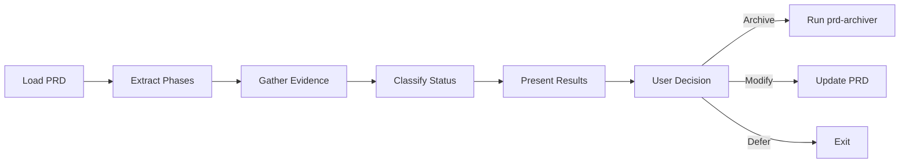

# blueprint-audit

Audits PRD documents against implementation evidence and guides lifecycle decisions.

---

## Synopsis

=== "Claude Code"

    ```bash
    /blueprint-audit <prd-name>
    ```

=== "OpenCode"

    ```bash
    /rp1-dev-blueprint-audit <prd-name>
    ```

=== "Codex CLI"

    ```text
    $rp1-dev-blueprint-audit <prd-name>
    ```

## Description

The `blueprint-audit` command analyzes a PRD document against actual implementation status. It extracts phases from the PRD, searches for evidence of completion in archives, features, and codebase, then guides you through disposition decisions.

Use this command for PRD housekeeping when you want to:

- Verify what work from a PRD has been completed
- Identify stale PRDs that need archival
- Adjust scope based on what remains unimplemented
- Keep your `.rp1/work/prds/` directory clean and current

## Parameters

| Parameter | Position | Required | Default | Description |
|-----------|----------|----------|---------|-------------|
| `PRD_NAME` | `$1` | Yes | - | PRD filename without extension |

## Workflow

The command follows a five-phase workflow:



### Phase Extraction

Phases are extracted from the PRD in priority order:

| Priority | Section | Extracted As |
|----------|---------|--------------|
| 1 | `## Milestones` or `## Phases` | Individual milestones (M1.1, Phase 1, etc.) |
| 2 | `## Requirements` | FR/NFR items |
| 3 | `## Scope` | In-scope items |
| 4 | Fallback | PRD title as single phase |

### Evidence Gathering

Evidence is collected in three tiers:

| Tier | Source | Confidence |
|------|--------|------------|
| 1 | Archived features with matching Parent PRD | Highest |
| 2 | Active features (checks for verification reports) | High |
| 3 | Codebase search for implementation patterns | Low |

### Phase Classification

Each phase is classified based on evidence:

| Evidence Found | Status |
|----------------|--------|
| Archived feature (complete) | Complete |
| Active feature with verification report | Complete |
| Active feature without verification | Partial |
| Codebase patterns found | Partial |
| No evidence | Not Started |

## Examples

### Audit a PRD

=== "Claude Code"

    ```bash
    /blueprint-audit web-ui
    ```

=== "OpenCode"

    ```bash
    /rp1-dev-blueprint-audit web-ui
    ```

**Example output:**

```markdown
## PRD Audit Results: Web UI Enhancement

| Phase | Status | Evidence |
|-------|--------|----------|
| M1.1: Initial Setup | Complete | Archived: web-ui-bootstrap |
| M1.2: Component Library | Complete | Feature: ui-components |
| M2.1: Dashboard | Partial | In-progress: dashboard-feature |
| M2.2: Settings Page | Not Started | No evidence |

**Summary**: 2 of 4 phases complete (50%)
```

### User Decision Flow

After presenting results, you're asked about PRD relevance:

| Option | Description |
|--------|-------------|
| Archive | PRD is complete or no longer needed - triggers prd-archiver |
| Add scope | Add new work items to the PRD |
| Remove scope | Remove incomplete phases from the PRD |
| Continue | Keep PRD active with no changes |
| Defer | Revisit this decision later (no changes) |

**Archive flow**: You'll be asked for closure status (Complete/Partial) and gap documentation if partial.

**Scope modification**: You provide descriptions (add) or select phase IDs (remove).

### Handle Invalid PRD Name

=== "Claude Code"

    ```bash
    /blueprint-audit non-existent
    ```

=== "OpenCode"

    ```bash
    /rp1-dev-blueprint-audit non-existent
    ```

**Example output:**

```
PRD 'non-existent' not found.

Available PRDs:
- web-ui
- api-redesign
- mobile-app
```

## Scope Modifications

When adjusting scope, changes are appended to the PRD under a `## Scope Changes` section:

**Adding scope:**

```markdown
### Scope Addition: 2026-01-27
**Added**:
- User preference persistence for dashboard layout
```

**Removing scope:**

```markdown
### Scope Reduction: 2026-01-27
**Removed Phases**:
- M2.2: Settings Page - Reason: User decision during audit
```

## Related Commands

- [`blueprint`](blueprint.md) - Create charter and PRD documents
- [`blueprint-archive`](blueprint-archive.md) - Archive completed PRDs directly
- [`feature-archive`](feature-archive.md) - Archive individual features
- [`build`](build.md) - Implement features from a PRD
