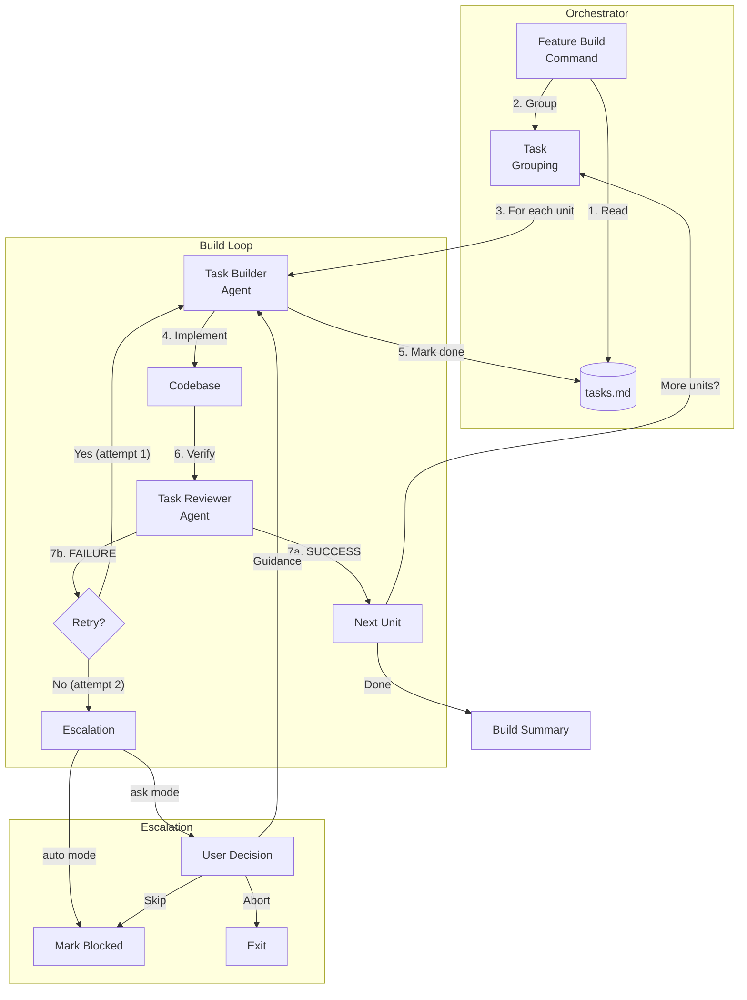
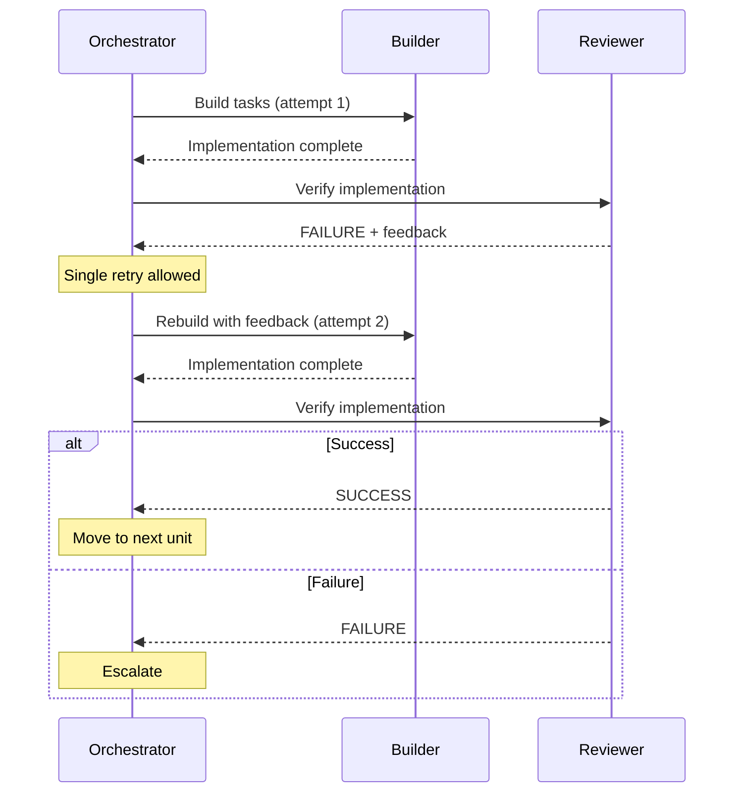
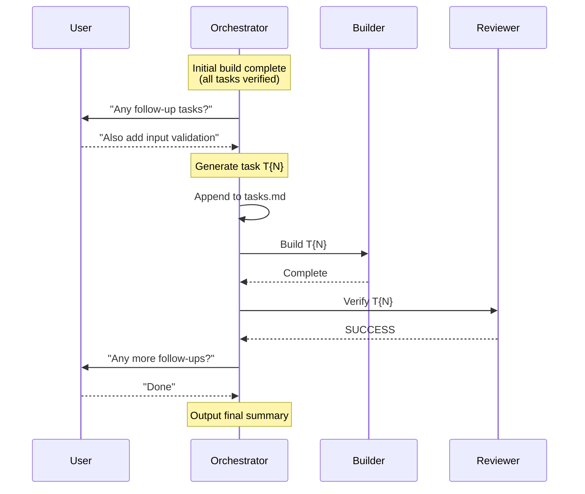

# feature-build

Orchestrates feature implementation using a builder-reviewer architecture with adaptive task grouping and configurable failure handling.

---

## Synopsis

=== "Claude Code"

    ```bash
    /feature-build <feature-id> [milestone-id] [mode]
    ```

=== "OpenCode"

    ```bash
    /rp1-dev/feature-build <feature-id> [milestone-id] [mode]
    ```

## Description

The `feature-build` command orchestrates feature implementation from pre-defined task lists. It uses a **builder-reviewer architecture** where specialized agents handle implementation and verification in a coordinated workflow.

### Key Features

- **Three-component architecture**: Orchestrator, Builder, and Reviewer agents
- **Adaptive task grouping**: Batches simple tasks, handles complex tasks individually
- **Single retry with feedback**: Failed tasks get one retry with reviewer feedback
- **Configurable failure handling**: Interactive (`ask`) or automatic (`auto`) modes
- **Resume support**: Picks up from first incomplete task on re-run

## Architecture

The builder-reviewer pattern separates concerns for reliable, high-quality implementation:



### Component Responsibilities

| Component | Role | Context Loaded |
|-----------|------|----------------|
| **Orchestrator** | Coordinates workflow, manages retry loop | Tasks only |
| **Task Builder** | Implements code, writes summaries | KB + Design + Tasks |
| **Task Reviewer** | Verifies implementation, provides feedback | Patterns + Design + Tasks |

The orchestrator is intentionally minimal--it only reads the task file to determine what to process. All context loading (KB, design docs, codebase analysis) is delegated to the builder and reviewer agents.

## Parameters

| Parameter | Position | Required | Default | Description |
|-----------|----------|----------|---------|-------------|
| `FEATURE_ID` | `$1` | Yes | - | Feature identifier |
| `MILESTONE_ID` | `$2` | No | All tasks | Specific milestone to build |
| `MODE` | `$3` | No | `ask` | Failure handling mode |

### Special Flags

| Flag | Effect |
|------|--------|
| `--no-group` | Process all tasks individually (disables adaptive grouping) |

## Prerequisites

- `requirements.md` in `.rp1/work/features/<feature-id>/`
- `design.md` in `.rp1/work/features/<feature-id>/`
- `tasks.md` or `milestone-N.md` files

## Complexity Tagging

Tasks can be tagged with complexity levels that affect how they are grouped:

```markdown
- [ ] **T1**: Simple task `[complexity:simple]`
- [ ] **T2**: Medium task `[complexity:medium]`
- [ ] **T3**: Complex task `[complexity:complex]`
```

| Complexity | Grouping Behavior | Default |
|------------|-------------------|---------|
| `simple` | Batched with up to 2 other simple tasks | No |
| `medium` | Processed individually | Yes |
| `complex` | Processed individually with extra context | No |

If no complexity tag is provided, `medium` is assumed.

## Adaptive Task Grouping

The orchestrator groups tasks to optimize throughput while ensuring quality:

```
Algorithm:
1. Start with empty buffer for simple tasks
2. For each pending task:
   - If simple: add to buffer
     - If buffer has 3 tasks: flush as unit
   - If medium/complex: flush buffer, create individual unit
3. Flush remaining buffer at end
```

**Example**: Given tasks T1 (simple), T2 (simple), T3 (medium), T4 (simple):

- Unit 1: T1, T2 (simple batch)
- Unit 2: T3 (medium, individual)
- Unit 3: T4 (simple, remaining)

### Disabling Grouping

Use `--no-group` to process every task individually:

=== "Claude Code"

    ```bash
    /feature-build user-auth --no-group
    ```

=== "OpenCode"

    ```bash
    /rp1-dev/feature-build user-auth --no-group
    ```

## Retry Mechanism

Each task unit gets up to 2 attempts:



### Feedback Flow

On failure, the reviewer provides structured feedback:

```json
{
  "issues": [
    {
      "type": "accuracy",
      "description": "Missing input validation",
      "evidence": "src/api.ts:45",
      "severity": "blocking"
    }
  ]
}
```

This feedback is passed to the builder on retry, enabling targeted fixes.

## Failure Modes

The `MODE` parameter controls behavior when tasks fail after max attempts:

### Ask Mode (Default)

Interactive mode prompts the user:

```
Task T3 failed after 2 attempts.

Options:
1. Skip this task (mark as blocked)
2. Provide guidance (get another attempt)
3. Abort workflow
```

- **Skip**: Marks task as `[!]` (blocked), continues to next unit
- **Guidance**: User provides hints, builder gets bonus attempt
- **Abort**: Outputs summary and exits immediately

### Auto Mode

Non-interactive mode for CI/CD or batch processing:

=== "Claude Code"

    ```bash
    /feature-build user-auth "" auto
    ```

=== "OpenCode"

    ```bash
    /rp1-dev/feature-build user-auth "" auto
    ```

- Failed tasks are automatically marked as blocked
- Workflow continues to next task unit
- No user intervention required

## Task Status Markers

| Marker | Meaning |
|--------|---------|
| `- [ ]` | Pending |
| `- [x]` | Completed and verified |
| `- [!]` | Blocked (failed after max attempts) |

## Output

The command produces:

- **Code changes** according to design specification
- **Task file updates** with completion status and implementation summaries
- **Field notes** for discoveries and deviations
- **Build summary** with completion statistics

### Implementation Summary Format

After each task, the builder writes:

```markdown
- [x] **T1**: Add user validation `[complexity:medium]`

  **Implementation Summary**:
  - **Files**: `src/auth/validation.ts`, `src/middleware/auth.ts`
  - **Approach**: Added JWT validation middleware with RS256 algorithm
  - **Deviations**: None
  - **Tests**: 5/5 passing
  **Validated**: PASS
```

### Build Summary

After all units complete:

```markdown
## Build Summary

**Feature**: user-auth
**Mode**: ask
**Task Units**: 4/5 completed

### Completed Tasks
- T1: Add user validation - VERIFIED
- T2, T3: Database schema tasks - VERIFIED (after retry)

### Blocked Tasks
- T5: Integration tests - BLOCKED (external API unavailable)

### Follow-up Tasks
- T6: Add input validation - VERIFIED
(if any follow-ups were processed)

### Next Steps
Ready for `/feature-verify user-auth`
```

## Post-Build Follow-ups

After a successful build (all tasks verified), the orchestrator offers an opportunity to add follow-up tasks without leaving the build session. This maintains builder-reviewer quality gates for ad-hoc additions.

### How It Works



### Follow-up Flow

1. **Trigger**: After post-build cleanup, if all initial tasks are verified
2. **Prompt**: User is asked if they want to add follow-up tasks
3. **Task Generation**: User's request is converted to a task with auto-generated ID
4. **Execution**: New task goes through full builder/reviewer loop
5. **Loop**: User can add more follow-ups or exit

### Example

```
Build complete. Any follow-up tasks?
(e.g., "also add input validation", "fix the edge case for empty arrays")

> Add input validation for email field

Adding task T6: Add input validation for email field [complexity:simple]
Building...
Reviewing...
✓ Task T6 verified

Any more follow-up tasks?
> Done

## Build Summary
...
### Follow-up Tasks
- T6: Add input validation for email field - VERIFIED
```

### When Follow-ups Are Skipped

Follow-up prompting is skipped when:

- Any initial tasks are blocked (failed after max attempts)
- Build was aborted by user
- Running in `auto` mode (non-interactive)

### Task ID Generation

Follow-up tasks get sequential IDs based on existing tasks:

- Existing: T1, T2, T3 → Follow-up: T4
- Existing: T1, T1.1, T2 → Follow-up: T3 (only counts base IDs)

## Examples

### Build Entire Feature

=== "Claude Code"

    ```bash
    /feature-build user-auth
    ```

=== "OpenCode"

    ```bash
    /rp1-dev/feature-build user-auth
    ```

### Build Specific Milestone

=== "Claude Code"

    ```bash
    /feature-build user-auth 2
    ```

=== "OpenCode"

    ```bash
    /rp1-dev/feature-build user-auth 2
    ```

### Build in Auto Mode (CI/CD)

=== "Claude Code"

    ```bash
    /feature-build user-auth "" auto
    ```

=== "OpenCode"

    ```bash
    /rp1-dev/feature-build user-auth "" auto
    ```

### Resume Interrupted Build

Simply re-run the command--it picks up from the first incomplete task:

=== "Claude Code"

    ```bash
    /feature-build user-auth
    ```

## Verification Dimensions

The reviewer verifies across four dimensions:

| Dimension | Question | Failure Impact |
|-----------|----------|----------------|
| **Discipline** | Did builder stay in scope? | Blocking |
| **Accuracy** | Does implementation match design? | Blocking |
| **Completeness** | Are all acceptance criteria met? | Blocking |
| **Quality** | Does code follow patterns? | Blocking or suggestion |

## Related Commands

- [`feature-design`](feature-design.md) - Previous step: create design (auto-generates tasks)
- [`feature-tasks`](feature-tasks.md) - Optional: regenerate or update tasks
- [`feature-verify`](feature-verify.md) - Next step: validate complete implementation

## See Also

- [Feature Development Tutorial](../../guides/feature-development.md) - Complete workflow
