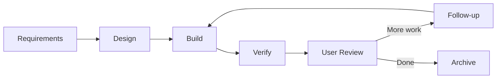

# Dev Plugin Reference

The `rp1-dev` plugin provides development workflow capabilities for the complete feature lifecycle, code quality tools, and PR management.

**Version**: 3.0.0
**Dependencies**: rp1-base >= 2.0.0

---

## Commands by Category

### Feature Development

Build features with full workflow orchestration.

| Command | Description |
|---------|-------------|
| [`build`](build.md) | **Primary command** — End-to-end feature workflow (requirements → design → build → verify → archive) |
| [`build-fast`](build-fast.md) | Quick iteration for small, well-scoped tasks |
| [`validate-hypothesis`](validate-hypothesis.md) | Test design assumptions through experiments |

### Blueprint & Planning

Start projects with structured documentation.

| Command | Description |
|---------|-------------|
| [`blueprint`](blueprint.md) | Create project charter and PRD documents |
| [`blueprint-archive`](blueprint-archive.md) | Archive completed blueprints |

### Feature Management

Manage features during and after development.

| Command | Description |
|---------|-------------|
| [`feature-edit`](feature-edit.md) | Propagate mid-stream changes across documents |
| [`feature-archive`](feature-archive.md) | Archive completed features |
| [`feature-unarchive`](feature-unarchive.md) | Restore archived features |

### Code Quality

Maintain code health with automated checks and analysis.

| Command | Description |
|---------|-------------|
| [`code-check`](code-check.md) | Fast hygiene validation (lint, test, coverage) |
| [`code-audit`](code-audit.md) | Pattern consistency and maintainability audit |
| [`code-investigate`](code-investigate.md) | Systematic bug investigation |
| [`code-clean-comments`](code-clean-comments.md) | Remove unnecessary code comments |

### PR Management

Review and manage pull requests effectively.

| Command | Description |
|---------|-------------|
| [`pr-review`](pr-review.md) | Map-reduce PR review with confidence gating |
| [`pr-visual`](pr-visual.md) | Generate Mermaid diagrams from PR diffs |
| [`address-pr-feedback`](address-pr-feedback.md) | Unified workflow: collect, triage, and fix PR review comments |

---

## Feature Development Workflow

Use `/build` as your **single entry point** for feature development:



The command handles all steps automatically with smart resumption — it detects existing artifacts and continues from where you left off.

| Step | What Happens | Artifact |
|------|--------------|----------|
| Requirements | Collect and document requirements | `requirements.md` |
| Design | Generate technical design + tasks | `design.md`, `tasks.md` |
| Build | Implement via builder-reviewer | Code changes |
| Verify | Validate against acceptance criteria | `verification-report.md` |
| User Review | Manual verification checkpoint | User decision |
| Follow-up | Add more work if needed | Loops to Build |
| Archive | Store completed feature | Archived artifacts |

**When to use which command:**

| Use Case | Command |
|----------|---------|
| Multi-component features, architectural changes | `/build` |
| Bug fixes, small enhancements, isolated changes | `/build-fast` |

[:octicons-arrow-right-24: Feature Development Tutorial](../../guides/feature-development.md)

---

## Installation

=== "Claude Code"

    ```bash
    /plugin marketplace add rp1-run/rp1
    /plugin install rp1-base  # Required dependency
    /plugin install rp1-dev
    ```

=== "OpenCode"

    ```bash
    curl -fsSL https://raw.githubusercontent.com/rp1-run/rp1/main/scripts/install-for-opencode.sh | bash
    ```

---

## Quick Start

After installation, start a new feature:

=== "Claude Code"

    ```bash
    /build my-feature
    ```

=== "OpenCode"

    ```bash
    /rp1-dev/build my-feature
    ```

This runs the complete feature workflow — collecting requirements, generating design, implementing with builder-reviewer, and verifying the result.
