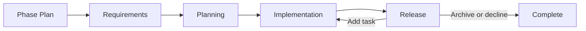

# Dev Plugin Reference

The `rp1-dev` plugin provides feature delivery, code-quality, and PR workflows
for day-to-day development.

---

## Skills by Category

### Feature Development

Build features with full workflow orchestration.

| Skill | Description |
|---------|-------------|
| [`build`](build.md) | **Primary skill** -- End-to-end feature workflow (`requirements` -> `planning` -> `implementation` -> `release`) |
| [`build-fast`](build-fast.md) | Quick iteration for small, well-scoped tasks |
| [`phase-plan`](phase-plan.md) | Decompose a completed PRD or oversized requirements artifact into delivery phases |
| [`validate-hypothesis`](validate-hypothesis.md) | Test design assumptions through experiments |

### Blueprint & Planning

Start projects with structured documentation.

| Skill | Description |
|---------|-------------|
| [`blueprint`](blueprint.md) | Create project charter and PRD documents |
| [`phase-plan`](phase-plan.md) | Turn a large PRD or oversized requirements artifact into child-feature handoffs |
| [`blueprint-archive`](blueprint-archive.md) | Archive completed blueprints |
| [`blueprint-audit`](blueprint-audit.md) | Audit PRDs against implementation status |

### Feature Management

Manage features during and after development.

| Skill | Description |
|---------|-------------|
| [`feature-edit`](feature-edit.md) | Propagate mid-stream changes across documents |
| [`feature-archive`](feature-archive.md) | Archive completed features |
| [`feature-unarchive`](feature-unarchive.md) | Restore archived features |

### Code Quality

Maintain code health with automated checks and analysis.

| Skill | Description |
|---------|-------------|
| [`code-check`](code-check.md) | Fast hygiene validation (lint, test, coverage) |
| [`code-audit`](code-audit.md) | Pattern consistency and maintainability audit |
| [`code-investigate`](code-investigate.md) | Systematic bug investigation |
| [`code-clean-comments`](code-clean-comments.md) | Remove unnecessary code comments |
| [`tech-debt-collector`](tech-debt-collector.md) | Evidence-gated tech debt and bloat detection with remediation actions |

### PR Management

Review and manage pull requests effectively.

| Skill | Description |
|---------|-------------|
| [`pr-review`](pr-review.md) | Map-reduce PR review with confidence gating |
| [`pr-visual`](pr-visual.md) | Generate Mermaid diagrams from PR diffs |
| [`pr-walkthrough`](pr-walkthrough.md) | Generate plain markdown walkthroughs grounded in direct PR evidence |
| [`pr-stack`](pr-stack.md) | Split a large PR or branch into an approved stack of smaller PRs |
| [`address-pr-feedback`](address-pr-feedback.md) | Unified workflow: collect, triage, and fix PR review comments |
| [`publish-artifact`](publish-artifact.md) | Publish an rp1 artifact as an idempotent PR or issue comment instead of committing it |

### Collaboration

| Skill | Description |
|---------|-------------|
| [`address-pr-feedback`](address-pr-feedback.md) | Collect, triage, and fix reviewer comments from a PR |

---

## Feature Development Workflow

Use the same workflow on every host:

| Host | Example |
|------|---------|
| Claude Code | `/build my-feature` |
| OpenCode | `/rp1-dev-build my-feature` |
| Codex | `$rp1-dev-build my-feature` |

`/build` is the primary entry point for large or multi-step feature work. It is
resumable by workflow state: rp1 reuses an active run for the same canonical
project and `FEATURE_ID`, then continues from the next incomplete parent phase
instead of inferring progress from artifact filenames. `/phase-plan` sits just
ahead of it when a planning source is too large for one independent feature:


```mermaid
flowchart LR
    P[Phase Plan]
    P --> R[Requirements]
    R --> PL[Planning]
    PL --> I[Implementation]
    I --> REL[Release]
    REL -->|Add task| I
    REL -->|Archive or decline| Done[Complete]
```

`build-fast` uses the same bootstrap contract, but always starts a fresh run and
writes its plan under `.rp1/work/quick-builds/`.

| Parent Phase | What Happens | Primary Artifacts |
|--------------|--------------|-------------------|
| `requirements` | Collect and document requirements, scope, and traceability | `requirements.md` |
| `planning` | Generate design, validate assumptions when needed, and write the accepted task plan once | `design.md`, `tasks.md`, `tasks.json` |
| `implementation` | Run planned task units, mechanical checks, feature verification, and scoped comment cleanup | Code changes, validation summaries, cleanup artifacts |
| `release` | Present readiness, manual verification items, archive choice, and add-task option | `build-readiness.md`, optional archived outputs |

Machine implementation planning consumes `tasks.json`. `tasks.md` remains the
human review artifact and mirrors the same task IDs.

**When to use which skill:**

| Use Case | Skill |
|----------|---------|
| Initiative-sized work, phased rollout, or multiple child features | `/phase-plan` |
| Multi-component features, architectural changes | `/build` |
| Bug fixes, small enhancements, isolated changes | `/build-fast` |

[:octicons-arrow-right-24: Feature Development Tutorial](../../guides/feature-development.md)

---

## Installation

Install the plugin from the CLI:

```bash
rp1 install claude-code
rp1 install opencode
rp1 install codex
```

---

## Quick Start

After installation, start a new feature:

=== "Claude Code"

    ```bash
    /build my-feature
    ```

=== "OpenCode"

    ```bash
    /rp1-dev-build my-feature
    ```

    You can also type `/skills` to browse all available skills — rp1 skills are prefixed with `rp1-` (e.g., `/rp1-dev-build`, `/rp1-dev-build-fast`).

=== "Codex"

    ```bash
    $rp1-dev-build my-feature
    ```

This runs the complete feature workflow -- collecting requirements, planning,
implementing with builder-reviewer, aggregating readiness, and completing the
release decision.
