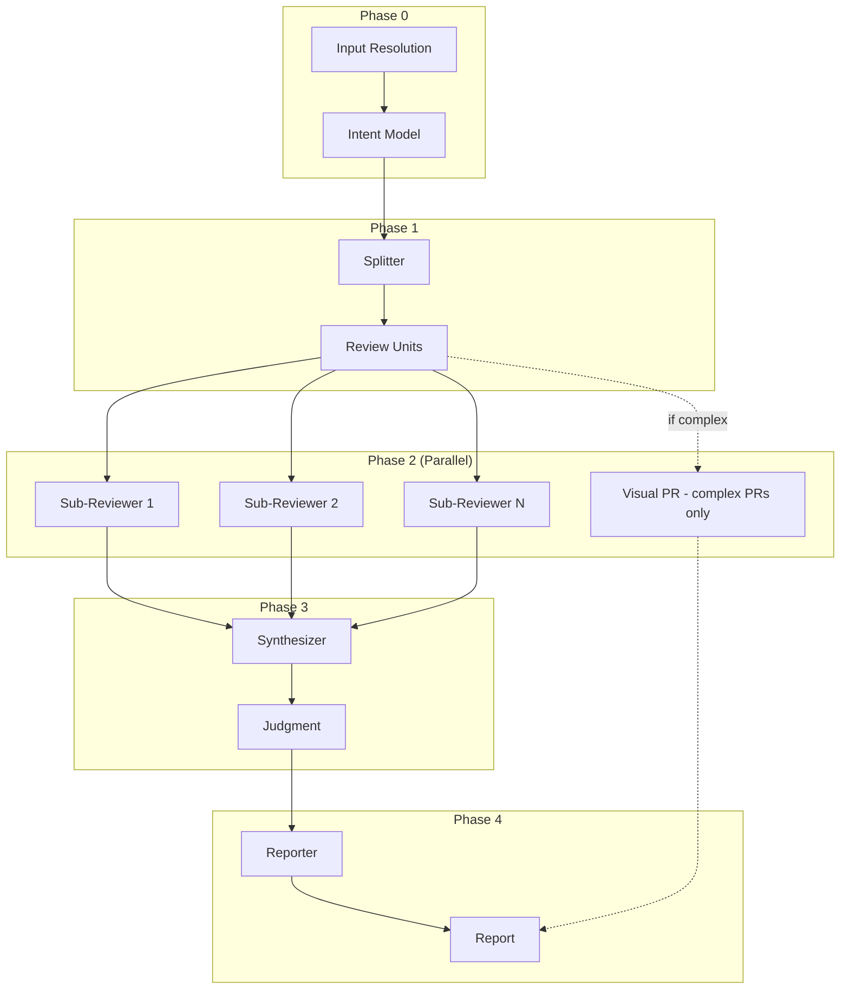

# pr-review

Thorough code review that understands what your PR is trying to accomplish and checks the implementation against that intent.

---

## Synopsis

=== "Claude Code"

    ```bash
    /pr-review [target] [base-branch]
    ```

=== "OpenCode"

    ```bash
    /rp1-dev/pr-review [target] [base-branch]
    ```

## Description

The `pr-review` command performs comprehensive code review by first understanding what your PR is trying to accomplish (from the description or linked issues), then reviewing each changed file against that intent. Findings are synthesized into an overall assessment with specific, actionable feedback.

## Parameters

| Parameter | Position | Required | Default | Description |
|-----------|----------|----------|---------|-------------|
| `TARGET` | `$1` | No | Current branch | PR number, URL, or branch name |
| `BASE_BRANCH` | `$2` | No | From PR or `main` | Base branch for comparison |

## Input Resolution

| Input Type | Example | Resolution |
|------------|---------|------------|
| Empty | - | Uses current branch |
| PR Number | `123` | Fetches PR metadata via `gh` |
| PR URL | `github.com/.../pull/123` | Extracts number, fetches PR |
| Branch Name | `feature/auth` | Uses branch, checks for PR |

## Architecture



## Review Dimensions

Each unit is analyzed across 5 dimensions:

| Dimension | Focus |
|-----------|-------|
| **Correctness** | Logic errors, edge cases, bugs |
| **Security** | Vulnerabilities, auth issues |
| **Performance** | Bottlenecks, inefficiencies |
| **Maintainability** | Code quality, patterns |
| **Testing** | Coverage, test quality |

## Confidence Gating

Findings are filtered by confidence level:

| Confidence | Action |
|------------|--------|
| 65%+ | Include in report |
| 40-64% (critical/high) | Investigate further |
| Below 40% | Exclude from report |

## Judgment Outcomes

| Judgment | Meaning |
|----------|---------|
| ✅ `approve` | Ready to merge |
| ⚠️ `request_changes` | Issues to address |
| 🛑 `block` | Critical problems found |

!!! info "Visual PR Workflow"
    For complex PRs (significant architectural changes or cross-cutting concerns), the review automatically triggers [`pr-visual`](pr-visual.md) in parallel with sub-reviewers, creating diagrams that help you understand the PR at a glance.

## Examples

### Review Current Branch

=== "Claude Code"

    ```bash
    /pr-review
    ```

=== "OpenCode"

    ```bash
    /rp1-dev/pr-review
    ```

### Review Specific PR

=== "Claude Code"

    ```bash
    /pr-review 123
    ```

=== "OpenCode"

    ```bash
    /rp1-dev/pr-review 123
    ```

**Example output:**
```
✅ PR Review Complete

Judgment: APPROVE
The PR correctly implements user authentication with proper validation.

Findings:
- 🚨 Critical: 0
- ⚠️ High: 1
- 💡 Medium: 3
- ✅ Low: 5

Report: .rp1/work/pr-reviews/pr-123.md
```

## Output

**Location:** `.rp1/work/pr-reviews/<review-id>.md`

**Contents:**

- Intent summary
- Judgment with rationale
- Findings by severity
- Cross-file issues
- Recommendations

## Related Commands

- [`pr-visual`](pr-visual.md) - Generate diagrams from PR
- [`address-pr-feedback`](address-pr-feedback.md) - Collect and fix review comments

## See Also

- [Map-Reduce Workflows](../../concepts/map-reduce-workflows.md) - How parallel review works
