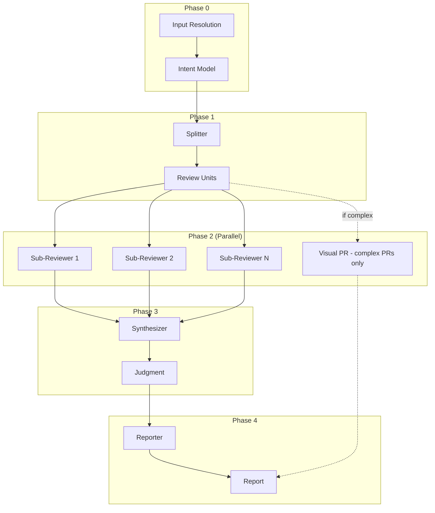

# pr-review

Thorough code review that understands what your PR is trying to accomplish and checks the implementation against that intent.

---

## Synopsis

=== "Claude Code"

    ```bash
    /pr-review [target] [base-branch] [skip-visual]
    ```

=== "OpenCode"

    ```bash
    /rp1-dev-pr-review [target] [base-branch] [skip-visual]
    ```

## Description

The `pr-review` command performs comprehensive code review by first understanding what your PR is trying to accomplish (from the description or linked issues), then reviewing each changed file against that intent. Findings are synthesized into an overall assessment with specific, actionable feedback.

## Parameters

| Parameter | Position | Required | Default | Description |
|-----------|----------|----------|---------|-------------|
| `TARGET` | `$1` | No | Current branch | PR number, URL, or branch name |
| `BASE_BRANCH` | `$2` | No | From PR or `main` | Base branch for comparison |
| `SKIP_VISUAL` | `$3` | No | `false` | Set `true` to skip visual diagram generation |

## Input Resolution

| Input Type | Example | Resolution |
|------------|---------|------------|
| Empty | - | Uses current branch |
| PR Number | `123` | Fetches PR metadata via `gh` |
| PR URL | `github.com/.../pull/123` | Extracts number, fetches PR |
| Branch Name | `feature/auth` | Uses branch, checks for PR |

## Architecture


```mermaid
flowchart TB
    subgraph "Phase 0"
        IR[Input Resolution] --> IM[Intent Model]
    end

    subgraph "Phase 1"
        SP[Splitter] --> RU[Review Units]
    end

    subgraph "Phase 2 (Parallel)"
        R1[Sub-Reviewer 1]
        R2[Sub-Reviewer 2]
        RN[Sub-Reviewer N]
        VIS[Visual PR - complex PRs only]
    end

    subgraph "Phase 3"
        SY[Synthesizer] --> JD[Judgment]
    end

    subgraph "Phase 4"
        RP[Reporter] --> MD[Report]
    end

    IM --> SP
    RU --> R1
    RU --> R2
    RU --> RN
    RU -.->|if complex| VIS
    R1 --> SY
    R2 --> SY
    RN --> SY
    VIS -.-> MD
    JD --> RP
```

## Review Dimensions

Each unit is analyzed across 5 dimensions:

| Dimension | Focus |
|-----------|-------|
| **Correctness** | Logic errors, edge cases, bugs |
| **Security** | Vulnerabilities, auth issues |
| **Performance** | Bottlenecks, inefficiencies |
| **Maintainability** | Code quality, patterns |
| **Testing** | Coverage, test quality |

## Confidence Gating

Findings are filtered by confidence level:

| Confidence | Action |
|------------|--------|
| 65%+ | Include in report |
| 40-64% (critical/high) | Investigate further |
| Below 40% | Exclude from report |

## Judgment Outcomes

| Judgment | Meaning |
|----------|---------|
| ✅ `approve` | Ready to merge |
| ⚠️ `request_changes` | Issues to address |
| 🛑 `block` | Critical problems found |

!!! info "Visual PR Workflow"
    For complex PRs (significant architectural changes or cross-cutting concerns), the review automatically triggers [`pr-visual`](pr-visual.md) in parallel with sub-reviewers, creating diagrams that help you understand the PR at a glance.

## Examples

### Review Current Branch

=== "Claude Code"

    ```bash
    /pr-review
    ```

=== "OpenCode"

    ```bash
    /rp1-dev-pr-review
    ```

### Review Specific PR

=== "Claude Code"

    ```bash
    /pr-review 123
    ```

=== "OpenCode"

    ```bash
    /rp1-dev-pr-review 123
    ```

**Example output:**
```
✅ PR Review Complete

Judgment: APPROVE
The PR correctly implements user authentication with proper validation.

Findings:
- 🚨 Critical: 0
- ⚠️ High: 1
- 💡 Medium: 3
- ✅ Low: 5

Report: .rp1/work/pr-reviews/pr-123.md
```

## Output

**Location:** `.rp1/work/pr-reviews/<review-id>.md`

**Contents:**

- Intent summary
- Judgment with rationale
- Findings by severity
- Cross-file issues
- Recommendations

---

## CI Mode

When running in a CI/CD environment (detected via `CI=true` environment variable), the command operates in **CI mode** with additional capabilities. The CI platform is determined by the `ci_platform` config option (default: `github`).

### CI Mode Behavior

| Phase | Local Mode | CI Mode |
|-------|------------|---------|
| P-1: Config | Skipped | Load `.rp1/config/pr-review.yaml`, apply env overrides |
| P0: Input | Interactive prompts | Extract from `GITHUB_EVENT_PATH` |
| P0.5: Visual | HTML preview | Markdown mode (embedded in summary) |
| P1-P4: Review | Standard | Standard |
| P5: Posting | Skipped | Post review to GitHub via API |

### Configuration

Create `.rp1/config/pr-review.yaml` to enable and configure CI reviews:

```yaml
enabled: true
verdict: auto
add_comments: true
max_comments: 25
visualize: false
```

See [PR Review Config Reference](../pr-review-config.md) for all options.

### Environment Variables

Override configuration via environment variables:

| Variable | Effect |
|----------|--------|
| `RP1_PR_REVIEW_ENABLED` | Enable/disable review |
| `RP1_PR_REVIEW_VERDICT` | Set verdict mode |
| `RP1_PR_REVIEW_ADD_COMMENTS` | Enable/disable inline comments |
| `RP1_PR_REVIEW_VISUALIZE` | Enable/disable diagrams |

### Comment Deduplication

In CI mode, the command:

1. Fetches existing comments from the PR
2. Compares new findings against existing bot comments
3. Acknowledges human comments that match findings
4. Posts only unique findings

This prevents duplicate comments across multiple workflow runs.

### GitHub Actions Setup

```yaml
name: rp1 PR Review

on:
  pull_request:
    types: [opened, synchronize, reopened]

permissions:
  contents: read
  pull-requests: write

jobs:
  review:
    runs-on: ubuntu-latest
    steps:
      - uses: actions/checkout@v4
        with:
          fetch-depth: 0

      - name: Install rp1
        run: curl -fsSL https://rp1.run/install.sh | sh

      - name: Install Claude Code
        run: npm install -g @anthropic-ai/claude-code

      - name: Run PR Review
        env:
          ANTHROPIC_API_KEY: ${{ secrets.ANTHROPIC_API_KEY }}
          GITHUB_TOKEN: ${{ secrets.GITHUB_TOKEN }}
        run: claude /rp1-dev:pr-review
```

See [Remote PR Review Guide](../../guides/remote-pr-review.md) for detailed setup instructions.

---

## Related Commands

- [`pr-visual`](pr-visual.md) - Generate diagrams from PR
- [`address-pr-feedback`](address-pr-feedback.md) - Collect and fix review comments

## See Also

- [Map-Reduce Workflows](../../concepts/map-reduce-workflows.md) - How parallel review works
- [Remote PR Review Guide](../../guides/remote-pr-review.md) - CI setup tutorial
- [PR Review Config](../pr-review-config.md) - Configuration reference
- [Agent Tools](../agent-tools.md) - GitHub PR tools documentation
