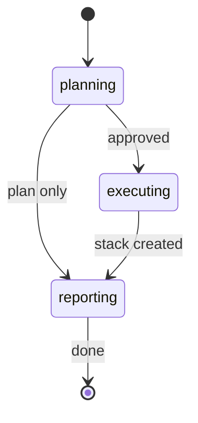

# pr-stack

Plan and create a stacked PR sequence from a large PR or branch.

`pr-stack` is a split-planning workflow with an explicit approval gate. It first
produces a proposed stack plan and only creates branches, commits, pushes, or
pull requests after you approve the plan.

---

## Synopsis

=== "Claude Code"

    ```bash
    /pr-stack <source> [base-branch] [max-line-change] [check-command] [generated-exclusions] [push-remote] [stack-prefix] [--plan-only]
    ```

=== "OpenCode"

    ```bash
    /rp1-dev-pr-stack <source> [base-branch] [max-line-change] [check-command] [generated-exclusions] [push-remote] [stack-prefix] [--plan-only]
    ```

=== "Codex"

    ```bash
    $rp1-dev-pr-stack <source> [base-branch] [max-line-change] [check-command] [generated-exclusions] [push-remote] [stack-prefix] [--plan-only]
    ```

## When To Use It

| Use `pr-stack` when... | Prefer another command when... |
|------------------------|--------------------------------|
| A PR is too large for effective review and needs to be split. | You only need a review verdict; use [`pr-review`](pr-review.md). |
| A branch contains separable changes that can be reviewed in order. | Reviewers need an orientation artifact without changing branches; use [`pr-walkthrough`](pr-walkthrough.md). |
| You want branch and PR creation to wait behind an explicit plan approval. | Existing review comments need fixes; use [`address-pr-feedback`](address-pr-feedback.md). |

## Parameters

| Parameter | Position | Required | Default | Description |
|-----------|----------|----------|---------|-------------|
| `SOURCE` | `$1` | Yes | - | PR URL/number, local branch, or remote branch to split |
| `BASE_BRANCH` | `$2` | No | `main` | Base branch for the bottom PR |
| `MAX_LINE_CHANGE` | `$3` | No | `1000` | Max added+deleted non-generated lines per PR |
| `CHECK_COMMAND` | `$4` | No | Auto-detected | Project validation command to run for each split PR |
| `GENERATED_EXCLUSIONS` | `$5` | No | None | Comma-separated generated paths or globs allowed outside size counts |
| `PUSH_REMOTE` | `$6` | No | `origin` | Remote used for stack branches |
| `STACK_PREFIX` | `$7` | No | `pr-stack` | Prefix for created branch names |
| `PLAN_ONLY` | Flag | No | `false` | Produce the plan and stop before branch or PR creation |

## Workflow



| Step | What Happens |
|------|--------------|
| `planning` | Resolves the source, inventories diff size, chooses checks, and writes the split plan. |
| `executing` | After approval, creates stack branches and PRs, runs checks, and links stack maps. |
| `reporting` | Verifies bases, size limits, CI/check status, reconstruction, and source preservation. |

## Approval Gate

`pr-stack` never creates branches, commits, pushes, or PRs until you approve the
split plan. Use `--plan-only` when you want only the plan artifact.

The plan is reader-first. It starts with the recommendation, a one-screen stack
table, checks, blockers, and the approval question. Internal details such as run
IDs, source/base SHAs, recovery points, and commit groupings are stored in
frontmatter or a compact technical appendix.

The plan includes:

- Ordered PR list with titles, bases, intent, validation, and size estimates
- Clear recommendation: ready to execute, blocked, or plan-only
- Generated-file exclusions and why each one is safe to exclude
- Per-PR deployability, verification path, main risk, and confidence
- Stack dependency narrative and reconstruction proof method in an appendix

## Output

The workflow writes a markdown artifact under `.rp1/work/pr-stacks/` and
registers it with the run. The artifact is meant to be read by maintainers:
machine metadata lives in YAML frontmatter, while the body focuses on the
decision and next action. After execution, the same artifact gets a short
execution status update and final report.

Expected final report:

- PR URLs in order
- Stack map
- Sizes and generated exclusions
- Base chain
- CI/check state
- Reconstruction result
- Original source preservation result
- Deviations from the approved plan

## Examples

### Plan A Stack For A Pull Request

=== "Claude Code"

    ```bash
    /pr-stack 123 --plan-only
    ```

=== "OpenCode"

    ```bash
    /rp1-dev-pr-stack 123 --plan-only
    ```

=== "Codex"

    ```bash
    $rp1-dev-pr-stack 123 --plan-only
    ```

### Split A Local Branch

=== "Claude Code"

    ```bash
    /pr-stack feature/large-change main 800 "just test-cli"
    ```

=== "OpenCode"

    ```bash
    /rp1-dev-pr-stack feature/large-change main 800 "just test-cli"
    ```

=== "Codex"

    ```bash
    $rp1-dev-pr-stack feature/large-change main 800 "just test-cli"
    ```

## Safety Rules

- The original source ref is recorded and preserved as a recovery point.
- Generated exclusions must be named in the plan and final report.
- Checks run for each created PR.
- Reconstruction mismatches block completion unless already listed as intentional generated-file exclusions.
- Force pushes, hard resets, source rewrites, branch deletion, and destructive rebases require explicit chat confirmation naming the exact command.

## Related Commands

- [`pr-review`](pr-review.md) - Produce a review verdict and actionable findings
- [`pr-walkthrough`](pr-walkthrough.md) - Generate a reviewer-orientation artifact from direct PR evidence
- [`pr-visual`](pr-visual.md) - Generate diagrams from PR diffs
- [`address-pr-feedback`](address-pr-feedback.md) - Collect and fix review comments
