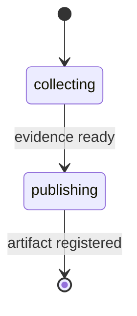

# pr-walkthrough

Generate a slide-ready markdown walkthrough that explains a pull request from direct PR evidence and remains readable as plain markdown.

---

## Synopsis

=== "Claude Code"

    ```bash
    /pr-walkthrough [target] [base-branch]
    ```

=== "OpenCode"

    ```bash
    /rp1-dev-pr-walkthrough [target] [base-branch]
    ```

=== "Codex"

    ```bash
    $rp1-dev-pr-walkthrough [target] [base-branch]
    ```

## Description

The `pr-walkthrough` command creates a reviewer-orientation artifact for a pull request. It gathers PR metadata, changed files, diffs, and commit summaries with `gh` and `git`, then writes an evidence-grounded slide-ready markdown walkthrough.

The walkthrough is not a review verdict, does not post PR comments, and does not use existing `pr-review` artifacts as source material. It includes contract frontmatter, reserved slide markers, slide metadata, speaker notes, vertical detail, and an Evidence Index, while staying coherent when opened as normal markdown. Arcade can render supported outputs in its Artifact Viewer slide reader; the command itself writes and registers markdown.

## Parameters

| Parameter | Position | Required | Default | Description |
|-----------|----------|----------|---------|-------------|
| `TARGET` | `$1` | No | Current branch | PR number, PR URL, branch name, or empty for the current branch |
| `BASE_BRANCH` | `$2` | No | `main` | Diff base branch used when no remote PR is available |

## Input Resolution

| Input Type | Example | Resolution |
|------------|---------|------------|
| Empty | - | Uses the PR associated with the current branch, falling back to a local diff against `BASE_BRANCH` |
| PR Number | `123` | Fetches PR metadata and diff with `gh` |
| PR URL | `https://github.com/owner/repo/pull/123` | Fetches PR metadata and diff with `gh` |
| Branch Name | `feature/auth` | Uses the branch PR when available, otherwise uses a local diff against `BASE_BRANCH` |

If the target cannot identify exactly one PR or one local diff, the workflow fails during evidence collection instead of producing an unrelated artifact.

## Workflow



| Step | What Happens |
|------|--------------|
| `collecting` | Resolves the target, gathers direct `gh` or `git` evidence, and assigns evidence IDs |
| `publishing` | Generates the slide-ready markdown walkthrough and registers it as a work artifact |

## Evidence And Scope

The generated walkthrough includes an Evidence Index that maps evidence IDs to PR metadata, changed files, diff excerpts, or commits. Major purpose, change, reviewer-focus, risk, speaker-note, and vertical-detail claims cite those IDs so reviewers can spot-check the artifact against the source PR evidence.

The artifact declares the `pr-walkthrough-slide-source` contract in frontmatter. Slide structure is represented with line-alone HTML comment markers such as `<!-- rp1-slide: horizontal -->`, `<!-- rp1-slide: vertical -->`, `<!-- rp1-notes -->`, and per-slide metadata blocks. These markers are part of the markdown source contract; PR excerpts stay fenced or quoted so separator-like source text is not treated as slide structure.

Horizontal slide groups include:

- `At A Glance`
- `Evidence Index`
- `Change Map`
- `Walkthrough`
- `Reviewer Focus`
- `Risks And Questions`

Overflow detail appears as vertical depth under the related topic, and supporting context appears in notes after the slide face. When read without slide rendering, the parent summary appears before its notes and deeper detail.

## Output Artifact Behavior

The workflow writes a markdown artifact under `.rp1/work/pr-walkthroughs/` and
registers it with explicit `storageRoot: "work_dir"`. That markdown file is the
source of truth for both the Arcade slide reader and normal markdown viewing.

When the registered file-backed markdown artifact declares
`rp1_contract: pr-walkthrough-slide-source` and has valid slide markers, Arcade
can open it in Slides mode from the artifact surface. The reader uses the
horizontal and vertical slide markers, speaker-note blocks, and evidence
metadata while keeping a Markdown mode available for source-order reading.

If the contract is unsupported, malformed, or slide rendering fails, Arcade
shows the markdown artifact instead. Evidence IDs such as `E-PR-###`,
`E-FILE-###`, `E-DIFF-###`, and `E-COMMIT-###` remain visible in slides, notes,
the Evidence Index, and fallback markdown so claims stay auditable.

## Examples

### Walk Through Current Branch

=== "Claude Code"

    ```bash
    /pr-walkthrough
    ```

=== "OpenCode"

    ```bash
    /rp1-dev-pr-walkthrough
    ```

=== "Codex"

    ```bash
    $rp1-dev-pr-walkthrough
    ```

### Walk Through Specific PR

=== "Claude Code"

    ```bash
    /pr-walkthrough 123
    ```

=== "OpenCode"

    ```bash
    /rp1-dev-pr-walkthrough 123
    ```

=== "Codex"

    ```bash
    $rp1-dev-pr-walkthrough 123
    ```

**Example output:**

```text
## PR Walkthrough Complete

**Target**: PR #123
**Artifact**: pr-walkthroughs/pr-123-walkthrough-001.md
**Evidence**: 8 files, 3 commits
```

## Output

**Location:** `.rp1/work/pr-walkthroughs/<review-id>-walkthrough-<NNN>.md`

**Contents:**

- Contract frontmatter identifying the walkthrough as `pr-walkthrough-slide-source`
- Reserved slide markers, slide metadata blocks, speaker notes, and vertical detail
- PR purpose and size at a glance
- Evidence Index with source references and evidence IDs used by slide metadata and claims
- Reviewable change map
- Narrative walkthrough of major changes
- Reviewer focus areas
- Risks and questions grounded in evidence

The artifact is slide-ready markdown source, not a rendered presentation file.
Opened in a plain markdown viewer, the visible metadata and markers should not
block the top-to-bottom walkthrough. In Arcade, supported artifacts can be read
with the slide reader or with the same markdown fallback.

The artifact is registered with `storageRoot: "work_dir"` and appears in the workflow run artifacts.

## Related Commands

- [`pr-review`](pr-review.md) - Produce a review verdict and actionable findings
- [`pr-visual`](pr-visual.md) - Generate diagrams from PR diffs
- [`address-pr-feedback`](address-pr-feedback.md) - Collect and fix review comments
