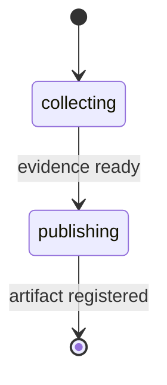

# pr-walkthrough

Generate a plain markdown walkthrough that explains a pull request from direct PR evidence.

---

## Synopsis

=== "Claude Code"

    ```bash
    /pr-walkthrough [target] [base-branch]
    ```

=== "OpenCode"

    ```bash
    /rp1-dev-pr-walkthrough [target] [base-branch]
    ```

=== "Codex"

    ```bash
    $rp1-dev-pr-walkthrough [target] [base-branch]
    ```

## Description

The `pr-walkthrough` command creates a reviewer-orientation artifact for a pull request. It gathers PR metadata, changed files, diffs, and commit summaries with `gh` and `git`, then writes an evidence-grounded markdown walkthrough.

The walkthrough is not a review verdict, does not post PR comments, and does not use existing `pr-review` artifacts as source material. It is designed to be useful as normal markdown, without Reveal.js separators, speaker notes, or slide metadata.

## Parameters

| Parameter | Position | Required | Default | Description |
|-----------|----------|----------|---------|-------------|
| `TARGET` | `$1` | No | Current branch | PR number, PR URL, branch name, or empty for the current branch |
| `BASE_BRANCH` | `$2` | No | `main` | Diff base branch used when no remote PR is available |

## Input Resolution

| Input Type | Example | Resolution |
|------------|---------|------------|
| Empty | - | Uses the PR associated with the current branch, falling back to a local diff against `BASE_BRANCH` |
| PR Number | `123` | Fetches PR metadata and diff with `gh` |
| PR URL | `https://github.com/owner/repo/pull/123` | Fetches PR metadata and diff with `gh` |
| Branch Name | `feature/auth` | Uses the branch PR when available, otherwise uses a local diff against `BASE_BRANCH` |

If the target cannot identify exactly one PR or one local diff, the workflow fails during evidence collection instead of producing an unrelated artifact.

## Workflow



| Step | What Happens |
|------|--------------|
| `collecting` | Resolves the target, gathers direct `gh` or `git` evidence, and assigns evidence IDs |
| `publishing` | Generates the markdown walkthrough and registers it as a work artifact |

## Evidence And Scope

The generated walkthrough includes an Evidence Index that maps evidence IDs to PR metadata, changed files, diff excerpts, or commits. Major purpose, change, reviewer-focus, and risk claims cite those IDs inline so reviewers can spot-check the artifact against the source PR evidence.

Top-level sections include:

- `At A Glance`
- `Evidence Index`
- `Change Map`
- `Walkthrough`
- `Reviewer Focus`
- `Risks And Questions`

## Examples

### Walk Through Current Branch

=== "Claude Code"

    ```bash
    /pr-walkthrough
    ```

=== "OpenCode"

    ```bash
    /rp1-dev-pr-walkthrough
    ```

=== "Codex"

    ```bash
    $rp1-dev-pr-walkthrough
    ```

### Walk Through Specific PR

=== "Claude Code"

    ```bash
    /pr-walkthrough 123
    ```

=== "OpenCode"

    ```bash
    /rp1-dev-pr-walkthrough 123
    ```

=== "Codex"

    ```bash
    $rp1-dev-pr-walkthrough 123
    ```

**Example output:**

```text
## PR Walkthrough Complete

**Target**: PR #123
**Artifact**: pr-walkthroughs/pr-123-walkthrough-001.md
**Evidence**: 8 files, 3 commits
```

## Output

**Location:** `.rp1/work/pr-walkthroughs/<review-id>-walkthrough-<NNN>.md`

**Contents:**

- PR purpose and size at a glance
- Evidence Index with source references
- Reviewable change map
- Narrative walkthrough of major changes
- Reviewer focus areas
- Risks and questions grounded in evidence

The artifact is registered with `storageRoot: "work_dir"` and appears in the workflow run artifacts.

## Related Commands

- [`pr-review`](pr-review.md) - Produce a review verdict and actionable findings
- [`pr-visual`](pr-visual.md) - Generate diagrams from PR diffs
- [`address-pr-feedback`](address-pr-feedback.md) - Collect and fix review comments
